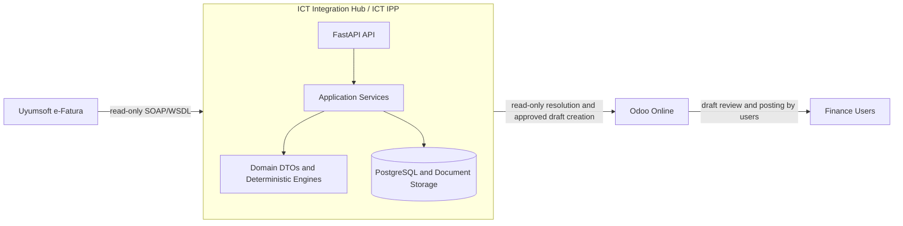

# ICT Integration Hub

ICT Integration Hub is the external product name for the integration platform that connects ICT Teknoloji's procurement and accounting workflows with ERP and e-invoice systems.

The internal architecture name is **ICT Intelligent Procurement Platform (IPP)**: AI-assisted procurement automation built on deterministic business rules.

## Vision

ICT IPP exists to protect procurement traceability from sales demand through actual cost and sales profitability while keeping business decisions inside the Integration Hub.

The platform uses deterministic rules for workflow selection, matching, validation, idempotency, and ERP write eligibility. AI is advisory only: it can recommend, explain, summarize, or flag anomalies after the Rule Engine has run, but it never chooses a workflow, approves a business decision, mutates provider state, or posts accounting documents.

## Architecture

ICT IPP follows Clean Architecture and Domain Driven Design boundaries:

- domain DTOs and deterministic engines are ERP-independent
- provider communication stays inside adapters/connectors
- repositories isolate ERP master-data access
- services own workflows, idempotency, matching, and safety gates
- API routers translate HTTP requests and errors but do not contain business rules
- Odoo is an adapter and execution surface, not the decision authority



See [Architecture](docs/ARCHITECTURE.md), [Project Constitution](docs/PROJECT_CONSTITUTION.md), and [Architecture Decision Records](docs/adr/README.md).

## Features

Current implemented capabilities:

- FastAPI service with health, liveness, and readiness endpoints.
- Environment-profile based runtime configuration with production safety gates.
- API-layer RequestContext foundation with gated development-header authentication and standard OIDC/JWT validation for future authenticated routes.
- Uyumsoft test SOAP/WSDL connectivity for read-only probes, inbox/outbox listing, and UBL XML retrieval.
- Idempotent Uyumsoft invoice metadata persistence using ETTN or deterministic fallback identity.
- Incremental sync run tracking with bounded windows, pages, summaries, and safe failure records.
- Local document storage for UBL XML plus document metadata and SHA-256 checks.
- Provider-independent UBL parsing into normalized invoice models.
- ERP-neutral immutable invoice domain DTOs for deterministic matching and billing transformations.
- Read-only ERP repository layer backed by Odoo JSON-2 `search_read`.
- Application layer contracts and `ImportInvoiceUseCase` orchestration for the deterministic Vendor Bill path.
- In-memory `ImportSession` orchestration for sequential multi-invoice imports through `ImportInvoiceUseCase`.
- Decision Engine orchestration with a Rule Engine port and extensible workflow strategy resolver.
- Deterministic Rule Engine implementation for the direct Vendor Bill workflow rule.
- Immutable deterministic Invoice Decision Rule domain contracts for future rule configuration and classification work.
- Odoo-backed Decision Rule authoring contracts for the Studio-owned `IPP Decision Rule` configuration model, centralized field mapping, and read-only canonical rule repository port.
- Production read-only Odoo Decision Rule repository that maps active company/shared Studio rules into canonical immutable Hub contracts without rule evaluation or Odoo writes.
- Application-layer deterministic Invoice Decision Rule classifier that evaluates canonical invoice context against canonical rules and returns classification evidence without ERP execution.
- Inbound import classification integration that builds canonical classification context after deterministic matching, loads rules through `DecisionRuleRepository`, and carries `InvoiceClassificationResult` on import/decision results without changing ERP execution.
- Durable Workbench review classification evidence persistence keyed by exact company, review, and review version so historical review classification is never recomputed from current Odoo Decision Rules.
- Read-only Workbench classification projection service that displays pinned historical `ReviewClassificationEvidence` with safe labels, badges, matched rule details, and conflict summaries without rerunning rules.
- Shared Workflow Model with canonical `WorkflowType`, immutable `WorkflowDecision`, and structured Manual Review reason contracts.
- Manual Review workflow foundation for deterministic business mismatches without ERP writes.
- Import Workbench application contracts for future review queue, review detail, user decision, and acknowledgement adapters.
- Durable Import Workbench review persistence for idempotent pending review creation, company-scoped queue/detail reads, and explicit decision submission.
- Authoritative pre-decision Workbench execution evidence persistence for immutable review-version snapshots of `InternalInvoice`, supplier match, product match, and tax mapping results before human decision.
- Import Workbench review query use cases for listing the review queue and retrieving one review item through `ReviewQueueReader`.
- Import Workbench review decision submission use case for optimistic, idempotent `SELECT_WORKFLOW` and `DISMISS` decisions without workflow execution.
- Authenticated Import Workbench REST API for queue, detail, and decision submission through `RequestContext` permissions.
- Odoo Online Workbench projection contract for future Odoo Studio review display and explicit decision capture.
- Business Context Allocation contracts and Workbench decision submission evidence for multi-Sales-Order, customer recharge, affiliate, project, and internal cost traceability.
- Immutable Workbench review billing evidence persistence for authoritative customer recharge billing instructions, fully separated from vendor cost allocation evidence.
- Production-safe read-only Odoo Workbench decision candidate reader for configured Studio parent projection and allocation child models.
- Odoo Workbench decision submission orchestrator that reads one decision-ready candidate and submits immutable Hub decision evidence without writing back to Odoo.
- Read-only ERP reference validation for Odoo-submitted Workbench allocation identifiers before Hub decision evidence is accepted.
- Workflow execution foundation for accepted Workbench decisions with immutable execution plans, deterministic execution idempotency, composite dry-run coordination, and no ERP writes.
- Durable workflow execution runtime with SQLAlchemy execution snapshots, step state, atomic append-only events, repository-owned event sequencing, optimistic runtime-version checks, checkpoints, recovery contracts, and retry policy vocabulary without ERP writes.
- End-to-end no-write accepted decision execution integration that reads canonical Hub decision evidence, creates or loads the durable runtime, executes all dry-run steps, and records a completed runtime without ERP/provider mutation.
- Production-safe `VendorBillWriter` infrastructure for dry-run-first Odoo Draft Vendor Bill creation.
- Production-capable `VENDOR_BILL` execution strategy that builds through `VendorBillBuilder`, writes only through `VendorBillWriter`, requires explicit execution approval for `EXECUTE`, and rejects heterogeneous executable plans before runtime creation.
- SQLAlchemy execution source invoice reader that loads version-pinned persisted Hub evidence for Vendor Bill execution without Odoo/Uyumsoft rereads or rematching.
- Atomic execution source evidence capture for accepted executable Vendor Bill Workbench decisions, storing immutable schema-versioned invoice and deterministic match snapshots in the same Hub transaction as decision persistence.
- Production Vendor Bill execution wiring that composes accepted decisions, the durable runtime, `VendorBillExecutionStrategy`, `VendorBillWriter`, and `OdooVendorBillWriter` for opt-in Draft Vendor Bill creation and duplicate-safe recovery.
- No-write Customer Recharge execution for allocations that already reference validated existing outgoing customer invoices, producing `CUSTOMER_INVOICE` artifacts with `created=false`.
- Customer Invoice Stage 2 pinning and execution wiring for `CUSTOMER_RECHARGE` allocations without `customer_invoice_id`, including one accepted billing instruction per draft customer invoice step, Stage 2 execution evidence reads only, builder/writer separation, and opt-in writer gates. Authoritative Stage 1 billing instruction capture source remains required.
- Deterministic supplier partner matching, tax mapping, and product matching.
- Odoo mapping preview and read-only Odoo resolution.
- Explicitly confirmed draft-only Odoo vendor bill creation with ETTN idempotency.
- Production readiness, testing, UAT, failure injection, and go-live documentation.

Not implemented or not allowed by default:

- Uyumsoft status mutation such as `SetInvoicesTaken`, `SendInvoice`, `Cancel*`, `RetrySendInvoices`, or `MoveToDraftStatus`.
- Odoo `action_post`, unlink, payment registration, reconciliation, or automatic master-data creation.
- Business decision logic inside Odoo.
- Custom Odoo Python addons for Odoo Online.
- Odoo Studio projection publishing, acknowledgement writes, model/view setup, or workflow execution.
- Customer invoice posting, recharge settlement, collections, allocation profitability posting, or analytic writes.
- Customer Invoice creation from the normal production Workbench/import flow until an authoritative Stage 1 billing instruction capture or Workbench authoring source exists.
- Customer Invoice `EXECUTE` without explicit, version-pinned billing instructions for customer, currency, product, quantity, unit price, and sales taxes. Customer Invoice pricing comes only from immutable billing evidence, never from `BusinessContextAllocation` amount/percentage, purchase tax mapping, display fields, current ERP prices, AI, or fuzzy logic.
- `EXECUTE` mode by default; real execution additionally requires `EXECUTION_EXECUTE_ENABLED`, explicit `ExecutionApproval.approved_by`, `PRODUCTION_OPERATIONS_ENABLED`, the production approval acknowledgement, and per-writer gates such as `CUSTOMER_INVOICE_EXECUTE_ENABLED`.
- `EXECUTE` mode for unsupported execution steps, background execution workers, retry scheduling, and ERP posting/payment/reconciliation.
- Live execution source reconstruction from current ERP/provider state or regenerated matching results.
- Execution source evidence capture for `DISMISS`, non-Vendor-Bill workflows, or decisions not executable by the current Vendor Bill strategy.
- AI-driven automatic decisions.
- Database schema changes without Alembic migrations and tests.

## Repository Structure

```text
app/
  api/                FastAPI routers and dependency wiring
  application/        Use-case, command/query, DTO, service, and port contracts
  billing/            ERP-neutral vendor bill and customer invoice DTO builders
  connectors/         Uyumsoft and Odoo transport adapters
  core/               configuration, logging, runtime safety checks
  db/                 SQLAlchemy base/session/types
  domain/             ERP-independent invoice domain DTOs and parser
  erp/                repository protocols and Odoo read-only implementation
  erp/write/          draft-only ERP write adapters behind application ports
  matching/           deterministic product matching
  models/             Integration Hub persistence models
  persistence/        SQLAlchemy adapters behind application ports
  schemas/            API and workflow Pydantic schemas
  services/           workflows, persistence, parsing, mapping, resolution
  tax_mapping/        deterministic tax matching
alembic/              database migrations
docs/                 architecture, workflow, testing, and ADR documentation
scripts/              safe diagnostic and validation scripts
tests/                unit tests and fixtures
```

## Development Workflow

Repository work follows the delivery loop:

```text
Issue -> Branch -> Small PR -> CI -> Review -> Merge
```

Use a dedicated branch:

```bash
git switch -c codex/<short-task-name>
```

Run local validation before handoff:

```bash
ruff check .
ruff format --check .
pytest
docker compose down --remove-orphans
docker compose up --build -d
docker compose ps
curl --fail http://localhost:8000/health
```

For documentation-only work, do not modify runtime behavior, source code, tests, dependencies, migrations, or external-provider connections. See [Development Workflow](docs/DEVELOPMENT_WORKFLOW.md), [Coding Standards](docs/CODING_STANDARDS.md), and [Contributing](docs/CONTRIBUTING.md).

## Documentation

Core documentation:

- [Project Constitution](docs/PROJECT_CONSTITUTION.md)
- [Application Layer](docs/APPLICATION_LAYER.md)
- [Vision](docs/VISION.md)
- [Architecture](docs/ARCHITECTURE.md)
- [Workflows](docs/WORKFLOWS.md)
- [Workflow Execution](docs/WORKFLOW_EXECUTION.md)
- [Rule Engine](docs/RULE_ENGINE.md)
- [Invoice Decision Rules](docs/DECISION_RULES.md)
- [Odoo Decision Rule Authoring](docs/ODOO_DECISION_RULE_AUTHORING.md)
- [AI Advisor](docs/AI_ADVISOR.md)
- [Matching](docs/MATCHING.md)
- [Import Workbench](docs/IMPORT_WORKBENCH.md)
- [Import Workbench API](docs/WORKBENCH_API.md)
- [Odoo Workbench Projection](docs/ODOO_WORKBENCH_PROJECTION.md)
- [Import Session](docs/IMPORT_SESSION.md)
- [Company Memory](docs/COMPANY_MEMORY.md)
- [Roadmap](docs/ROADMAP.md)
- [Production Readiness](docs/PRODUCTION_READINESS.md)
- [Security](docs/SECURITY.md)
- [Keycloak OIDC Adapter](docs/KEYCLOAK.md)
- [Testing Documentation](docs/testing/README.md)
- [Architecture Decision Records](docs/adr/README.md)

## Roadmap

The platform roadmap is intentionally incremental:

- preserve the implemented read-only Uyumsoft ingestion and draft-only Odoo boundary
- formalize IPP decision, rule, strategy, company memory, and import-session concepts in documentation before implementation
- add production-ready implementation slices only when an issue defines scope, tests, safety gates, and rollback
- keep future ERP adapters behind repository and adapter boundaries
- keep AI advisory and downstream of deterministic rules

See [Roadmap](docs/ROADMAP.md).

## Architecture Decisions

Accepted principles:

- Clean Architecture
- Domain Driven Design
- Repository Pattern
- Immutable DTOs
- ERP-independent business logic
- deterministic matching
- small production-ready PRs
- Odoo is an adapter
- Hub owns business decisions
- AI is advisory only

Canonical ADRs live in [docs/adr](docs/adr/README.md), including IPP, ERP boundary, Decision Engine, Rule Engine, AI Advisor, Company Memory, Import Session, Procurement Traceability, Strategy Pattern, Odoo Online Workbench Projection, and Business Context Allocation decisions.

## Contributing

Keep changes narrow, tested, and aligned with the constitution. Never commit secrets or real environment files. Do not call external providers unless the task explicitly authorizes the exact safe operation.

Start with [Contributing](docs/CONTRIBUTING.md) and [Development Workflow](docs/DEVELOPMENT_WORKFLOW.md).
