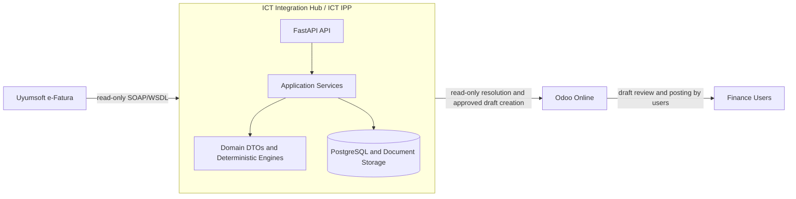

# ICT Integration Hub

ICT Integration Hub is the external product name for the integration platform that connects ICT Teknoloji's procurement and accounting workflows with ERP and e-invoice systems.

The internal architecture name is **ICT Intelligent Procurement Platform (IPP)**: AI-assisted procurement automation built on deterministic business rules.

## Vision

ICT IPP exists to protect procurement traceability from sales demand through actual cost and sales profitability while keeping business decisions inside the Integration Hub.

The platform uses deterministic rules for workflow selection, matching, validation, idempotency, and ERP write eligibility. AI is advisory only: it can recommend, explain, summarize, or flag anomalies after the Rule Engine has run, but it never chooses a workflow, approves a business decision, mutates provider state, or posts accounting documents.

## Architecture

ICT IPP follows Clean Architecture and Domain Driven Design boundaries:

- domain DTOs and deterministic engines are ERP-independent
- provider communication stays inside adapters/connectors
- repositories isolate ERP master-data access
- services own workflows, idempotency, matching, and safety gates
- API routers translate HTTP requests and errors but do not contain business rules
- Odoo is an adapter and execution surface, not the decision authority



See [Architecture](docs/ARCHITECTURE.md), [Project Constitution](docs/PROJECT_CONSTITUTION.md), and [Architecture Decision Records](docs/adr/README.md).

## Features

Current implemented capabilities:

- FastAPI service with health, liveness, and readiness endpoints.
- Environment-profile based runtime configuration with production safety gates.
- Uyumsoft test SOAP/WSDL connectivity for read-only probes, inbox/outbox listing, and UBL XML retrieval.
- Idempotent Uyumsoft invoice metadata persistence using ETTN or deterministic fallback identity.
- Incremental sync run tracking with bounded windows, pages, summaries, and safe failure records.
- Local document storage for UBL XML plus document metadata and SHA-256 checks.
- Provider-independent UBL parsing into normalized invoice models.
- ERP-neutral immutable invoice domain DTOs for deterministic matching and billing transformations.
- Read-only ERP repository layer backed by Odoo JSON-2 `search_read`.
- Application layer contracts and `ImportInvoiceUseCase` orchestration for the deterministic Vendor Bill path.
- In-memory `ImportSession` orchestration for sequential multi-invoice imports through `ImportInvoiceUseCase`.
- Decision Engine orchestration with a Rule Engine port and extensible workflow strategy resolver.
- Deterministic Rule Engine implementation for the direct Vendor Bill workflow rule.
- Shared Workflow Model with canonical `WorkflowType`, immutable `WorkflowDecision`, and structured Manual Review reason contracts.
- Manual Review workflow foundation for deterministic business mismatches without ERP writes.
- Import Workbench application contracts for future review queue, review detail, user decision, and acknowledgement adapters.
- Durable Import Workbench review persistence for idempotent pending review creation and company-scoped queue/detail reads.
- Import Workbench review query use cases for listing the review queue and retrieving one review item through `ReviewQueueReader`.
- Production-safe `VendorBillWriter` infrastructure for dry-run-first Odoo Draft Vendor Bill creation.
- Deterministic supplier partner matching, tax mapping, and product matching.
- Odoo mapping preview and read-only Odoo resolution.
- Explicitly confirmed draft-only Odoo vendor bill creation with ETTN idempotency.
- Production readiness, testing, UAT, failure injection, and go-live documentation.

Not implemented or not allowed by default:

- Uyumsoft status mutation such as `SetInvoicesTaken`, `SendInvoice`, `Cancel*`, `RetrySendInvoices`, or `MoveToDraftStatus`.
- Odoo `action_post`, unlink, payment registration, reconciliation, or automatic master-data creation.
- Business decision logic inside Odoo.
- AI-driven automatic decisions.
- Database schema changes without Alembic migrations and tests.

## Repository Structure

```text
app/
  api/                FastAPI routers and dependency wiring
  application/        Use-case, command/query, DTO, service, and port contracts
  billing/            ERP-neutral vendor bill DTO builder
  connectors/         Uyumsoft and Odoo transport adapters
  core/               configuration, logging, runtime safety checks
  db/                 SQLAlchemy base/session/types
  domain/             ERP-independent invoice domain DTOs and parser
  erp/                repository protocols and Odoo read-only implementation
  erp/write/          draft-only ERP write adapters behind application ports
  matching/           deterministic product matching
  models/             Integration Hub persistence models
  persistence/        SQLAlchemy adapters behind application ports
  schemas/            API and workflow Pydantic schemas
  services/           workflows, persistence, parsing, mapping, resolution
  tax_mapping/        deterministic tax matching
alembic/              database migrations
docs/                 architecture, workflow, testing, and ADR documentation
scripts/              safe diagnostic and validation scripts
tests/                unit tests and fixtures
```

## Development Workflow

Repository work follows the delivery loop:

```text
Issue -> Branch -> Small PR -> CI -> Review -> Merge
```

Use a dedicated branch:

```bash
git switch -c codex/<short-task-name>
```

Run local validation before handoff:

```bash
ruff check .
ruff format --check .
pytest
docker compose down --remove-orphans
docker compose up --build -d
docker compose ps
curl --fail http://localhost:8000/health
```

For documentation-only work, do not modify runtime behavior, source code, tests, dependencies, migrations, or external-provider connections. See [Development Workflow](docs/DEVELOPMENT_WORKFLOW.md), [Coding Standards](docs/CODING_STANDARDS.md), and [Contributing](docs/CONTRIBUTING.md).

## Documentation

Core documentation:

- [Project Constitution](docs/PROJECT_CONSTITUTION.md)
- [Application Layer](docs/APPLICATION_LAYER.md)
- [Vision](docs/VISION.md)
- [Architecture](docs/ARCHITECTURE.md)
- [Workflows](docs/WORKFLOWS.md)
- [Rule Engine](docs/RULE_ENGINE.md)
- [AI Advisor](docs/AI_ADVISOR.md)
- [Matching](docs/MATCHING.md)
- [Import Workbench](docs/IMPORT_WORKBENCH.md)
- [Import Session](docs/IMPORT_SESSION.md)
- [Company Memory](docs/COMPANY_MEMORY.md)
- [Roadmap](docs/ROADMAP.md)
- [Production Readiness](docs/PRODUCTION_READINESS.md)
- [Testing Documentation](docs/testing/README.md)
- [Architecture Decision Records](docs/adr/README.md)

## Roadmap

The platform roadmap is intentionally incremental:

- preserve the implemented read-only Uyumsoft ingestion and draft-only Odoo boundary
- formalize IPP decision, rule, strategy, company memory, and import-session concepts in documentation before implementation
- add production-ready implementation slices only when an issue defines scope, tests, safety gates, and rollback
- keep future ERP adapters behind repository and adapter boundaries
- keep AI advisory and downstream of deterministic rules

See [Roadmap](docs/ROADMAP.md).

## Architecture Decisions

Accepted principles:

- Clean Architecture
- Domain Driven Design
- Repository Pattern
- Immutable DTOs
- ERP-independent business logic
- deterministic matching
- small production-ready PRs
- Odoo is an adapter
- Hub owns business decisions
- AI is advisory only

Canonical ADRs live in [docs/adr](docs/adr/README.md), including IPP, ERP boundary, Decision Engine, Rule Engine, AI Advisor, Company Memory, Import Session, Procurement Traceability, and Strategy Pattern decisions.

## Contributing

Keep changes narrow, tested, and aligned with the constitution. Never commit secrets or real environment files. Do not call external providers unless the task explicitly authorizes the exact safe operation.

Start with [Contributing](docs/CONTRIBUTING.md) and [Development Workflow](docs/DEVELOPMENT_WORKFLOW.md).
