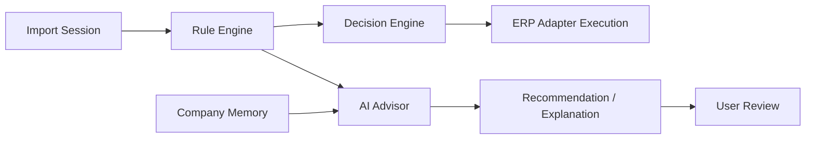

# AI Advisor

AI Advisor is the advisory intelligence layer for ICT IPP. It runs only after deterministic rules and never makes business decisions.

No AI runtime is currently implemented in this repository. This document defines the accepted boundary for future implementation.

## Accepted Decisions

- AI Advisor lives inside ICT IPP.
- AI never makes business decisions.
- AI produces recommendations only.
- AI runs only after the Rule Engine.
- AI uses local AI through Ollama.
- AI may be Company Memory aware.

## Position In The Flow

AI output may support user review, but it does not change the deterministic decision or execute an ERP action.

## Allowed AI Uses

AI Advisor may:

- summarize import-session status
- explain failed, warning, ambiguous, or missing rule outcomes
- recommend which fields a user should inspect
- suggest likely missing master data without creating it
- identify patterns from Company Memory
- draft human-readable comments for review logs
- flag unusual invoices for human attention

## Forbidden AI Uses

AI Advisor must not:

- choose workflow or strategy
- approve, reject, or block an import as the source of authority
- select a partner, product, tax, currency, or journal candidate
- override deterministic matching
- create, update, post, cancel, unlink, or reconcile ERP records
- call Uyumsoft or Odoo directly
- modify Company Memory without an approved workflow
- run before Rule Engine output exists

## Local Ollama Boundary

The accepted AI runtime is local Ollama. Future implementation must document:

- model name and version selection
- prompt templates
- context limits
- Company Memory retrieval rules
- output schema
- safety filters
- logging and redaction
- failure behavior when Ollama is unavailable

AI unavailability must not block deterministic workflows that do not require advisory output.

## Company Memory Awareness

Company Memory may provide historical context such as:

- known vendor aliases
- prior procurement relationships
- prior review decisions
- preferred traceability patterns
- common invoice anomalies

Company Memory is evidence, not authority. If memory conflicts with deterministic rules, deterministic rules win and the conflict should be reviewable.

## Required Output Shape

Future AI Advisor output should be structured:

- recommendation id
- source import session id
- referenced rule result ids
- recommendation type
- confidence label or qualitative strength
- explanation
- suggested human action
- memory references used
- explicit `advisory_only=true`

Free-form prose may be included for user readability, but the system must not depend on unstructured text to execute business decisions.

## Logging And Privacy

AI prompts, completions, and memory snippets must be treated as sensitive operational data. Do not log raw invoice XML, SOAP payloads, credentials, API keys, or full ERP payloads.

If AI output includes sensitive business data, store and display it only through approved import-session review surfaces.

## Related Documents

- [Rule Engine](RULE_ENGINE.md)
- [Company Memory](COMPANY_MEMORY.md)
- [AI Advisor ADR](adr/ADR-0006-ai-advisor.md)
