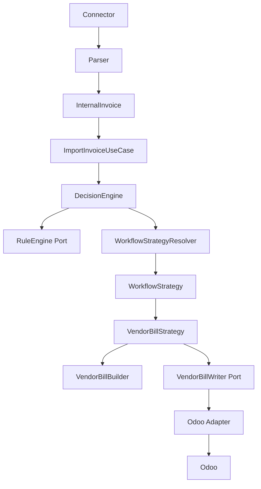
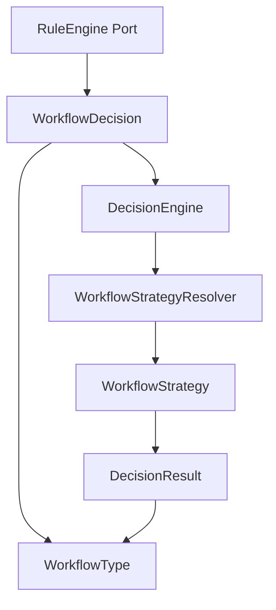
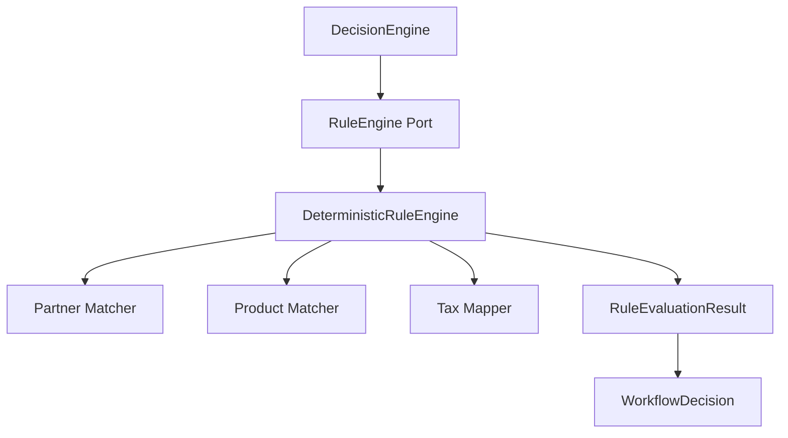
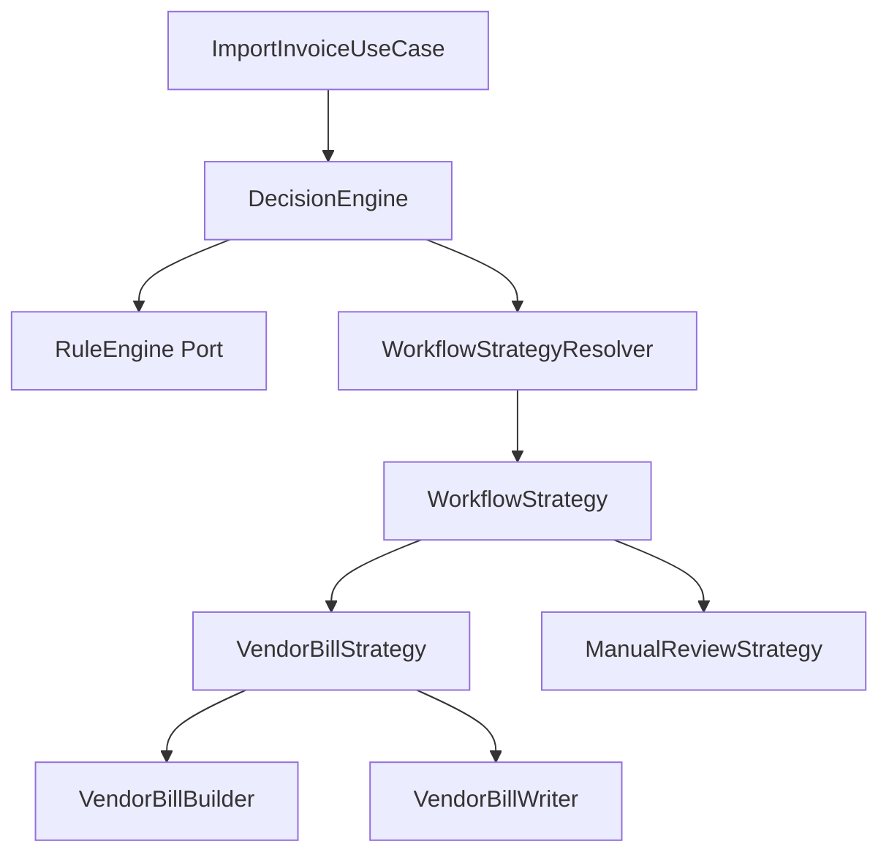
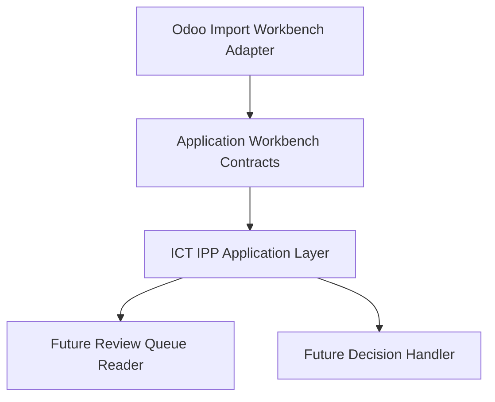
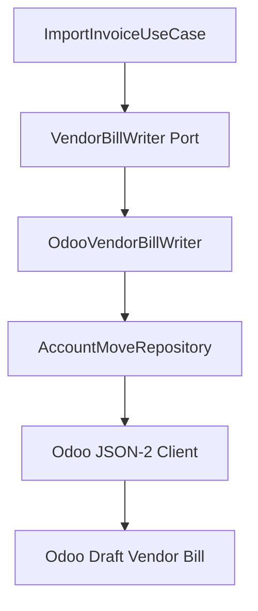
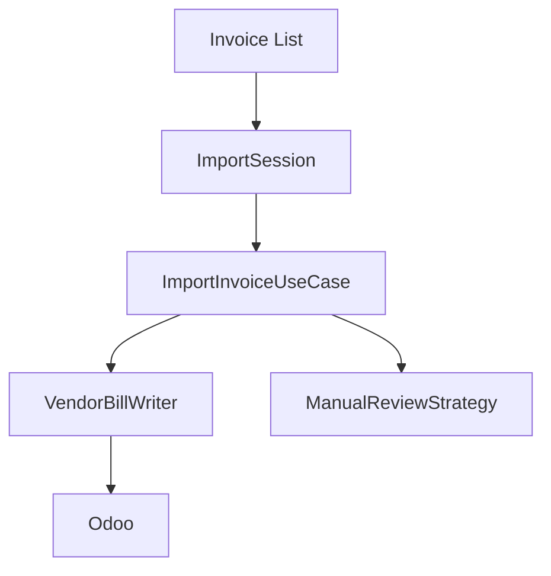

# Application Layer

The Application layer is the orchestration boundary for future ICT IPP use cases. It coordinates flow between API/service entry points, domain rules, domain builders, repository abstractions, and infrastructure ports.

This foundation does not implement business behavior. It establishes the project convention future workflows will use.

## Responsibility

Application layer coordinates.

Domain owns business rules.

Infrastructure owns external systems.

Adapters execute approved operations and contain no business logic.

## Package Structure

```text
app/application/
  commands/      immutable state-changing request DTOs
  queries/       immutable read request DTOs
  dto/           application flow result DTOs
  ports/         protocols implemented by infrastructure adapters
  services/      shared application service contracts
  use_cases/     executable workflow boundaries
  workbench/     Import Workbench application contracts
  exceptions/    application-safe exception base types
  rules/         deterministic RuleEngine implementations
  workflow.py    shared workflow vocabulary and decisions
```

Current foundation contracts:

- `ApplicationDTO`
- `Command`
- `Query`
- `UseCase`
- `ApplicationError`
- `UnitOfWork`
- `InvoiceImportHistory`
- `ImportInvoiceCommand`
- `ImportInvoiceResult`
- `ImportInvoiceUseCase`
- `DecisionEngine`
- `DecisionResult`
- `RuleEngine`
- `DeterministicRuleEngine`
- `WorkflowType`
- `WorkflowDecision`
- `ManualReviewDecision`
- `ManualReviewReason`
- `ManualReviewReasonCode`
- `WorkflowStrategyResolver`
- `WorkflowStrategy`
- `VendorBillStrategy`
- `ManualReviewStrategy`
- `VendorBillWriter`
- `VendorBillWriteCommand`
- `VendorBillWriteResult`
- `ImportSessionCommand`
- `ImportSessionResult`
- `ImportSession`
- `ReviewItem`
- `ReviewStatus`
- `ReviewQueueQuery`
- `ReviewDetailQuery`
- `ReviewQueueResult`
- `ReviewDecisionCommand`
- `ReviewDecisionAcknowledgement`
- `ReviewDecisionType`
- `LineResolution`
- `TaxResolution`
- `BusinessContextDecision`
- `ReviewQueueReader`

## Use Case Convention

Every future business workflow should be represented by a dedicated use case.

Examples:

- `ImportInvoiceUseCase`
- `DecisionEngine`
- `CreateVendorBillUseCase`
- `CreateRFQUseCase`
- `CreatePurchaseOrderUseCase`
- `ReviewInvoiceUseCase`

Use cases should:

- accept a command or query DTO
- call domain services, matching engines, builders, or validators
- invoke infrastructure through ports
- return immutable application DTOs
- keep provider transport, ORM, HTTP, and adapter code outside the use case

Current executable use cases:

- `ImportInvoiceUseCase`
- `ImportSession`

## ImportInvoiceUseCase

`ImportInvoiceUseCase` is the first executable ICT IPP application workflow. It coordinates one deterministic invoice import through the direct Vendor Bill path.

It may:

- validate the import request
- check duplicate import state through `InvoiceImportHistory`
- call `DecisionEngine`
- return immutable `ImportInvoiceResult`

It must not:

- contain SOAP, HTTP, SQL, Odoo JSON-2, or ORM code
- instantiate ERP adapters or provider clients
- implement Rule Engine, AI Advisor, Import Session, RFQ, Purchase Order, expense, asset, or subscription logic
- choose between workflows or strategies
- retry provider operations
- parse configuration or own logging framework behavior



## DecisionEngine

`DecisionEngine` is the application orchestration component responsible for selecting and executing one procurement workflow for a single imported invoice.

It:

- calls the deterministic `RuleEngine` port
- reads the canonical `WorkflowDecision` selected by the Rule Engine result
- resolves the workflow through `WorkflowStrategyResolver`
- executes the selected `WorkflowStrategy`
- returns immutable `DecisionResult`

It must not:

- evaluate rules
- contain matching logic
- contain workflow if/else trees
- call AI
- call ERP/provider clients
- build Vendor Bill DTOs directly
- know Odoo, SOAP, HTTP, SQL, or persistence details

Current implemented strategy:

- `VendorBillStrategy`
- `ManualReviewStrategy`

Future strategies such as RFQ, Purchase Order, expense, asset, subscription, and ignored-import strategies should be added by registering new `WorkflowStrategy` implementations without modifying `DecisionEngine`.

## Workflow Model

The shared Workflow Model is the canonical workflow vocabulary for the Decision Engine, Rule Engine, Workflow Strategies, and future AI Advisor recommendations.

Current contracts:

- `WorkflowType`: immutable enum values for `VENDOR_BILL`, `RFQ`, `EXPENSE`, `ASSET`, `SUBSCRIPTION`, and `MANUAL_REVIEW`
- `ManualReviewReasonCode`: canonical reason codes for deterministic business mismatches that require human review
- `ManualReviewReason`: immutable structured reason with safe display text, optional line/tax context, candidate count, source, and non-sensitive details
- `ManualReviewDecision`: immutable Manual Review payload containing one or more structured reasons
- `WorkflowDecision`: immutable Rule Engine workflow selection output containing the selected `WorkflowType`, matched rule reference, explanation, optional Manual Review payload, warnings, and errors

`RuleEvaluationResult` wraps `WorkflowDecision` and exposes the selected `WorkflowType` to `DecisionEngine`. `DecisionResult` also carries `WorkflowType`, so workflow identity remains stable across orchestration and result DTOs.

No component should introduce ad-hoc workflow string literals. New workflow implementations must add or reuse a `WorkflowType`, register a `WorkflowStrategy`, and keep workflow execution outside the model itself.



## DeterministicRuleEngine

`DeterministicRuleEngine` is the first concrete implementation of the `RuleEngine` application port.

It evaluates `RULE-DIRECT-VENDOR-BILL-001` for a single `ImportInvoiceCommand` by coordinating injected deterministic dependencies:

- supplier partner matcher
- product matcher
- tax mapper

It returns `RuleEvaluationResult` with an immutable `WorkflowDecision` selecting `WorkflowType.VENDOR_BILL` only when all supplier, product, and tax prerequisites are complete and deterministic.

It returns `WorkflowType.MANUAL_REVIEW` with structured `ManualReviewReason` values for deterministic business mismatches such as missing suppliers, ambiguous suppliers, missing products, ambiguous products, incomplete mappings, or unmapped taxes.

It still raises application-safe rule evaluation errors for technical/provider failures such as repository, mapper, transport, authorization, or unexpected dependency failures. Those failures are not converted into business review outcomes.

It must not:

- instantiate ERP adapters or provider clients
- call HTTP, SOAP, SQL, Odoo JSON-2, or persistence
- build Vendor Bills
- execute workflow strategies
- perform duplicate detection
- contain AI, fuzzy matching, or configurable rule storage





## ManualReviewStrategy

`ManualReviewStrategy` is the first non-writing workflow strategy. It returns a `DecisionResult` with `status="review_required"`, `review_required=True`, and the structured review reasons selected by the Rule Engine.

It must not:

- build or write Vendor Bills
- call ERP/provider clients
- perform matching, mapping, workflow selection, retries, persistence, or AI
- transform technical failures into review results

Manual Review is an application outcome for deterministic business mismatches only. It gives future Import Workbench and AI Advisor slices a stable, safe review contract without introducing UI, persistence, or ERP writes.

## Import Workbench Contracts

`app/application/workbench` defines the application-layer contract surface for a future Odoo Import Workbench adapter. This package contains immutable DTOs, queries, commands, safe validation errors, and a read-only review queue port.

Current contracts:

- `ReviewItem`: safe review-required invoice summary with `WorkflowType`, `ReviewStatus`, `ManualReviewReason` values, warnings, timestamps, and optimistic-concurrency `version`
- `ReviewStatus`: canonical review states: `PENDING_REVIEW`, `DECISION_SUBMITTED`, `RESOLVED`, and `DISMISSED`
- `ReviewQueueQuery`: bounded list query with exact supplier tax-number filtering and optional `WorkflowType` filtering
- `ReviewDetailQuery`: one-item query scoped by review id and company id
- `ReviewQueueResult`: immutable paginated result
- `ReviewDecisionCommand`: explicit user decision command with canonical decision type, expected version, user identity, idempotency key, optional selected workflow, explicit line/tax resolutions, and optional procurement traceability context
- `ReviewDecisionAcknowledgement`: immutable acknowledgement contract for a future command handler
- `ReviewQueueReader`: read-only port for future queue/detail adapters

These contracts do not implement Odoo UI, FastAPI routes, persistence, user approval writes, workflow execution, ERP writes, rule creation, AI recommendations, or fuzzy matching.



## Command And Query Convention

Commands represent state-changing requests.

Queries represent read-only requests.

This structure is CQRS-friendly, but it does not require separate infrastructure, handlers, queues, or buses. Those should be added only when a concrete workflow needs them.

## DTO Convention

Application DTOs coordinate application flow.

They are:

- immutable whenever practical
- explicit about state and safe messages
- independent of ORM models
- independent of API schemas
- independent of provider transport payloads

## Port Convention

Future infrastructure services must be accessed through application ports. Ports are protocols owned by `app/application/ports`; adapter implementations live outside the Application layer.

Examples:

- `VendorBillWriter`
- `InvoiceImportHistory`
- `InvoiceRepository`
- `CompanyRepository`
- `PartnerRepository`
- `ProductRepository`

Do not duplicate existing repository abstractions. Reuse `app/erp` repository protocols for ERP master-data reads where they already fit.

## Vendor Bill Write Direction

Future vendor bill write workflows should follow this dependency direction:

```text
Connector
  |
  v
Parser
  |
  v
InternalInvoice
  |
  v
Application Use Case
  |
  v
VendorBillBuilder
  |
  v
VendorBillWriter (Application Port)
  |
  v
Odoo Adapter
  |
  v
Odoo
```

`VendorBillStrategy` consumes `VendorBillWriter` through this port. The Odoo implementation lives outside the Application layer.

## Odoo Vendor Bill Writer

`OdooVendorBillWriter` is the production-safe infrastructure implementation of the `VendorBillWriter` application port.

It:

- accepts immutable `VendorBillWriteCommand`
- returns immutable `VendorBillWriteResult`
- defaults to dry-run behavior through the command
- requires explicit production operation gates before real draft creation
- checks for an existing Odoo Vendor Bill before creating one
- delegates account.move payload construction and JSON-2 calls to `AccountMoveRepository`
- creates only draft `account.move` records with `move_type=in_invoice`

It must not:

- post Vendor Bills
- register payments
- reconcile accounting entries
- delete records
- update partners, products, taxes, journals, or other master data
- choose workflows or strategies
- contain Rule Engine, Decision Engine, AI Advisor, or Import Session logic



The deterministic idempotency key is stored on the Odoo draft via `invoice_origin` and used for duplicate lookup before create. Duplicate detection remains part of the write boundary; it does not authorize workflow selection or matching decisions.

Infrastructure exceptions are translated to application-safe Vendor Bill write exceptions for authentication, authorization, validation, transport, duplicate detection, and unexpected ERP failures.

## ImportSession

`ImportSession` is the sequential in-memory orchestration layer for importing multiple `InternalInvoice` DTOs.

It coordinates already existing single-invoice processing by calling `ImportInvoiceUseCase` once per invoice. It does not select workflows, run rules, match products, build Vendor Bills, or call ERP adapters.

It may:

- accept a collection of `InternalInvoice` DTOs through `ImportSessionCommand`
- execute `ImportInvoiceUseCase` sequentially
- collect immutable `ImportInvoiceResult` values
- measure elapsed time
- count processed, successful, duplicate, review-required, and failed invoices
- continue processing when one invoice fails
- return immutable `ImportSessionResult`

It must not:

- contain Rule Engine, Decision Engine, AI Advisor, or Company Memory logic
- contain matching, tax mapping, Vendor Bill creation, ERP, HTTP, SOAP, SQL, retry, batching, scheduler, or workflow-selection logic
- import Odoo, Uyumsoft, connector, persistence, or infrastructure modules



`ImportSession` status is in-memory only. Current statuses are `CREATED`, `RUNNING`, `COMPLETED`, and `FAILED`; `CANCELLED` is reserved in the DTO status type for future explicit cancellation work.

## Boundaries

The Application layer must not import:

- `app.connectors`
- `app.models`
- `app.db`
- FastAPI
- SQLAlchemy
- httpx
- Zeep

It may depend inward on domain and ERP-independent DTOs such as `app.billing.VendorBill`.

## Related Documents

- [Project Constitution](PROJECT_CONSTITUTION.md)
- [Coding Standards](CODING_STANDARDS.md)
- [Development Workflow](DEVELOPMENT_WORKFLOW.md)
- [Workflows](WORKFLOWS.md)
