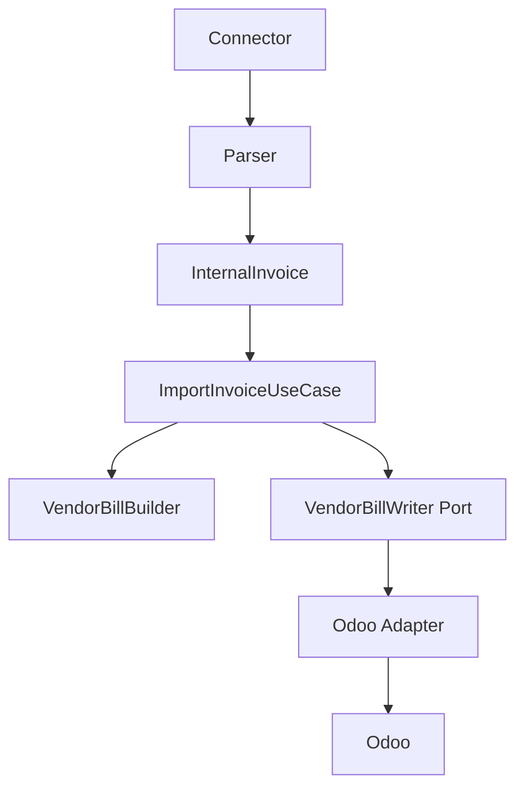

# Application Layer

The Application layer is the orchestration boundary for future ICT IPP use cases. It coordinates flow between API/service entry points, domain rules, domain builders, repository abstractions, and infrastructure ports.

This foundation does not implement business behavior. It establishes the project convention future workflows will use.

## Responsibility

Application layer coordinates.

Domain owns business rules.

Infrastructure owns external systems.

Adapters execute approved operations and contain no business logic.

## Package Structure

```text
app/application/
  commands/      immutable state-changing request DTOs
  queries/       immutable read request DTOs
  dto/           application flow result DTOs
  ports/         protocols implemented by infrastructure adapters
  services/      shared application service contracts
  use_cases/     executable workflow boundaries
  exceptions/    application-safe exception base types
```

Current foundation contracts:

- `ApplicationDTO`
- `Command`
- `Query`
- `UseCase`
- `ApplicationError`
- `UnitOfWork`
- `InvoiceImportHistory`
- `ImportInvoiceCommand`
- `ImportInvoiceResult`
- `ImportInvoiceUseCase`
- `VendorBillWriter`
- `VendorBillWriteCommand`
- `VendorBillWriteResult`

## Use Case Convention

Every future business workflow should be represented by a dedicated use case.

Examples:

- `ImportInvoiceUseCase`
- `CreateVendorBillUseCase`
- `CreateRFQUseCase`
- `CreatePurchaseOrderUseCase`
- `ReviewInvoiceUseCase`

Use cases should:

- accept a command or query DTO
- call domain services, matching engines, builders, or validators
- invoke infrastructure through ports
- return immutable application DTOs
- keep provider transport, ORM, HTTP, and adapter code outside the use case

Current executable use cases:

- `ImportInvoiceUseCase`

## ImportInvoiceUseCase

`ImportInvoiceUseCase` is the first executable ICT IPP application workflow. It coordinates one deterministic invoice import through the direct Vendor Bill path.

It may:

- validate the import request
- check duplicate import state through `InvoiceImportHistory`
- call deterministic supplier, product, and tax matching dependencies
- call `VendorBillBuilder`
- call `VendorBillWriter`
- return immutable `ImportInvoiceResult`

It must not:

- contain SOAP, HTTP, SQL, Odoo JSON-2, or ORM code
- instantiate ERP adapters or provider clients
- implement Rule Engine, Decision Engine, AI Advisor, Import Session, RFQ, Purchase Order, expense, asset, or subscription logic
- choose between workflows or strategies
- retry provider operations
- parse configuration or own logging framework behavior



## Command And Query Convention

Commands represent state-changing requests.

Queries represent read-only requests.

This structure is CQRS-friendly, but it does not require separate infrastructure, handlers, queues, or buses. Those should be added only when a concrete workflow needs them.

## DTO Convention

Application DTOs coordinate application flow.

They are:

- immutable whenever practical
- explicit about state and safe messages
- independent of ORM models
- independent of API schemas
- independent of provider transport payloads

## Port Convention

Future infrastructure services must be accessed through application ports. Ports are protocols owned by `app/application/ports`; adapter implementations live outside the Application layer.

Examples:

- `VendorBillWriter`
- `InvoiceImportHistory`
- `InvoiceRepository`
- `CompanyRepository`
- `PartnerRepository`
- `ProductRepository`

Do not duplicate existing repository abstractions. Reuse `app/erp` repository protocols for ERP master-data reads where they already fit.

## Vendor Bill Write Direction

Future vendor bill write workflows should follow this dependency direction:

```text
Connector
  |
  v
Parser
  |
  v
InternalInvoice
  |
  v
Application Use Case
  |
  v
VendorBillBuilder
  |
  v
VendorBillWriter (Application Port)
  |
  v
Odoo Adapter
  |
  v
Odoo
```

`ImportInvoiceUseCase` consumes `VendorBillWriter` through this port. It does not implement Vendor Bill Write Service, Odoo write behavior, production writes, import sessions, decision logic, rules, AI, or company memory.

## Boundaries

The Application layer must not import:

- `app.connectors`
- `app.models`
- `app.db`
- FastAPI
- SQLAlchemy
- httpx
- Zeep

It may depend inward on domain and ERP-independent DTOs such as `app.billing.VendorBill`.

## Related Documents

- [Project Constitution](PROJECT_CONSTITUTION.md)
- [Coding Standards](CODING_STANDARDS.md)
- [Development Workflow](DEVELOPMENT_WORKFLOW.md)
- [Workflows](WORKFLOWS.md)
