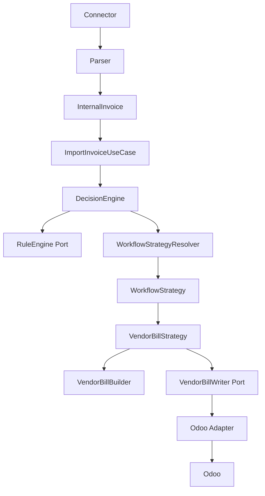
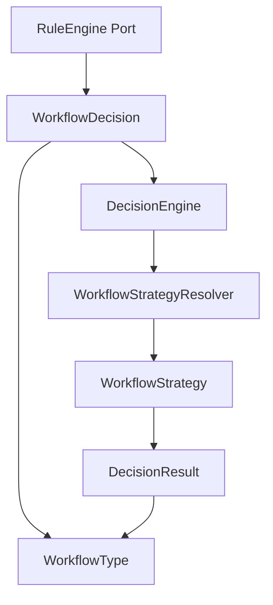
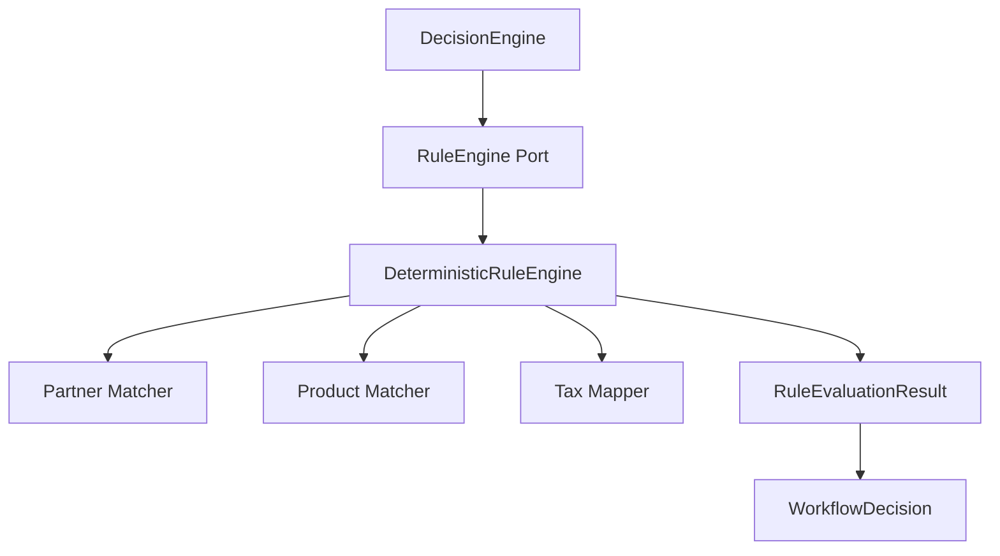
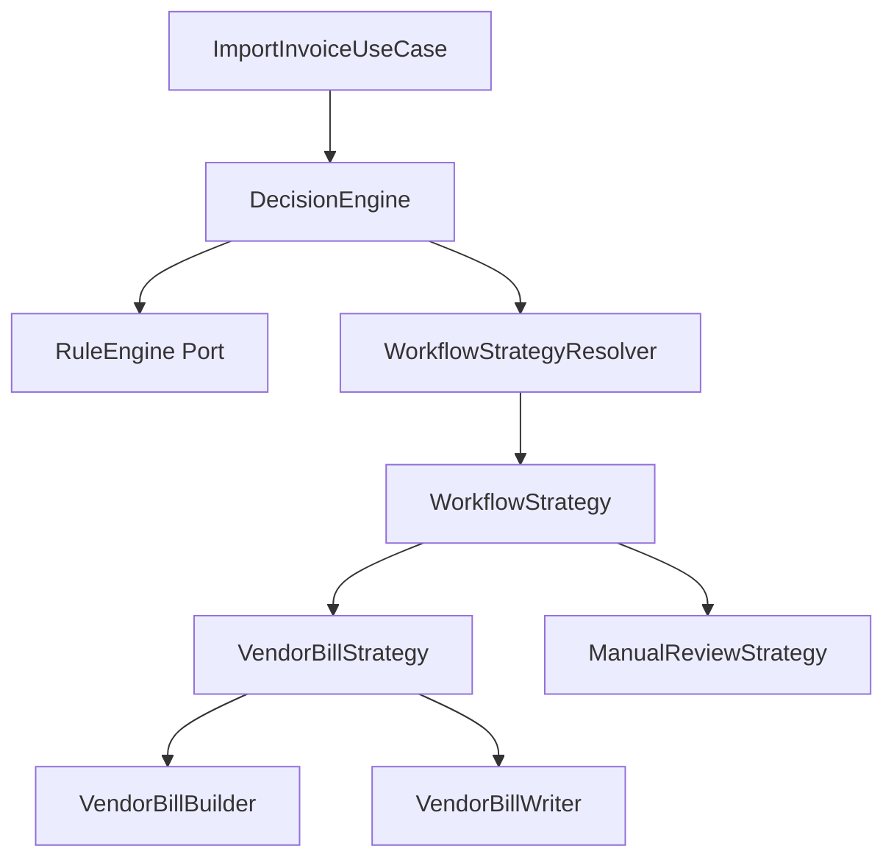
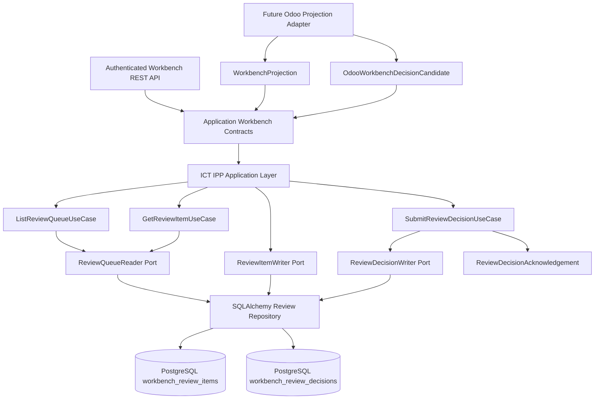
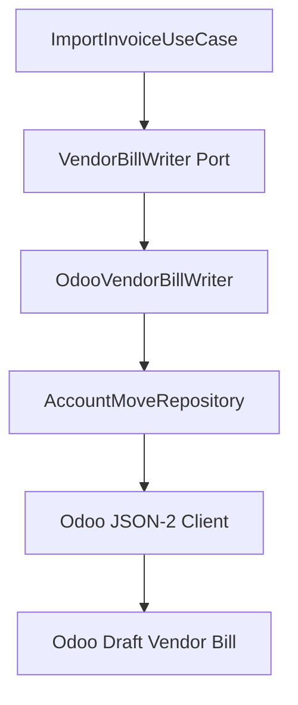
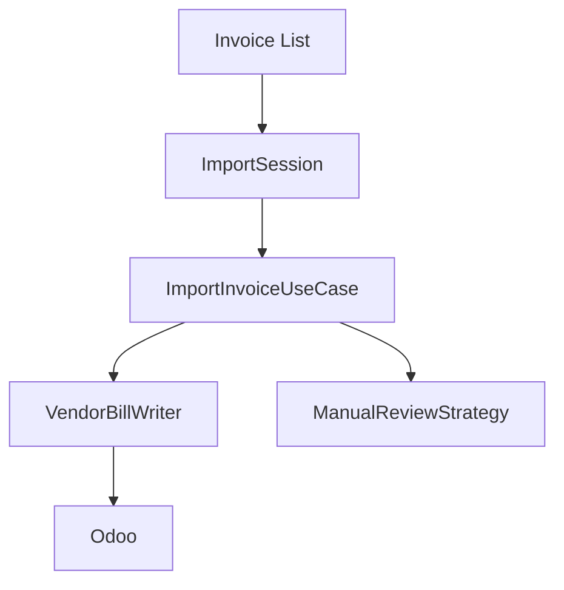

# Application Layer

The Application layer is the orchestration boundary for future ICT IPP use cases. It coordinates flow between API/service entry points, domain rules, domain builders, repository abstractions, and infrastructure ports.

This foundation does not implement business behavior. It establishes the project convention future workflows will use.

API authentication and request metadata are outside the Application layer. Future route adapters must resolve `RequestContext` at the API boundary and use it to populate company and user identity fields before constructing application commands or queries.

## Responsibility

Application layer coordinates.

Domain owns business rules.

Infrastructure owns external systems.

Adapters execute approved operations and contain no business logic.

## Package Structure

```text
app/application/
  commands/      immutable state-changing request DTOs
  queries/       immutable read request DTOs
  dto/           application flow result DTOs
  ports/         protocols implemented by infrastructure adapters
  services/      shared application service contracts
  use_cases/     executable workflow boundaries
  workbench/     Import Workbench application contracts
  exceptions/    application-safe exception base types
  rules/         deterministic RuleEngine implementations
  workflow.py    shared workflow vocabulary and decisions
```

Current foundation contracts:

- `ApplicationDTO`
- `Command`
- `Query`
- `UseCase`
- `ApplicationError`
- `UnitOfWork`
- `InvoiceImportHistory`
- `ImportInvoiceCommand`
- `ImportInvoiceResult`
- `ImportInvoiceUseCase`
- `DecisionEngine`
- `DecisionResult`
- `RuleEngine`
- `DeterministicRuleEngine`
- `WorkflowType`
- `WorkflowDecision`
- `ManualReviewDecision`
- `ManualReviewReason`
- `ManualReviewReasonCode`
- `WorkflowStrategyResolver`
- `WorkflowStrategy`
- `VendorBillStrategy`
- `ManualReviewStrategy`
- `VendorBillWriter`
- `VendorBillWriteCommand`
- `VendorBillWriteResult`
- `ImportSessionCommand`
- `ImportSessionResult`
- `ImportSession`
- `ReviewItem`
- `ReviewStatus`
- `ReviewQueueQuery`
- `ReviewDetailQuery`
- `ReviewQueueResult`
- `ReviewDecisionCommand`
- `ReviewDecisionAcknowledgement`
- `ReviewDecisionType`
- `LineResolution`
- `TaxResolution`
- `BusinessContextDecision`
- `BusinessContextAllocationType`
- `AllocationCompleteness`
- `BusinessContextAllocation`
- `BusinessContextAllocationSet`
- `SubmitOdooWorkbenchCandidateCommand`
- `OdooWorkbenchSubmissionResult`
- `OdooWorkbenchSubmissionStatus`
- `WorkbenchErpReferenceValidator`
- focused Workbench ERP reference DTOs and read-only repository ports
- `ExecutionRequest`
- `ExecutionPlan`
- `ExecutionStep`
- `ExecutionArtifact`
- `ExecutionArtifactType`
- `ExecutionResult`
- `ExecutionPlanner`
- `ExecutionCoordinator`
- `ExecutionStrategyResolver`
- `ExecutionStateRepository`
- `ExecutionRuntime`
- `ExecutionSnapshot`
- `ExecutionEvent`
- `ExecutionCheckpoint`
- `ExecutionRetryPolicy`
- `ExecutionRuntimeService`
- `ExecutionRuntimeCoordinator`
- `ExecutionApproval`
- `ExecutionSourceInvoice`
- `ExecutionSourceInvoiceReader`
- `ReviewExecutionBillingEvidence`
- `ReviewBillingEvidenceReader`
- `VendorBillExecutionStrategy`
- `RunAcceptedDecisionExecutionCommand`
- `RunAcceptedDecisionExecutionUseCase`
- `AcceptedDecisionExecutionResult`
- runtime repository, event history, and retry policy ports
- `ReviewQueueReader`
- `ReviewDecisionWriter`
- `ListReviewQueueUseCase`
- `GetReviewItemUseCase`
- `SubmitReviewDecisionUseCase`
- `SubmitOdooWorkbenchCandidateUseCase`
- `RunAcceptedDecisionExecutionUseCase`

## Use Case Convention

Every future business workflow should be represented by a dedicated use case.

Examples:

- `ImportInvoiceUseCase`
- `DecisionEngine`
- `CreateVendorBillUseCase`
- `CreateRFQUseCase`
- `CreatePurchaseOrderUseCase`
- `ReviewInvoiceUseCase`

Use cases should:

- accept a command or query DTO
- call domain services, matching engines, builders, or validators
- invoke infrastructure through ports
- return immutable application DTOs
- keep provider transport, ORM, HTTP, and adapter code outside the use case

Current executable use cases:

- `ImportInvoiceUseCase`
- `ImportSession`
- `ListReviewQueueUseCase`
- `GetReviewItemUseCase`
- `SubmitReviewDecisionUseCase`
- `SubmitOdooWorkbenchCandidateUseCase`

## Odoo Decision Rule Authoring

Odoo is the only business UI for Invoice Decision Rule configuration. Hub does not provide an editable rule UI and does not store editable business rules.

`OdooDecisionRuleFieldMapping` centralizes the Studio field names for the documented `IPP Decision Rule` model (`x_ipp_decision_rule`). Application services and future adapters must not scatter `x_studio_*` field names.

`OdooDecisionRuleAuthoringRecord` is the immutable mapping contract for one already-read, normalized Odoo rule row. It maps to the canonical `InvoiceDecisionRule`, `InvoiceDecisionRuleMatch`, `InvoiceDecisionRuleAction`, and `InvoiceDecisionRulePriority` contracts. It is not an Odoo reader and does not expose raw Odoo dictionaries.

`DecisionRuleRepository` is the application port for future read-only adapters:

```text
list_invoice_decision_rules(company_id=...) -> tuple[InvoiceDecisionRule, ...]
```

The port returns only canonical immutable rule contracts. It does not persist, write, cache, evaluate, expose Odoo payloads, or depend on SQLAlchemy, Odoo transport, XML-RPC, JSON-RPC, AI, fuzzy matching, or rule execution.

`OdooDecisionRuleRepository` implements this port in infrastructure. It reads active `IPP Decision Rule` rows for the requested company plus shared rows with no company, consumes Many2one values by exact ERP ID, resolves currency codes through read-only ERP reference data, maps workflow from stored selection values into closed `WorkflowType`, rejects duplicate rule code/version pairs, and returns deterministically ordered `InvoiceDecisionRule` contracts. It ignores Odoo display labels and never exposes raw Odoo dictionaries to the application layer.

The infrastructure adapter boundary is:

```text
Odoo read
  -> raw adapter data
  -> Odoo mapper
  -> OdooDecisionRuleAuthoringRecord
  -> InvoiceDecisionRule
```

The repository remains orchestration-focused: build the deterministic company/shared Odoo domain, call the read-only adapter, delegate mapping, validate duplicate identities, and order the canonical rules. Raw row parsing and currency resolution stay inside the Odoo infrastructure mapper, not in application/domain contracts.

The adapter remains read-only configuration ingestion. It does not evaluate rules, classify invoices, call Workbench services, touch runtime execution, mutate Odoo, call providers, use SQLAlchemy, use AI, or use fuzzy matching.

## Odoo Workbench Decision Submission

`SubmitOdooWorkbenchCandidateUseCase` connects the read-only Odoo Workbench candidate reader port to the existing Hub decision submission use case:

```text
Odoo candidate
  -> WorkbenchDecisionCandidateReader
  -> OdooWorkbenchDecisionCandidate
  -> SubmitOdooWorkbenchCandidateUseCase
  -> WorkbenchErpReferenceValidator
  -> ReviewDecisionCommand
  -> SubmitReviewDecisionUseCase
  -> append-only Hub decision evidence
```

The use case depends only on `WorkbenchDecisionCandidateReader`, `WorkbenchErpReferenceValidator`, and `SubmitReviewDecisionUseCase`. It does not know Odoo JSON-2 details, Studio field names, SQLAlchemy, HTTP, provider credentials, or Odoo model names.

The requested `company_id` is the authoritative execution scope. A candidate whose company differs from the requested company is rejected with a safe application error and is never submitted. The candidate's `expected_version`, `idempotency_key`, selected workflow, selected partner, line resolutions, tax resolutions, business context allocation set, comment, and Odoo user audit identity are copied into the canonical `ReviewDecisionCommand`. The allocation set object is passed through as immutable evidence; it is not serialized and parsed again.

`WorkbenchCandidateNotFoundError` and not-ready candidates produce `OdooWorkbenchSubmissionStatus.NOT_READY_OR_NOT_FOUND` without submission. Stale versions, idempotency conflicts, malformed decisions, ambiguity, provider read failures, and submission failures are not retried by the orchestrator.

This application service remains Odoo read -> ERP reference read validation -> Hub submit only. It does not acknowledge the projection, modify Odoo, execute workflows, create Vendor Bills, create customer invoices, create RFQs or Purchase Orders, post profitability, infer decisions, infer allocations, cache validation results, persist validation snapshots, or use AI/fuzzy matching.

## Workbench ERP Reference Validation

`WorkbenchErpReferenceValidator` validates supplied allocation references before authoritative Hub decision persistence. It is an application-layer service backed by focused read-only repository ports for Partners, Companies, Sales Orders, Sales Order Lines, Purchase Orders, Customer Invoices, Opportunities, and Analytic Accounts.

Validation is exact-ID and deterministic. It does not use names, display labels, fuzzy matching, AI, automatic correction, or fallback inference. Repositories may batch unique IDs per reference type; the current validator deduplicates IDs before calling each port.

Policy:

- `res.partner` references may be shared; `company_id=None` is accepted, while an explicit different company is rejected.
- `target_company_id` must exist but never changes requested company scope or authorizes intercompany execution.
- Sales Orders and Purchase Orders must exist and belong to requested `company_id`.
- Sales Order customer consistency is exact partner ID only in this PR.
- Customer Invoice references must be `account.move` records with `move_type` `out_invoice` or `out_refund`, requested company scope, and partner consistency with `recharge_partner_id` when supplied, otherwise `customer_id`.
- Opportunities must exist, match requested company when company is set, and match `customer_id` when both carry partner IDs.
- Analytic Accounts may be shared when `company_id` is empty; explicit different companies are rejected.
- Non-null Project and Subscription references fail safely as unsupported until exact model/repository support is introduced.

## Workflow Execution Foundation

Workflow execution starts from an accepted Hub Workbench decision, never from a raw Odoo candidate. The foundation introduces immutable execution identity, execution plans, execution-step results, strategy contracts, deterministic idempotency, durable runtime state, checkpoints, and append-only events.

The execution foundation is separate from import-time `DecisionEngine` strategy selection. `WorkflowType` remains the review-level decision vocabulary; `BusinessContextAllocationType` maps to per-allocation execution purposes.

The planner performs no repository calls, provider calls, persistence, or writes. It creates stable ordered `ExecutionStep` values and adds a separate `VENDOR_BILL` step when `selected_workflow == WorkflowType.VENDOR_BILL`. Real `VendorBillWriter` invocation is deferred.

`ExecutionRuntimeService` creates or loads a durable runtime snapshot from an execution plan. `ExecutionRuntimeCoordinator` runs steps sequentially through execution-specific strategies and delegates each state-changing transition to the runtime repository. The application layer emits immutable event drafts only; event sequence allocation, SQL transaction boundaries, checkpoint `last_event_id` updates, and optimistic runtime-version checks are owned by persistence adapters. `DRY_RUN` mode remains no-write unless an execution strategy explicitly routes to a writer in dry-run mode. `EXECUTE` mode is allowed only after planning, after explicit approval is supplied, after production execution is enabled, after writer approval gates pass, and after every planned step resolves to a strategy that supports `EXECUTE`.

The application layer has no independent snapshot, checkpoint, or event mutation API. Runtime mutations are only legal through atomic execution creation or `persist_transition`.

`RunAcceptedDecisionExecutionUseCase` reads exactly one accepted Hub decision by `review_id`, `company_id`, and decision version, derives a deterministic `execution_id` separately from execution idempotency, plans through `ExecutionPlanner`, creates or loads the runtime idempotently from the planner-owned `ExecutionPlan.idempotency_key`, and runs steps through the configured strategy resolver. `DISMISS` decisions return `NOT_EXECUTABLE` without creating runtime rows. For `EXECUTE`, `ExecutionApproval.approved_by` is required; Workbench `decided_by`, Odoo user identity, and projection audit fields are not execution approval.

`VendorBillExecutionStrategy` is the production-capable write strategy for Draft Vendor Bills. It supports `ExecutionStepType.VENDOR_BILL` only, reads authoritative source invoice and deterministic matching evidence through `ExecutionSourceInvoiceReader`, builds with `VendorBillBuilder`, and writes only through the `VendorBillWriter` port. It does not import SQLAlchemy, Odoo repositories, provider connectors, Workbench free-form payloads, or ERP adapter classes.

`CustomerRechargeExecutionStrategy` is the no-write strategy for `ExecutionStepType.CUSTOMER_RECHARGE` allocations that already reference existing outgoing customer invoices through `customer_invoice_id`. It consumes immutable accepted allocation evidence only, does not call Odoo or SQLAlchemy, returns one deduplicated `CUSTOMER_INVOICE` artifact per distinct `customer_invoice_id`, and always sets `created=false`. Successful execution means the recharge allocation has been associated with already-validated customer invoice evidence; it does not mean a customer invoice was created, posted, paid, collected, or settled.

`CustomerInvoiceExecutionStrategy` is the write-capable strategy for `ExecutionStepType.CUSTOMER_RECHARGE` allocations where `customer_invoice_id` is absent. It is reached only through the Customer Recharge router, reads immutable source evidence through `ExecutionSourceInvoiceReader`, builds with `CustomerInvoiceBuilder`, writes only through `CustomerInvoiceWriter`, and returns `CUSTOMER_INVOICE` artifacts for draft Odoo `account.move` invoices only when explicit accepted `CustomerInvoiceBillingInstruction` evidence is present on the execution step. It must not handle allocations that already reference an invoice, infer customer price from cost allocation amounts, infer sales tax from purchase tax evidence, post invoices, register payments, reconcile, settle collections, mutate Sales Orders, write analytics, call providers, rematch, use fuzzy matching, or use AI.

`ReviewExecutionBillingEvidence` is the application-layer contract for immutable Stage 1 customer billing terms pinned to one Workbench review version. It wraps canonical `CustomerInvoiceBillingInstruction` values and is intentionally separate from `BusinessContextAllocation`, which continues to represent vendor/source cost allocation and traceability context only. Customer Invoice pricing, quantity, outgoing product, customer, currency, and sales taxes may come only from billing evidence; they must never be inferred from allocation amount, allocation percentage, incoming purchase tax mapping, vendor product matches, display text, current ERP prices, AI, or fuzzy logic. `ReviewBillingEvidenceReader` exposes exact review/company/version reads for that evidence without SQLAlchemy leaking into the application layer.

`WorkbenchBillingAuthoringRow` is the pre-decision application contract for Odoo-authored Customer Invoice billing lines. `CaptureOdooWorkbenchBillingEvidenceUseCase` reads the current Hub review, the exact decision-ready Workbench candidate, and the Odoo billing child rows through ports, validates review/company/version alignment, validates exact creation-mode `CUSTOMER_RECHARGE` allocation coverage, validates ERP references through exact read-only repositories, and persists immutable Stage 1 billing evidence. Odoo currency authoring carries the exact `res.currency` Many2one id only; `WorkbenchBillingReferenceValidator` resolves the canonical ISO code from `CurrencyReferenceRepository` by exact id before building `CustomerInvoiceBillingInstruction`. Odoo display labels, localized labels, and relation tuple text are never authoritative. The use case does not call Odoo writers, Uyumsoft, providers, AI, fuzzy matching, rematching, pricelists, current sales-price lookup, or Hub UI code.

Accepted Customer Invoice creation evidence is Stage 2 billing evidence in `execution_customer_billing_evidence`. `SubmitReviewDecisionUseCase` reads the complete Stage 1 set for `(review_id, company_id, expected_version)`, validates that it covers exactly the creation-mode `CUSTOMER_RECHARGE` allocations, and the SQLAlchemy review repository persists the accepted decision, execution source evidence, and accepted billing evidence in one Hub transaction. The accepted decision version is `expected_version + 1`. `RunAcceptedDecisionExecutionUseCase` and `ExecutionPlanner` consume only Stage 2 accepted billing evidence through `AcceptedBillingEvidenceReader`; execution does not read Stage 1 billing rows.

Odoo Workbench billing authoring is the authoritative Stage 1 capture source for Customer Invoice creation terms. Missing, malformed, stale, cross-company, incomplete, duplicated, inferred, or ERP-reference-invalid billing rows fail closed before accepted decision persistence, Stage 2 pinning, runtime creation, or writer calls. Replays are idempotent only when the complete Stage 1 persisted evidence set and incoming authored set have identical canonical fingerprints; conflicts never overwrite or delete historical evidence.

`ExecutionArtifact` is the canonical application-layer representation of ERP objects produced by execution. Vendor Bill and Customer Invoice execution both use it. Future strategies should return typed artifacts through `ExecutionStepResult.produced_artifacts` instead of introducing generic string reference lists or step-specific result fields.

`SqlAlchemyExecutionSourceInvoiceReader` implements `ExecutionSourceInvoiceReader` in persistence. It loads one exact evidence snapshot by accepted `review_id`, `company_id`, `decision_version`, and decision id from `execution_source_invoice_evidence`, then hydrates immutable `InternalInvoice`, `PartnerMatchResult`, `InvoiceProductMatchResult`, and `InvoiceTaxMappingResult` values. It does not call Odoo, call Uyumsoft, read current ERP master data, rerun supplier/product/tax matching, parse Workbench display text, or use AI/fuzzy logic.

Execution source evidence is version-pinned. A later Workbench review version does not change the source returned for an older accepted decision. Missing, malformed, cross-company, or ambiguous source evidence fails closed with safe execution-source errors. Production Vendor Bill execute wiring remains disabled unless this full evidence snapshot is available.

Production composition is owned outside the application layer. `app/composition/execution.py` wires `SqlAlchemyExecutionSourceInvoiceReader`, `ExecutionPlanner`, `SqlAlchemyExecutionRuntimeRepository`, `ExecutionRuntimeService`, `ExecutionRuntimeCoordinator`, `VendorBillExecutionStrategy`, `CustomerRechargeExecutionRouter`, `CustomerRechargeExecutionStrategy`, `CustomerInvoiceExecutionStrategy`, `VendorBillBuilder`, `CustomerInvoiceBuilder`, writer ports, `AccountMoveRepository`, and Odoo writers without application services instantiating SQLAlchemy or Odoo infrastructure directly.

SQLAlchemy persistence is implemented by runtime repositories for `workflow_executions`, `workflow_execution_steps`, and `workflow_execution_events`. Runtime rows carry `runtime_version` for stale-transition rejection and `next_event_sequence` for monotonic event ordering. Runtime recovery for Vendor Bill and Customer Invoice execution uses the persisted runtime state plus deterministic writer idempotency plus Odoo duplicate lookup. It does not introduce distributed transactions, distributed locks, background workers, or retry schedulers. Background workers, distributed locks, posting, payment, reconciliation, and provider execution beyond draft Odoo document writing remain out of scope.

## ImportInvoiceUseCase

`ImportInvoiceUseCase` is the first executable ICT IPP application workflow. It coordinates one deterministic invoice import through the direct Vendor Bill path.

It may:

- validate the import request
- check duplicate import state through `InvoiceImportHistory`
- call `DecisionEngine`
- return immutable `ImportInvoiceResult`

It must not:

- contain SOAP, HTTP, SQL, Odoo JSON-2, or ORM code
- instantiate ERP adapters or provider clients
- implement Rule Engine, AI Advisor, Import Session, RFQ, Purchase Order, expense, asset, or subscription logic
- choose between workflows or strategies
- retry provider operations
- parse configuration or own logging framework behavior



## DecisionEngine

`DecisionEngine` is the application orchestration component responsible for selecting and executing one procurement workflow for a single imported invoice.

It:

- calls the deterministic `RuleEngine` port
- reads the canonical `WorkflowDecision` selected by the Rule Engine result
- resolves the workflow through `WorkflowStrategyResolver`
- executes the selected `WorkflowStrategy`
- returns immutable `DecisionResult`

It must not:

- evaluate rules
- contain matching logic
- contain workflow if/else trees
- call AI
- call ERP/provider clients
- build Vendor Bill DTOs directly
- know Odoo, SOAP, HTTP, SQL, or persistence details

Current implemented strategy:

- `VendorBillStrategy`
- `ManualReviewStrategy`

Future strategies such as RFQ, Purchase Order, expense, asset, subscription, and ignored-import strategies should be added by registering new `WorkflowStrategy` implementations without modifying `DecisionEngine`.

## Workflow Model

The shared Workflow Model is the canonical workflow vocabulary for the Decision Engine, Rule Engine, Workflow Strategies, and future AI Advisor recommendations.

Current contracts:

- `WorkflowType`: immutable enum values for `VENDOR_BILL`, `RFQ`, `EXPENSE`, `ASSET`, `SUBSCRIPTION`, and `MANUAL_REVIEW`
- `ManualReviewReasonCode`: canonical reason codes for deterministic business mismatches that require human review
- `ManualReviewReason`: immutable structured reason with safe display text, optional line/tax context, candidate count, source, and non-sensitive details
- `ManualReviewDecision`: immutable Manual Review payload containing one or more structured reasons
- `WorkflowDecision`: immutable Rule Engine workflow selection output containing the selected `WorkflowType`, matched rule reference, explanation, optional Manual Review payload, warnings, and errors

`RuleEvaluationResult` wraps `WorkflowDecision` and exposes the selected `WorkflowType` to `DecisionEngine`. `DecisionResult` also carries `WorkflowType`, so workflow identity remains stable across orchestration and result DTOs.

No component should introduce ad-hoc workflow string literals. New workflow implementations must add or reuse a `WorkflowType`, register a `WorkflowStrategy`, and keep workflow execution outside the model itself.



## DeterministicRuleEngine

`DeterministicRuleEngine` is the first concrete implementation of the `RuleEngine` application port.

It evaluates `RULE-DIRECT-VENDOR-BILL-001` for a single `ImportInvoiceCommand` by coordinating injected deterministic dependencies:

- supplier partner matcher
- product matcher
- tax mapper

It returns `RuleEvaluationResult` with an immutable `WorkflowDecision` selecting `WorkflowType.VENDOR_BILL` only when all supplier, product, and tax prerequisites are complete and deterministic.

It returns `WorkflowType.MANUAL_REVIEW` with structured `ManualReviewReason` values for deterministic business mismatches such as missing suppliers, ambiguous suppliers, missing products, ambiguous products, incomplete mappings, or unmapped taxes.

It still raises application-safe rule evaluation errors for technical/provider failures such as repository, mapper, transport, authorization, or unexpected dependency failures. Those failures are not converted into business review outcomes.

It must not:

- instantiate ERP adapters or provider clients
- call HTTP, SOAP, SQL, Odoo JSON-2, or persistence
- build Vendor Bills
- execute workflow strategies
- perform duplicate detection
- contain AI, fuzzy matching, or configurable rule storage





## ManualReviewStrategy

`ManualReviewStrategy` is the first non-writing workflow strategy. It returns a `DecisionResult` with `status="review_required"`, `review_required=True`, and the structured review reasons selected by the Rule Engine.

It must not:

- build or write Vendor Bills
- call ERP/provider clients
- perform matching, mapping, workflow selection, retries, persistence, or AI
- transform technical failures into review results

Manual Review is an application outcome for deterministic business mismatches only. It gives future Import Workbench and AI Advisor slices a stable, safe review contract without introducing UI, persistence, or ERP writes.

## Import Workbench Contracts

`app/application/workbench` defines the application-layer contract surface for direct Hub Workbench API adapters and the future Odoo Online Studio projection synchronization. This package contains immutable DTOs, queries, commands, safe validation errors, a read-only review queue port, an evidence-aware review item writer port, a focused decision submission writer port, projection DTOs, projection ports, and small use-case/service boundaries.

Current contracts:

- `ReviewItem`: safe review-required invoice summary with `WorkflowType`, `ReviewStatus`, `ManualReviewReason` values, warnings, timestamps, and optimistic-concurrency `version`
- `ReviewStatus`: canonical review states: `PENDING_REVIEW`, `DECISION_SUBMITTED`, `RESOLVED`, and `DISMISSED`
- `ReviewQueueQuery`: bounded list query with exact supplier tax-number filtering and optional `WorkflowType` filtering
- `ReviewDetailQuery`: one-item query scoped by review id and company id
- `ReviewQueueResult`: immutable paginated result
- `ReviewDecisionType`: canonical explicit user decisions: `SELECT_WORKFLOW` and `DISMISS`
- `ReviewDecisionCommand`: explicit user decision command with canonical decision type, expected version, user identity, idempotency key, optional selected workflow, explicit line/tax resolutions, and optional `BusinessContextAllocationSet`
- `BusinessContextDecision`: legacy single-context procurement traceability evidence type retained only for historical compatibility
- `BusinessContextAllocationType`: canonical allocation purpose vocabulary for multi-allocation decisions
- `AllocationCompleteness`: explicit `COMPLETE` or `PARTIAL` allocation-set intent
- `BusinessContextAllocation`: immutable ERP-neutral allocation line with amount and/or percentage, commercial customer, recharge recipient, optional existing customer invoice, target company, Sales Order, Purchase Order, project, analytic account, and cost-purpose context
- `BusinessContextAllocationSet`: immutable aggregate that validates unique allocation keys, currency consistency, and complete or partial amount/percentage reconciliation
- `ReviewDecisionAcknowledgement`: immutable acknowledgement contract for a future command handler
- `ReviewExecutionEvidence`: immutable pre-decision evidence pinned to the current Workbench review version, carrying the normalized `InternalInvoice`, supplier match, product match, and tax mapping result
- `ReviewQueueReader`: read-only port for future queue/detail adapters
- `ReviewItemWriter`: port for idempotent pending review item creation, with a focused atomic creation method for Vendor Bill-capable reviews that persists pre-decision execution evidence in the same repository transaction
- `ReviewDecisionWriter`: decision submission port for optimistic, idempotent user decisions
- `ReviewItemCreationService`: application service that delegates pending review item creation to the writer port
- `ListReviewQueueUseCase`: application boundary that delegates `ReviewQueueQuery` to `ReviewQueueReader.list_review_items`
- `GetReviewItemUseCase`: application boundary that delegates `ReviewDetailQuery` to `ReviewQueueReader.get_review_item`
- `SubmitReviewDecisionUseCase`: application boundary that delegates `ReviewDecisionCommand` to `ReviewDecisionWriter.submit_review_decision`
- `WorkbenchProjection`: ERP-neutral projection of one Hub-owned review item for future Odoo Studio display
- `OdooWorkbenchDecisionCandidate`: candidate decision read from the future Odoo Studio projection before Hub acceptance
- `ProjectionPublishResult`: immutable result for future projection publish and acknowledgement operations
- `WorkbenchProjectionPublisher`: port for future projection publishing and acknowledgement writes
- `WorkbenchDecisionCandidateReader`: port for ready-decision reads from an ERP UI projection surface
- `OdooWorkbenchDecisionCandidateReader`: read-only Odoo JSON-2 adapter for configured Studio projection candidate and allocation child models

The current infrastructure provides a SQLAlchemy repository behind these ports for durable PostgreSQL-backed review item creation, queue/detail reads, explicit review decision submission, and pre-decision execution evidence persistence. It persists structured `ManualReviewReason` values as controlled JSON, stores optimistic-concurrency metadata through `version`, stores `total_amount` as `Numeric(24, 6)`, scopes detail reads by `review_id` plus `company_id`, and records submitted decisions in append-only audit rows.

Pre-decision execution evidence is Stage 1 of the execution evidence model. `workbench_review_execution_evidence` stores one immutable row for `(company_id, review_id, review_version)` before a review is exposed for human decision. The row uses `review_version == ReviewItem.version`, which is the later `ReviewDecisionCommand.expected_version`; accepted Stage 2 evidence maps that review evidence to decision version `expected_version + 1`.

Stage 1 evidence is sourced only from already-created immutable import and deterministic matching DTOs. It does not call Odoo, call Uyumsoft, refresh current ERP master data, rerun supplier/product/tax matching, parse Workbench display text, use AI, or infer missing fields. Replaying the same review version with identical evidence is idempotent; replaying with different evidence fails closed. Historical review-version evidence is never updated in place.

`ReviewDecisionCommand` now accepts `business_context_allocations: BusinessContextAllocationSet | None` and no longer accepts the legacy `business_context` field. New decision rows write allocation evidence to `business_context_allocations` JSON and leave legacy `business_context` empty. Existing historical rows with no allocation payload remain readable; historical rows with legacy `business_context` preserve that legacy object as evidence and are not rewritten or converted into fabricated allocation amounts.

Allocation validation is structural and deterministic only:

- allocation keys are required and unique inside a set
- source invoice lines may appear in multiple allocations
- amount and percentage values use finite `Decimal` values without float conversion
- values preserve the current Workbench monetary precision boundary of 24 total digits and 6 fractional digits
- `COMPLETE` allocation sets must reconcile fully by amount or percentage
- `PARTIAL` allocation sets may be below the invoice total or 100 percent, but must not exceed either
- `CUSTOMER_RECHARGE` distinguishes commercial `customer_id` from actual `recharge_partner_id`
- `customer_invoice_id` is an optional existing outgoing customer invoice evidence link; it does not create an invoice, prove recharge completion, or grant authorization

Negative and zero allocations are intentionally not supported in the initial contract. Credit-note allocation semantics are future work and require a focused ADR or implementation scope before they can affect accepted allocation evidence.

Projection candidate timestamps are audit values. `OdooWorkbenchDecisionCandidate.decided_at` must be timezone-aware, and `WorkbenchProjection.updated_at` must be timezone-aware when supplied. The contracts reject naive values instead of assuming UTC or converting timezones. `ProjectionPublishResult` represents exactly one publish operation: create or update.

Decision submission supports only explicit `SELECT_WORKFLOW` and `DISMISS` commands. `SELECT_WORKFLOW` transitions a matching pending review from `PENDING_REVIEW` to `DECISION_SUBMITTED`; `DISMISS` transitions it to `DISMISSED`. Both paths increment `version` exactly once, persist the submitted command content, and return `ReviewDecisionAcknowledgement`. They do not execute the selected workflow, write ERP records, create Vendor Bills, create rules, or call AI.

Executable Vendor Bill decisions have an additional evidence boundary. `SubmitReviewDecisionUseCase` requires a `ReviewExecutionEvidenceReader` for `SELECT_WORKFLOW` decisions whose selected workflow is `WorkflowType.VENDOR_BILL`. The reader returns immutable `ExecutionSourceInvoice` evidence from Hub-owned review/import state; it must not call Odoo, call Uyumsoft, rerun supplier/product/tax matching, parse display text, or infer missing results.

`ReviewDecisionWriter.submit_review_decision_with_execution_evidence` is the atomic persistence contract for this path. The application layer supplies immutable command and evidence DTOs, while the SQLAlchemy adapter owns the single Hub transaction that updates the pending review, inserts the accepted decision, and inserts exactly one `execution_source_invoice_evidence` row linked to the generated `decision_id`. If evidence is missing, malformed, cross-company, linked to a different source invoice, or cannot be inserted, the accepted decision write rolls back.

`ReviewDecisionWriter.submit_review_decision_with_execution_and_billing_evidence` extends the same atomic boundary for Customer Invoice creation decisions. It updates the pending review, inserts the accepted decision, inserts the source invoice execution evidence, and inserts the complete accepted `execution_customer_billing_evidence` set linked to the generated `decision_id` in one transaction. Idempotent replay succeeds only when the complete Stage 2 billing evidence set is semantically identical; removed, added, or changed billing instructions conflict and never overwrite historical evidence.

This atomic method is not itself proof that normal production review creation captures billing instructions. Until an authoritative Stage 1 billing authoring/capture path calls the corresponding review item creation method with canonical billing evidence, decision submission for creation-mode Customer Recharge allocations must reject missing billing evidence and persist no accepted decision.

Execution source evidence is immutable historical data. It is stored with `schema_version = 1` and a unique decision identity. Idempotent replay of the same decision verifies the existing evidence is semantically identical and does not insert a duplicate; conflicting evidence for the same accepted decision identity fails safely and does not overwrite the older snapshot.

Optimistic concurrency uses `ReviewDecisionCommand.expected_version`. The persistence adapter updates a review row only when `review_id`, `company_id`, `status=PENDING_REVIEW`, and `version=expected_version` all match. A stale version raises `ReviewVersionConflictError`; a non-pending review raises `ReviewStateConflictError`; a missing company-scoped review raises `ReviewNotFoundError`.

Decision idempotency is scoped by `(company_id, idempotency_key)`. An identical replay returns the original acknowledgement without incrementing `version` or inserting another decision row. Reusing the same key for different canonical command content raises `ReviewDecisionIdempotencyConflictError`. Fingerprints use structured enum values, tuples, explicit scalar fields, and canonical DTO content rather than raw JSON or display strings. Allocation fingerprints serialize enum values as strings, Decimals as canonical strings, currencies in canonical case, and allocation rows sorted by `allocation_key`, so list reordering alone is idempotent while changed amounts, percentages, allocation types, target records, completeness, totals, currency, or allocation keys conflict.

The current API adapter exposes authenticated FastAPI routes for listing review items, retrieving one review item, and submitting explicit user decisions. These routes only construct existing application queries and commands from trusted `RequestContext` identity and HTTP boundary schemas. They do not execute workflows, write ERP records, create Vendor Bills, create rules, call AI, or perform fuzzy matching.

The Odoo Online projection contracts exist because Odoo 19 Online cannot install custom Python modules. The current Odoo adapter implements read-only candidate ingestion behind `WorkbenchDecisionCandidateReader`: it reads a configured parent Studio projection model by exact `review_id` and `company_id`, reads allocation child rows by parent Odoo record id, and maps them into immutable `OdooWorkbenchDecisionCandidate` and `BusinessContextAllocationSet` values. It treats decision-ready `false` as no ready candidate, rejects malformed readiness as data error, detects duplicate parent records with `limit=2`, parses Decimal values without float arithmetic, and requires allocation completeness from an explicit mapped field or configured fixed value. It does not publish projections, acknowledge Hub processing results, persist accepted decisions, execute workflows, or write Odoo records. Future projection publishing and acknowledgement writes must remain behind `WorkbenchProjectionPublisher`.

The API response envelope is consistent across Workbench routes:

```json
{
  "success": true,
  "data": {},
  "warnings": [],
  "errors": [],
  "trace_id": "trace-123"
}
```

Error responses use the same envelope with `success=false`, `data=null`, and structured safe error items. `trace_id` is returned both in the response body and the `X-Trace-ID` header.

Review query use cases are synchronous because the current `ReviewQueueReader` and SQLAlchemy repository are synchronous. They do not perform in-memory filtering, sorting, pagination, persistence access, transaction management, workflow execution, or decision submission.

Repeated creation with the same company-scoped idempotency key returns the existing item when immutable business content matches. Monetary comparison uses canonical `Decimal` values, so equivalent values such as `259.2000` and `259.20` do not create false conflicts. Reusing the same key for different content raises a safe idempotency conflict and does not overwrite existing data.

Recommendation acceptance is future work. A future recommendation contract must include recommendation identity, version metadata, source, and rationale before a user can accept it safely. Current decision commands support only explicit workflow selection or dismissal. `WorkflowType.MANUAL_REVIEW` represents the unresolved review state and cannot be selected as a resolution.



## Command And Query Convention

Commands represent state-changing requests.

Queries represent read-only requests.

This structure is CQRS-friendly, but it does not require separate infrastructure, handlers, queues, or buses. Those should be added only when a concrete workflow needs them.

## DTO Convention

Application DTOs coordinate application flow.

They are:

- immutable whenever practical
- explicit about state and safe messages
- independent of ORM models
- independent of API schemas
- independent of provider transport payloads

## Port Convention

Future infrastructure services must be accessed through application ports. Ports are protocols owned by `app/application/ports`; adapter implementations live outside the Application layer.

Examples:

- `VendorBillWriter`
- `InvoiceImportHistory`
- `InvoiceRepository`
- `CompanyRepository`
- `PartnerRepository`
- `ProductRepository`

Do not duplicate existing repository abstractions. Reuse `app/erp` repository protocols for ERP master-data reads where they already fit.

## Vendor Bill Write Direction

Future vendor bill write workflows should follow this dependency direction:

```text
Connector
  |
  v
Parser
  |
  v
InternalInvoice
  |
  v
Application Use Case
  |
  v
VendorBillBuilder
  |
  v
VendorBillWriter (Application Port)
  |
  v
Odoo Adapter
  |
  v
Odoo
```

`VendorBillStrategy` consumes `VendorBillWriter` through this port. The Odoo implementation lives outside the Application layer.

## Odoo Vendor Bill Writer

`OdooVendorBillWriter` is the production-safe infrastructure implementation of the `VendorBillWriter` application port.

It:

- accepts immutable `VendorBillWriteCommand`
- returns immutable `VendorBillWriteResult`
- defaults to dry-run behavior through the command
- requires explicit production operation gates before real draft creation
- checks for an existing Odoo Vendor Bill before creating one
- delegates account.move payload construction and JSON-2 calls to `AccountMoveRepository`
- creates only draft `account.move` records with `move_type=in_invoice`

It must not:

- post Vendor Bills
- register payments
- reconcile accounting entries
- delete records
- update partners, products, taxes, journals, or other master data
- choose workflows or strategies
- contain Rule Engine, Decision Engine, AI Advisor, or Import Session logic



The deterministic idempotency key is stored on the Odoo draft via `invoice_origin` and used for duplicate lookup before create. Duplicate detection remains part of the write boundary; it does not authorize workflow selection or matching decisions.

Infrastructure exceptions are translated to application-safe Vendor Bill write exceptions for authentication, authorization, validation, transport, duplicate detection, and unexpected ERP failures.

## ImportSession

`ImportSession` is the sequential in-memory orchestration layer for importing multiple `InternalInvoice` DTOs.

It coordinates already existing single-invoice processing by calling `ImportInvoiceUseCase` once per invoice. It does not select workflows, run rules, match products, build Vendor Bills, or call ERP adapters.

It may:

- accept a collection of `InternalInvoice` DTOs through `ImportSessionCommand`
- execute `ImportInvoiceUseCase` sequentially
- collect immutable `ImportInvoiceResult` values
- measure elapsed time
- count processed, successful, duplicate, review-required, and failed invoices
- continue processing when one invoice fails
- return immutable `ImportSessionResult`

It must not:

- contain Rule Engine, Decision Engine, AI Advisor, or Company Memory logic
- contain matching, tax mapping, Vendor Bill creation, ERP, HTTP, SOAP, SQL, retry, batching, scheduler, or workflow-selection logic
- import Odoo, Uyumsoft, connector, persistence, or infrastructure modules



`ImportSession` status is in-memory only. Current statuses are `CREATED`, `RUNNING`, `COMPLETED`, and `FAILED`; `CANCELLED` is reserved in the DTO status type for future explicit cancellation work.

## Boundaries

The Application layer must not import:

- `app.connectors`
- `app.api.security`
- `app.models`
- `app.db`
- FastAPI
- SQLAlchemy
- httpx
- Zeep

It may depend inward on domain and ERP-independent DTOs such as `app.billing.VendorBill`.

## Related Documents

- [Project Constitution](PROJECT_CONSTITUTION.md)
- [Coding Standards](CODING_STANDARDS.md)
- [Development Workflow](DEVELOPMENT_WORKFLOW.md)
- [Workflows](WORKFLOWS.md)
