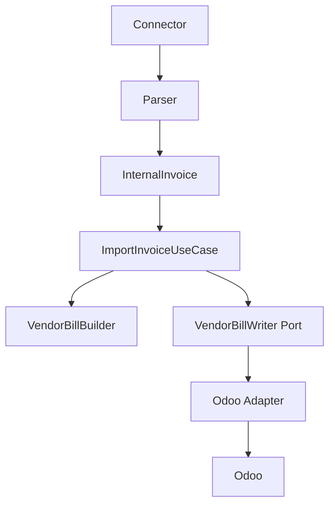
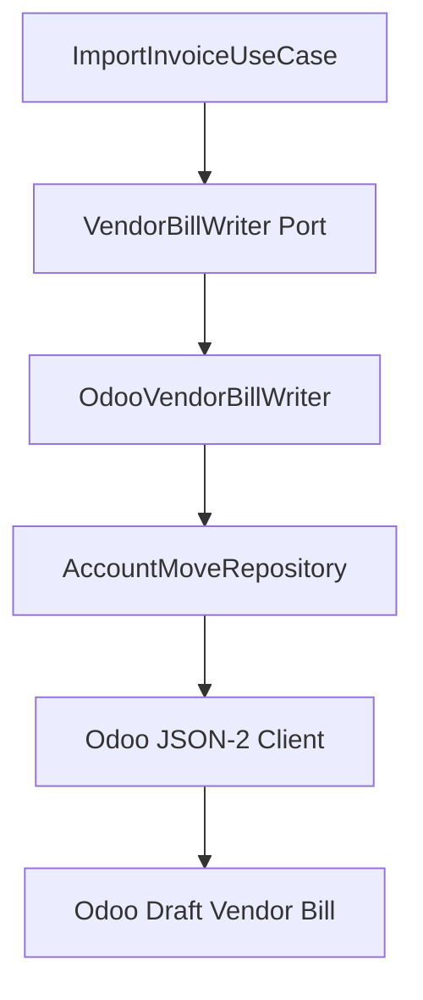
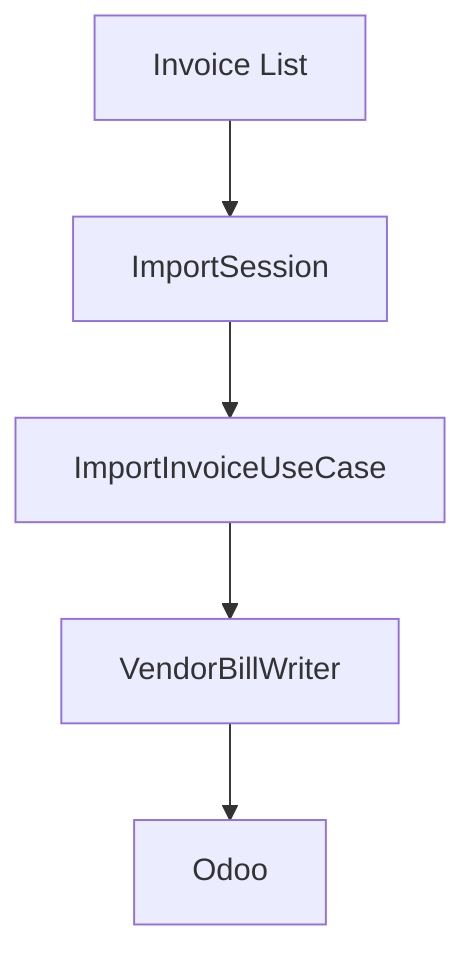

# Application Layer

The Application layer is the orchestration boundary for future ICT IPP use cases. It coordinates flow between API/service entry points, domain rules, domain builders, repository abstractions, and infrastructure ports.

This foundation does not implement business behavior. It establishes the project convention future workflows will use.

## Responsibility

Application layer coordinates.

Domain owns business rules.

Infrastructure owns external systems.

Adapters execute approved operations and contain no business logic.

## Package Structure

```text
app/application/
  commands/      immutable state-changing request DTOs
  queries/       immutable read request DTOs
  dto/           application flow result DTOs
  ports/         protocols implemented by infrastructure adapters
  services/      shared application service contracts
  use_cases/     executable workflow boundaries
  exceptions/    application-safe exception base types
```

Current foundation contracts:

- `ApplicationDTO`
- `Command`
- `Query`
- `UseCase`
- `ApplicationError`
- `UnitOfWork`
- `InvoiceImportHistory`
- `ImportInvoiceCommand`
- `ImportInvoiceResult`
- `ImportInvoiceUseCase`
- `VendorBillWriter`
- `VendorBillWriteCommand`
- `VendorBillWriteResult`
- `ImportSessionCommand`
- `ImportSessionResult`
- `ImportSession`

## Use Case Convention

Every future business workflow should be represented by a dedicated use case.

Examples:

- `ImportInvoiceUseCase`
- `CreateVendorBillUseCase`
- `CreateRFQUseCase`
- `CreatePurchaseOrderUseCase`
- `ReviewInvoiceUseCase`

Use cases should:

- accept a command or query DTO
- call domain services, matching engines, builders, or validators
- invoke infrastructure through ports
- return immutable application DTOs
- keep provider transport, ORM, HTTP, and adapter code outside the use case

Current executable use cases:

- `ImportInvoiceUseCase`
- `ImportSession`

## ImportInvoiceUseCase

`ImportInvoiceUseCase` is the first executable ICT IPP application workflow. It coordinates one deterministic invoice import through the direct Vendor Bill path.

It may:

- validate the import request
- check duplicate import state through `InvoiceImportHistory`
- call deterministic supplier, product, and tax matching dependencies
- call `VendorBillBuilder`
- call `VendorBillWriter`
- return immutable `ImportInvoiceResult`

It must not:

- contain SOAP, HTTP, SQL, Odoo JSON-2, or ORM code
- instantiate ERP adapters or provider clients
- implement Rule Engine, Decision Engine, AI Advisor, Import Session, RFQ, Purchase Order, expense, asset, or subscription logic
- choose between workflows or strategies
- retry provider operations
- parse configuration or own logging framework behavior



## Command And Query Convention

Commands represent state-changing requests.

Queries represent read-only requests.

This structure is CQRS-friendly, but it does not require separate infrastructure, handlers, queues, or buses. Those should be added only when a concrete workflow needs them.

## DTO Convention

Application DTOs coordinate application flow.

They are:

- immutable whenever practical
- explicit about state and safe messages
- independent of ORM models
- independent of API schemas
- independent of provider transport payloads

## Port Convention

Future infrastructure services must be accessed through application ports. Ports are protocols owned by `app/application/ports`; adapter implementations live outside the Application layer.

Examples:

- `VendorBillWriter`
- `InvoiceImportHistory`
- `InvoiceRepository`
- `CompanyRepository`
- `PartnerRepository`
- `ProductRepository`

Do not duplicate existing repository abstractions. Reuse `app/erp` repository protocols for ERP master-data reads where they already fit.

## Vendor Bill Write Direction

Future vendor bill write workflows should follow this dependency direction:

```text
Connector
  |
  v
Parser
  |
  v
InternalInvoice
  |
  v
Application Use Case
  |
  v
VendorBillBuilder
  |
  v
VendorBillWriter (Application Port)
  |
  v
Odoo Adapter
  |
  v
Odoo
```

`ImportInvoiceUseCase` consumes `VendorBillWriter` through this port. The Odoo implementation lives outside the Application layer.

## Odoo Vendor Bill Writer

`OdooVendorBillWriter` is the production-safe infrastructure implementation of the `VendorBillWriter` application port.

It:

- accepts immutable `VendorBillWriteCommand`
- returns immutable `VendorBillWriteResult`
- defaults to dry-run behavior through the command
- requires explicit production operation gates before real draft creation
- checks for an existing Odoo Vendor Bill before creating one
- delegates account.move payload construction and JSON-2 calls to `AccountMoveRepository`
- creates only draft `account.move` records with `move_type=in_invoice`

It must not:

- post Vendor Bills
- register payments
- reconcile accounting entries
- delete records
- update partners, products, taxes, journals, or other master data
- choose workflows or strategies
- contain Rule Engine, Decision Engine, AI Advisor, or Import Session logic



The deterministic idempotency key is stored on the Odoo draft via `invoice_origin` and used for duplicate lookup before create. Duplicate detection remains part of the write boundary; it does not authorize workflow selection or matching decisions.

Infrastructure exceptions are translated to application-safe Vendor Bill write exceptions for authentication, authorization, validation, transport, duplicate detection, and unexpected ERP failures.

## ImportSession

`ImportSession` is the sequential in-memory orchestration layer for importing multiple `InternalInvoice` DTOs.

It coordinates already existing single-invoice processing by calling `ImportInvoiceUseCase` once per invoice. It does not select workflows, run rules, match products, build Vendor Bills, or call ERP adapters.

It may:

- accept a collection of `InternalInvoice` DTOs through `ImportSessionCommand`
- execute `ImportInvoiceUseCase` sequentially
- collect immutable `ImportInvoiceResult` values
- measure elapsed time
- count processed, successful, duplicate, and failed invoices
- continue processing when one invoice fails
- return immutable `ImportSessionResult`

It must not:

- contain Rule Engine, Decision Engine, AI Advisor, or Company Memory logic
- contain matching, tax mapping, Vendor Bill creation, ERP, HTTP, SOAP, SQL, retry, batching, scheduler, or workflow-selection logic
- import Odoo, Uyumsoft, connector, persistence, or infrastructure modules



`ImportSession` status is in-memory only. Current statuses are `CREATED`, `RUNNING`, `COMPLETED`, and `FAILED`; `CANCELLED` is reserved in the DTO status type for future explicit cancellation work.

## Boundaries

The Application layer must not import:

- `app.connectors`
- `app.models`
- `app.db`
- FastAPI
- SQLAlchemy
- httpx
- Zeep

It may depend inward on domain and ERP-independent DTOs such as `app.billing.VendorBill`.

## Related Documents

- [Project Constitution](PROJECT_CONSTITUTION.md)
- [Coding Standards](CODING_STANDARDS.md)
- [Development Workflow](DEVELOPMENT_WORKFLOW.md)
- [Workflows](WORKFLOWS.md)
