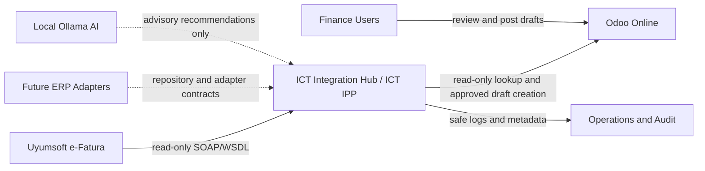
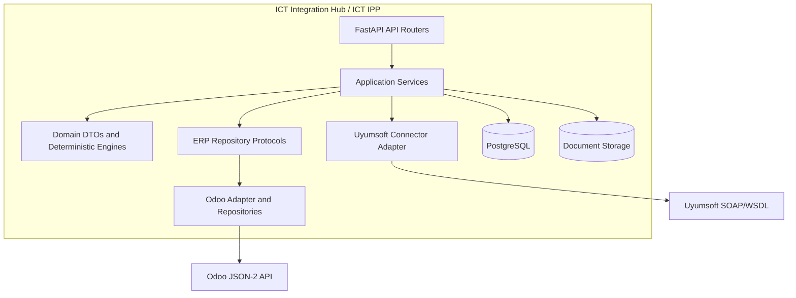
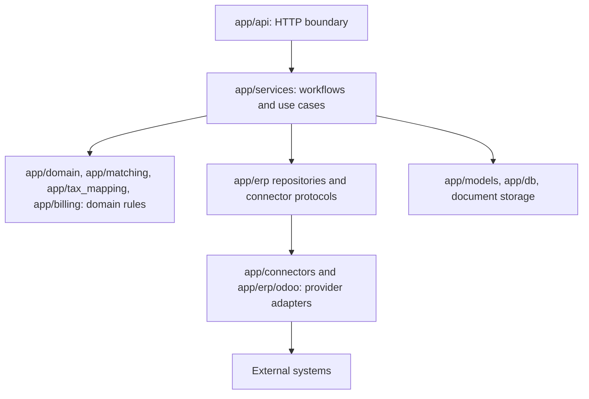
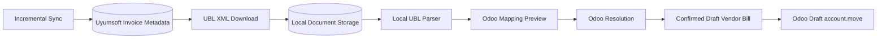

# Architecture

ICT Integration Hub is the external product. ICT Intelligent Procurement Platform (IPP) is the internal architecture that owns procurement decisions, deterministic rules, matching, workflow selection, import traceability, and AI advisory boundaries.

This document describes the current implementation plus accepted architecture decisions. It does not authorize runtime behavior that has not been implemented.

## Architectural Style

The architecture follows:

- Clean Architecture
- Domain Driven Design
- Repository Pattern
- Immutable DTOs
- ERP-independent business logic
- deterministic matching
- small production-ready PRs

Provider and ERP systems are adapters. The Hub owns business decisions.

## Context Diagram

## Container Diagram

## Architecture Layers

Layer rules:

- API routers may map requests, responses, and HTTP exceptions.
- Services own workflows, idempotency, persistence orchestration, and safe error categories.
- Domain engines and DTOs must not import FastAPI, SQLAlchemy, SOAP clients, Odoo clients, or provider transport code.
- Repository protocols describe ERP master-data access without tying business logic to Odoo.
- Adapters own transport details and sanitize provider failures.

## Implemented Modules

| Area | Current modules | Responsibility |
| --- | --- | --- |
| HTTP API | `app/api` | Health, Uyumsoft read-only endpoints, sync, document download, Odoo mapping, resolution, draft creation |
| Uyumsoft adapter | `app/connectors/uyumsoft` | SOAP/WSDL client, WSDL-aware query construction, provider response normalization |
| Odoo connector | `app/connectors/odoo` | JSON-2 calls for read-only probe, `search_read`, and approved draft create |
| Runtime safety | `app/core` | Settings, selected env profile, logging redaction, production gates |
| Persistence | `app/models`, `app/db` | SQLAlchemy models for provider metadata, sync runs, documents, draft references |
| Document handling | `app/services/document_service.py`, `document_storage.py` | UBL XML download, local storage, document metadata, SHA-256 idempotency |
| Legacy normalized parser | `app/services/document_parser.py`, `app/schemas/normalized_invoice.py` | Local UBL parser for API mapping preview flow |
| Internal invoice domain | `app/domain/invoice` | ERP-independent immutable invoice dataclasses and parser |
| ERP repositories | `app/erp` | Immutable ERP master-data DTOs and Odoo read-only repository implementation |
| Matching | `app/matching`, `app/tax_mapping` | Deterministic product and tax matching |
| Billing | `app/billing` | Pure Vendor Bill DTO builder and Odoo account move payload transformation |
| Odoo workflow services | `app/services/odoo_mapping_preview.py`, `odoo_resolution.py`, `odoo_draft_invoice.py` | Mapping preview, read-only resolution, draft-only creation |

## Current Flow

The current flow remains bounded and explicit:

- sync uses read-only Uyumsoft listing
- document download retrieves only `UBL_XML`
- parser runs locally
- mapping preview does not call Odoo
- resolution uses Odoo `search_read`
- draft creation uses only `account.move/create` for `move_type=in_invoice` and only after confirmation

## Decision Engine

The accepted Decision Engine lives inside ICT IPP. It will choose workflow and strategy. It must not live inside Odoo.

Current implementation has deterministic workflow services but not a single consolidated Decision Engine package. Future implementation must place that engine behind application/domain boundaries and keep ERP-specific execution behind adapters.

See [Decision Engine ADR](adr/ADR-0004-decision-engine.md).

## Rule Engine

The accepted Rule Engine lives inside ICT IPP. It runs before AI and is the source of workflow decisions. Current deterministic rules exist in matching, tax mapping, Odoo resolution, runtime gates, idempotency checks, and draft validation.

Future Rule Engine work should consolidate these policy concepts without changing existing accepted behavior.

See [Rule Engine](RULE_ENGINE.md).

## AI Advisor

AI Advisor is advisory only. It runs after deterministic rules and may use local Ollama and Company Memory. It must not choose workflows, select ambiguous records, approve invoices, or mutate provider/ERP state.

No AI runtime is implemented in this repository at this stage.

See [AI Advisor](AI_ADVISOR.md).

## Import Workbench

The accepted Import Workbench lives inside Odoo as a user interface only. It does not contain business logic. It may show Import Sessions, rule outcomes, missing data, AI recommendations, and user-review actions. All business decisions remain in ICT IPP.

See [Import Workbench](IMPORT_WORKBENCH.md).

## Procurement Traceability

ICT IPP preserves the procurement chain whenever possible:

Current implemented work is concentrated on vendor invoice and vendor bill stages. Future workflow implementation must preserve upstream and downstream links when data is available.

## Security And Production Boundaries

- Secrets and real environment files must never be committed.
- Uyumsoft state-changing operations are forbidden by default.
- Odoo `action_post`, unlink, payment registration, reconciliation, and master-data mutation are forbidden by default.
- Production startup fails fast unless explicit gates are satisfied.
- Readiness checks do not call Uyumsoft or Odoo.
- Logs must not include credentials, SOAP payloads, XML, or full Odoo payloads.

## Related Documents

- [Project Constitution](PROJECT_CONSTITUTION.md)
- [Workflows](WORKFLOWS.md)
- [Matching](MATCHING.md)
- [Import Session](IMPORT_SESSION.md)
- [Production Readiness](PRODUCTION_READINESS.md)
- [Architecture Decisions](adr/README.md)
