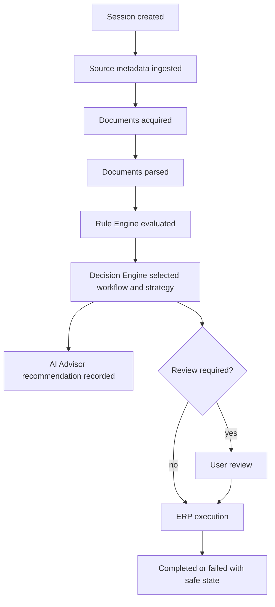

# Import Session

Import Session is the durable audit unit for an import attempt in ICT IPP.

The current repository already tracks sync runs, invoice metadata, document metadata, and draft invoice references. A consolidated Import Session model is an accepted future architecture decision, not yet implemented as a single table or package.

## Purpose

An Import Session groups source data, rule execution, workflow decisions, AI recommendations, user review, ERP execution, and traceability outcomes.

It should answer:

- What was imported?
- Which deterministic rules ran?
- Which workflow and strategy were selected?
- What did AI recommend, if anything?
- Who reviewed unresolved items?
- What ERP action was executed?
- Which procurement traceability links were preserved?
- What failed and how can it be retried safely?

## Import Session Flow

## Expected Data

Future Import Session records should include:

- session id
- source provider
- source document identifiers
- ETTN/UUID
- import type
- workflow id
- selected strategy id
- rule result references
- AI recommendation references
- company memory references used
- review status
- reviewed user/action metadata
- ERP execution references
- traceability chain references
- safe failure category and message
- created, updated, started, finished timestamps

## Status Model

Recommended statuses:

- created
- ingesting
- parsed
- rules_evaluated
- needs_review
- ready_for_execution
- executing
- completed
- failed
- blocked
- cancelled_by_user

Do not collapse ambiguous, missing, invalid, and blocked states into a single generic failure if downstream users need different actions.

## Relationship To Current Tables

Current tables represent parts of the future Import Session:

- `uyumsoft_invoice_metadata`: source invoice metadata and identity.
- `uyumsoft_sync_runs`: bounded sync execution summary.
- `invoice_documents`: acquired UBL XML document metadata.
- `odoo_draft_invoices`: draft creation idempotency and Odoo reference.

A future Import Session may reference these records rather than replacing them.

## Idempotency

ETTN/UUID remains the primary identity for invoice import and draft creation. Import Session identity should preserve ETTN and link to source provider identity. Missing ETTN may use documented fallback identity for metadata ingestion, but ERP draft creation requires ETTN.

## Audit And Privacy

Import Session records must support review without storing raw credentials, SOAP envelopes, full XML, or full ERP payloads in logs. Store sensitive documents only through approved document storage boundaries.

## Related Documents

- [Import Workbench](IMPORT_WORKBENCH.md)
- [Company Memory](COMPANY_MEMORY.md)
- [Import Session ADR](adr/ADR-0008-import-session.md)
