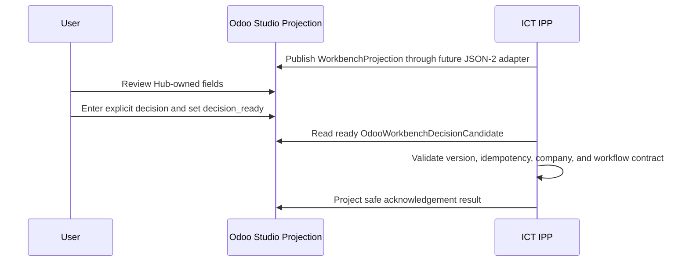
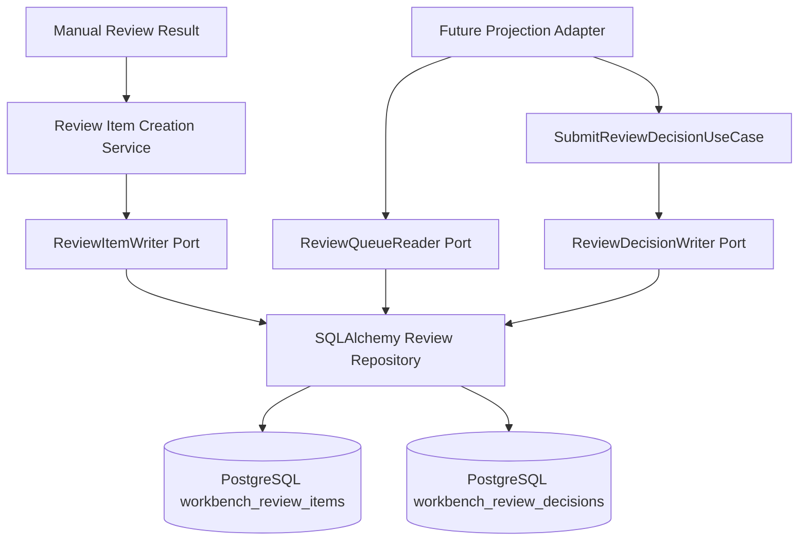
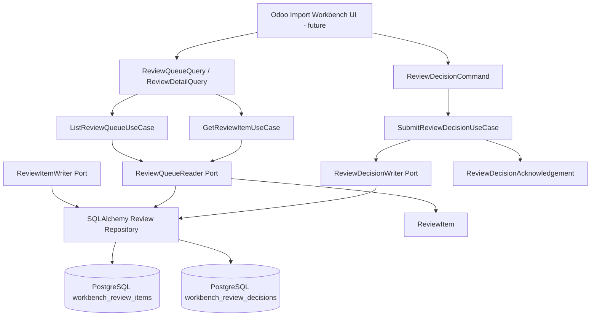
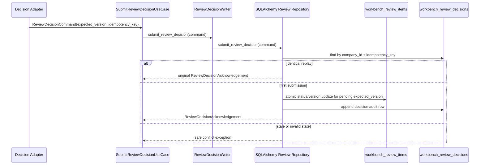

# Import Workbench

Import Workbench is the accepted Odoo-side user interface for reviewing import sessions. It lives inside Odoo as UI only and does not contain business logic.

Odoo 19 Online cannot install custom Python modules. The accepted Odoo Online architecture is a future Odoo Studio projection model, `x_ipp_import_review`, synchronized by the Hub through JSON-2. No Odoo Studio model, views, ACLs, JSON-2 projection adapter, scheduler, decision ingestion, or Odoo UI implementation exists in this repository yet.

The repository now provides application-layer contracts, durable review item persistence, queue/detail query use cases, explicit review decision submission persistence, authenticated REST API adapters for direct Hub clients, and ERP-neutral projection contracts for the future Odoo Studio Workbench projection.

## Purpose

The Import Workbench should give users a practical review surface for:

- imported invoices and documents
- deterministic rule outcomes
- missing or ambiguous matches
- procurement traceability links
- AI Advisor recommendations
- approved user actions
- ERP execution results

## Boundary

Import Workbench lives inside Odoo, but business logic does not.

Odoo may display:

- Import Session status
- source invoice metadata
- matching results
- structured Manual Review reasons, rule failures, and warnings
- advisory AI explanations
- links to draft vendor bills
- required user-review actions
- Hub acknowledgement status projected after future decision processing

Odoo must not own:

- workflow selection
- strategy selection
- rule execution
- Manual Review reason creation
- deterministic matching logic
- AI decision making
- procurement traceability policy
- idempotency decisions
- accepted decision ledger

## Expected Interaction



## Current Application Contracts

The current implementation defines contracts under `app/application/workbench` and a SQLAlchemy persistence adapter outside the Application layer.

Future API or Odoo adapter routes must resolve `RequestContext` before constructing these contracts. `company_id` must come from `RequestContext.company_id`, and future decision submission routes must derive `decided_by` from `RequestContext.user_id`.

Implemented contract types:

- `ReviewItem`: safe invoice summary for a review-required item
- `ReviewStatus`: canonical states for pending, submitted, resolved, and dismissed review records
- `ReviewQueueQuery` and `ReviewQueueResult`: bounded queue listing contract
- `ReviewDetailQuery`: one-item lookup contract
- `ReviewDecisionCommand`: explicit user decision command for `SELECT_WORKFLOW` or `DISMISS`
- `ReviewDecisionAcknowledgement`: safe acknowledgement contract
- `LineResolution` and `TaxResolution`: explicit selected ERP IDs for invoice lines and taxes
- `BusinessContextDecision`: legacy single-context procurement traceability identifiers selected by the user
- `BusinessContextAllocationType`, `AllocationCompleteness`, `BusinessContextAllocation`, and `BusinessContextAllocationSet`: future multi-allocation business context contracts
- `ReviewQueueReader`: read-only application port for future queue/detail adapters
- `ReviewItemWriter`: create-only application port for idempotent pending review item creation
- `ReviewDecisionWriter`: decision submission application port for explicit user decisions
- `ReviewItemCreationService`: small application service that delegates review item creation through the writer port
- `ListReviewQueueUseCase`: application query boundary for listing review items through `ReviewQueueReader`
- `GetReviewItemUseCase`: application query boundary for retrieving one company-scoped review item through `ReviewQueueReader`
- `SubmitReviewDecisionUseCase`: application command boundary for submitting `ReviewDecisionCommand` through `ReviewDecisionWriter`
- `WorkbenchProjection`: ERP-neutral projection of one Hub-owned review item for a future UI projection store
- `OdooWorkbenchDecisionCandidate`: candidate decision read from the future Odoo Studio projection before Hub acceptance
- `ProjectionPublishResult`: safe result for future projection publish or acknowledgement writes
- `WorkbenchProjectionPublisher`: application port for future projection publishing and acknowledgement
- `WorkbenchDecisionCandidateReader`: application port for future candidate decision reads

`BusinessContextDecision` remains the current runtime contract used by `ReviewDecisionCommand`, decision persistence, Workbench API schemas, and Odoo projection candidates. A later implementation PR should replace `business_context` with `business_context_allocations: BusinessContextAllocationSet | None` after API, persistence, Odoo projection, and idempotency behavior are explicitly scoped. This PR does not add both fields to avoid dual-source ambiguity.

## Current Persistence Foundation

The persistence foundation stores Workbench review items in `workbench_review_items` and append-only user decisions in `workbench_review_decisions`.

Implemented behavior:

- create one `PENDING_REVIEW` item idempotently through `ReviewItemWriter`
- list the review queue through `ListReviewQueueUseCase` and `ReviewQueueReader`
- retrieve one review item through `GetReviewItemUseCase` and `ReviewQueueReader`
- submit an explicit `SELECT_WORKFLOW` or `DISMISS` decision through `SubmitReviewDecisionUseCase` and `ReviewDecisionWriter`
- transition `PENDING_REVIEW` to `DECISION_SUBMITTED` or `DISMISSED`
- increment `version` exactly once on first accepted decision submission
- enforce optimistic concurrency with `expected_version`
- replay identical decision commands idempotently by company-scoped idempotency key
- reject conflicting decision idempotency-key reuse without mutating the review item
- return an existing item when the same company-scoped idempotency key is reused with identical immutable business content
- raise a safe idempotency conflict when the same key is reused for different content
- read one item by `review_id` and `company_id`
- list a company-scoped queue with exact status, workflow, supplier tax number, created-from, and created-to filters
- return paginated results with `total_count`
- persist structured `ManualReviewReason` values as controlled JSON
- persist `total_amount` as `Numeric(24, 6)` to preserve UBL monetary values up to six fractional digits
- compare persisted monetary values through canonical `Decimal` values for idempotency, not display formatting
- store `version` starting at `1` for future optimistic concurrency updates
- preserve original review reasons when a decision is submitted
- persist selected workflow, partner, line resolutions, tax resolutions, business context, comment, user identity, idempotency key, and version-before/version-after as controlled audit data

The persistence adapter does not store raw XML, provider payloads, credentials, tokens, HTTP responses, stack traces, or unsafe provider exception text.



Implemented REST API endpoints:

- `GET /api/workbench/reviews`
- `GET /api/workbench/reviews/{review_id}`
- `POST /api/workbench/reviews/{review_id}/decision`

Permissions:

- queue and detail reads require `workbench_review_read`
- decision submission requires `workbench_review_decide`

Company isolation and user identity:

- `company_id` always comes from `RequestContext.company_id`
- `decided_by` always comes from `RequestContext.user_id`
- neither field is accepted from query parameters, path parameters, request bodies, or custom Workbench headers
- detail reads always use both `review_id` and trusted `company_id`, so reviews from another company are returned as not found

Response shape:

```json
{
  "success": true,
  "data": {},
  "warnings": [],
  "errors": [],
  "trace_id": "trace-123"
}
```

Errors use the same envelope with `success=false`, `data=null`, and safe error codes/messages. `X-Trace-ID` is also returned in the response header. Workbench API responses do not expose ORM objects, tokens, SQL, connection strings, provider responses, or stack traces. Monetary values are serialized as strings.

Not implemented in this slice:

- Odoo UI
- Odoo Studio model creation
- Odoo Studio views and ACLs
- Odoo JSON-2 projection synchronization
- decision ingestion from Odoo
- Hub acknowledgement projection to Odoo
- user decision execution
- workflow execution
- ERP writes
- RFQ, Purchase Order, expense, asset, or subscription workflows
- business context allocation persistence, API submission, Odoo synchronization, or acknowledgement
- AI recommendations
- attachments or raw XML display

The contracts keep supplier name as display data only. Matching remains deterministic and does not use supplier name, fuzzy text search, AI similarity, or name-only selections.

Recommendation acceptance is intentionally not part of the current contract. A future recommendation contract must include recommendation id, recommendation version, source, and rationale to prevent stale acceptance. Until that exists, users can only submit explicit workflow selections or dismissals. `WorkflowType.MANUAL_REVIEW` is the unresolved state and cannot be selected as a resolution.



## Odoo Online Projection

The future Odoo Workbench UI uses the proposed Studio model `x_ipp_import_review` as a projection store. Hub PostgreSQL remains authoritative for review lifecycle, review version, accepted decisions, decision idempotency, acknowledgement, and execution state. The Odoo projection is authoritative only for the user-entered candidate decision before Hub acceptance and for the Odoo user identity captured as audit evidence.

Field ownership is explicit:

- Hub-owned fields: review identity, company identity, invoice display data, review reasons, warnings, Hub status/version, synchronization metadata, and acknowledgement result.
- Odoo-user-owned fields: explicit decision, selected workflow, selected partner, line resolutions, tax resolutions, business context, comment, and decision-ready flag.
- System-derived Odoo fields: Odoo user id and decision timestamp when safely available.

Odoo users must not edit Hub-owned identity or version fields. The Hub must not silently overwrite submitted user-decision fields. A decision candidate is processed only when `x_ipp_decision_ready` is explicitly true.

Future Business Context Allocation child lines will allow one supplier invoice to be split across multiple Sales Orders, commercial customers, recharge recipients, target companies, projects, and internal costs. Candidate allocation lines from Odoo are untrusted until Hub validation. The Hub must verify company isolation, selected ERP IDs, allocation totals, expected version, and idempotency before accepting allocations.

See [Odoo Workbench Projection](ODOO_WORKBENCH_PROJECTION.md) and [ADR-0011](adr/ADR-0011-odoo-online-import-workbench-projection.md).

## Decision Submission

Decision submission persists explicit user intent only. It does not execute the selected workflow.



`SELECT_WORKFLOW` stores the selected canonical workflow and any explicit partner, line, tax, or traceability choices. It moves the review item to `DECISION_SUBMITTED` and leaves execution to a future approved workflow slice.

Future `SELECT_WORKFLOW` decisions may carry `BusinessContextAllocationSet` evidence. Future `DISMISS` decisions must reject allocations. Allocation requirements will depend on selected workflow and future execution strategy.

`DISMISS` stores the dismissal decision, moves the review item to `DISMISSED`, and stores no workflow-specific selections.

## UI Responsibilities

Future Workbench screens should support:

- session list and detail
- status filters
- rule result display
- missing master-data indicators
- ambiguous match review
- AI recommendation display marked as advisory
- traceability chain display
- business context allocation line review
- action confirmation
- links to created draft ERP documents

## Implementation Requirements

- Business decisions must remain API calls into ICT IPP.
- UI actions must send explicit user intent and confirmation.
- User decisions must include explicit user identity, idempotency key, and expected version.
- API adapters must derive trusted user identity and company identity from `RequestContext`.
- `company_id` must not be trusted from request bodies, query strings, or path parameters.
- Future decision adapters must derive `decided_by` from `RequestContext.user_id`.
- Pending review item creation must be idempotent by company-scoped key.
- Detail reads must always include both `review_id` and `company_id`.
- Current explicit decisions are `SELECT_WORKFLOW` and `DISMISS`.
- `MANUAL_REVIEW` must not be submitted as a selected resolution workflow.
- Procurement traceability fields must be explicit user choices, not inferred by Odoo UI logic.
- The Hub must revalidate rules before execution.
- Workbench must display AI recommendations as advisory.
- Workbench must not call Odoo posting, unlink, payment, or reconciliation actions as part of import automation.

## Related Documents

- [Import Session](IMPORT_SESSION.md)
- [Workflows](WORKFLOWS.md)
- [Security](SECURITY.md)
- [ERP Boundary ADR](adr/ADR-0003-erp-boundary.md)
