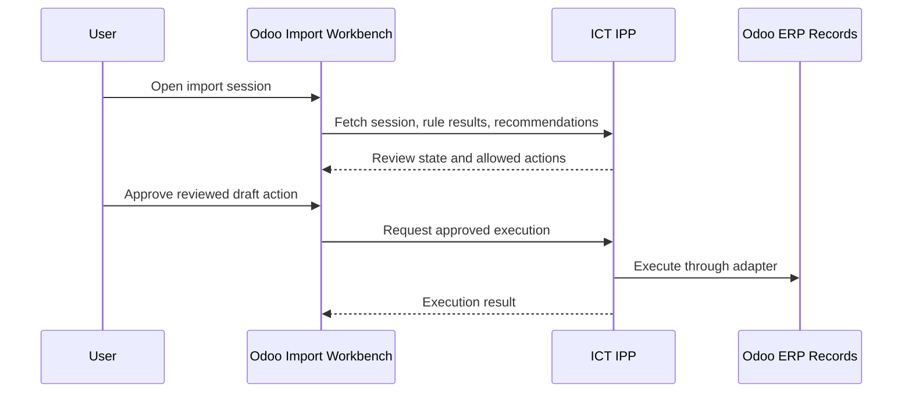
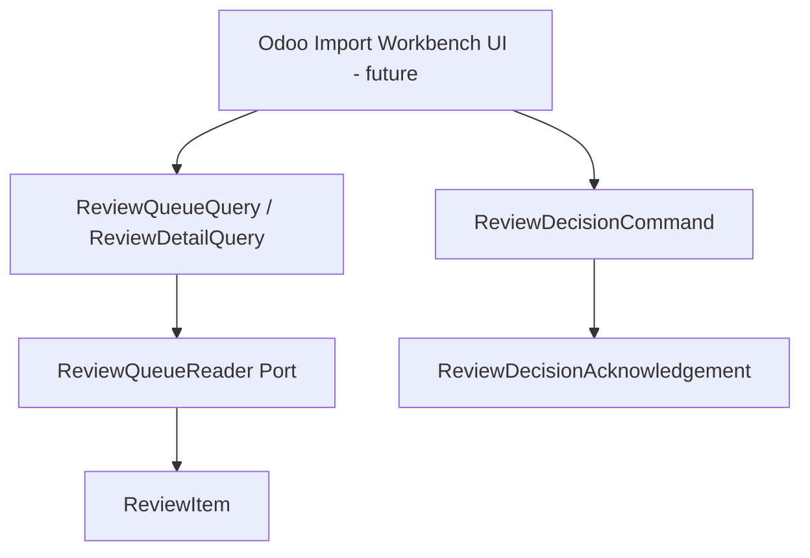

# Import Workbench

Import Workbench is the accepted Odoo-side user interface for reviewing import sessions. It lives inside Odoo as UI only and does not contain business logic.

No Odoo Import Workbench UI implementation exists in this repository yet. The repository now provides application-layer contracts that a future Odoo Workbench adapter can consume.

## Purpose

The Import Workbench should give users a practical review surface for:

- imported invoices and documents
- deterministic rule outcomes
- missing or ambiguous matches
- procurement traceability links
- AI Advisor recommendations
- approved user actions
- ERP execution results

## Boundary

Import Workbench lives inside Odoo, but business logic does not.

Odoo may display:

- Import Session status
- source invoice metadata
- matching results
- structured Manual Review reasons, rule failures, and warnings
- advisory AI explanations
- links to draft vendor bills
- required user-review actions

Odoo must not own:

- workflow selection
- strategy selection
- rule execution
- Manual Review reason creation
- deterministic matching logic
- AI decision making
- procurement traceability policy
- idempotency decisions

## Expected Interaction

## Current Application Contracts

The current implementation adds contracts only under `app/application/workbench`.

Implemented contract types:

- `ReviewItem`: safe invoice summary for a review-required item
- `ReviewStatus`: canonical states for pending, submitted, resolved, and dismissed review records
- `ReviewQueueQuery` and `ReviewQueueResult`: bounded queue listing contract
- `ReviewDetailQuery`: one-item lookup contract
- `ReviewDecisionCommand`: explicit user decision command
- `ReviewDecisionAcknowledgement`: safe acknowledgement contract
- `LineResolution` and `TaxResolution`: explicit selected ERP IDs for invoice lines and taxes
- `BusinessContextDecision`: explicit procurement traceability identifiers selected by the user
- `ReviewQueueReader`: read-only application port for future queue/detail adapters

Not implemented in this slice:

- Odoo UI
- FastAPI routes
- persistence or Alembic migrations
- review queue storage
- user decision execution
- ERP writes
- RFQ, Purchase Order, expense, asset, or subscription workflows
- AI recommendations
- attachments or raw XML display

The contracts keep supplier name as display data only. Matching remains deterministic and does not use supplier name, fuzzy text search, AI similarity, or name-only selections.

## UI Responsibilities

Future Workbench screens should support:

- session list and detail
- status filters
- rule result display
- missing master-data indicators
- ambiguous match review
- AI recommendation display marked as advisory
- traceability chain display
- action confirmation
- links to created draft ERP documents

## Implementation Requirements

- Business decisions must remain API calls into ICT IPP.
- UI actions must send explicit user intent and confirmation.
- User decisions must include explicit user identity, idempotency key, and expected version.
- Procurement traceability fields must be explicit user choices, not inferred by Odoo UI logic.
- The Hub must revalidate rules before execution.
- Workbench must display AI recommendations as advisory.
- Workbench must not call Odoo posting, unlink, payment, or reconciliation actions as part of import automation.

## Related Documents

- [Import Session](IMPORT_SESSION.md)
- [Workflows](WORKFLOWS.md)
- [ERP Boundary ADR](adr/ADR-0003-erp-boundary.md)
