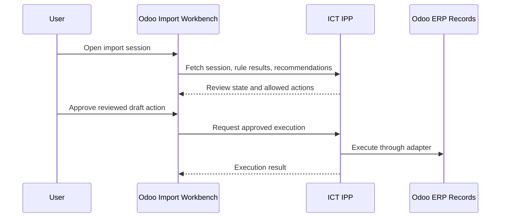

# Import Workbench

Import Workbench is the accepted Odoo-side user interface for reviewing import sessions. It lives inside Odoo as UI only and does not contain business logic.

No Import Workbench implementation exists in this repository yet. This document defines the boundary future Odoo customization work must respect.

## Purpose

The Import Workbench should give users a practical review surface for:

- imported invoices and documents
- deterministic rule outcomes
- missing or ambiguous matches
- procurement traceability links
- AI Advisor recommendations
- approved user actions
- ERP execution results

## Boundary

Import Workbench lives inside Odoo, but business logic does not.

Odoo may display:

- Import Session status
- source invoice metadata
- matching results
- rule failures and warnings
- advisory AI explanations
- links to draft vendor bills
- required user-review actions

Odoo must not own:

- workflow selection
- strategy selection
- rule execution
- deterministic matching logic
- AI decision making
- procurement traceability policy
- idempotency decisions

## Expected Interaction

## UI Responsibilities

Future Workbench screens should support:

- session list and detail
- status filters
- rule result display
- missing master-data indicators
- ambiguous match review
- AI recommendation display marked as advisory
- traceability chain display
- action confirmation
- links to created draft ERP documents

## Implementation Requirements

- Business decisions must remain API calls into ICT IPP.
- UI actions must send explicit user intent and confirmation.
- The Hub must revalidate rules before execution.
- Workbench must display AI recommendations as advisory.
- Workbench must not call Odoo posting, unlink, payment, or reconciliation actions as part of import automation.

## Related Documents

- [Import Session](IMPORT_SESSION.md)
- [Workflows](WORKFLOWS.md)
- [ERP Boundary ADR](adr/ADR-0003-erp-boundary.md)
