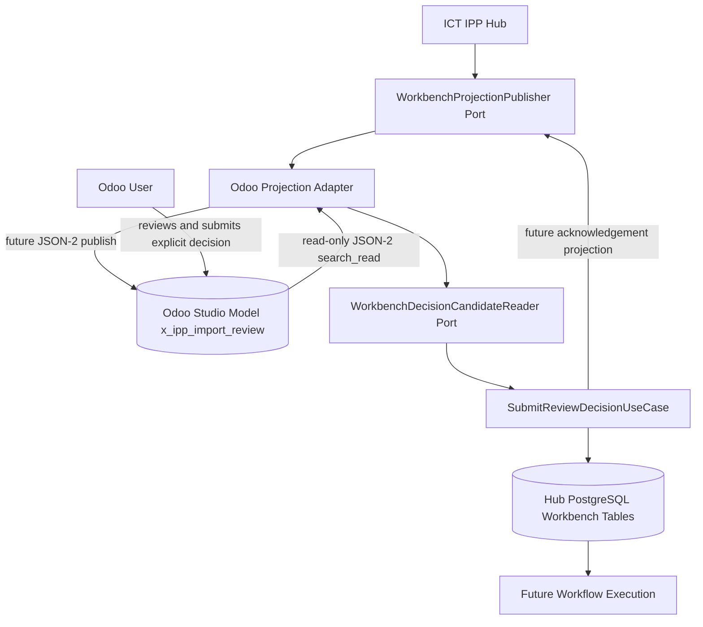

# Odoo Online Workbench Projection

This document defines the architecture and contract for presenting Hub-owned Import Workbench reviews inside Odoo 19 Online through Odoo Studio projection models.

This slice includes the read-only Odoo JSON-2 candidate reader that reads decision-ready projection records and Business Context Allocation child rows into immutable application DTOs. The Studio models, Studio views, ACLs, projection publishing, scheduler, decision persistence trigger, acknowledgement projection, and workflow execution are not implemented in this slice.

## Architecture

Odoo Online cannot install custom Python modules. The selected architecture uses an Odoo Studio model as a projection store and keeps all decision authority in ICT IPP.



The future synchronization flow is Hub-controlled:

1. Hub creates or updates a review item in PostgreSQL.
2. Hub publishes an immutable `WorkbenchProjection` to Odoo.
3. Odoo users review Hub-owned fields and enter explicit decision fields.
4. Hub reads only records where the configured decision-ready field is explicitly true.
5. Hub validates the candidate through existing Workbench command rules.
6. Hub persists an accepted decision with optimistic concurrency and idempotency.
7. Hub writes acknowledgement fields back to the projection.
8. Later focused workflow PRs may execute accepted decisions.

## Proposed Studio Model

ADR-0011 proposed technical model name:

```text
x_ipp_import_review
```

The model name follows Odoo Studio custom-model naming with the `x_` prefix and uses the `ipp` namespace to avoid generic field names.

ADR-0012 proposed Business Context Allocation child model:

```text
x_ipp_review_allocation
```

Display name:

```text
IPP Review Allocation
```

Actual Odoo Online Studio technical field names may use generated `x_` or `x_studio_` identifiers. The application contract does not depend on those generated names; adapter mapping translates between Studio fields and `BusinessContextAllocation` values.

Current deployments may use configured Studio model names such as:

```text
x_ipp_import_workbench
x_ipp_review_allocatio
```

Those deployment names are adapter configuration, not application vocabulary. The Hub reads them through `OdooWorkbenchFieldMapping`.

## Source Of Truth

| Data | Authoritative system | Notes |
| --- | --- | --- |
| Review lifecycle | Hub PostgreSQL | Includes pending, submitted, resolved, and dismissed states. |
| Review version | Hub PostgreSQL | Used for optimistic concurrency. |
| Accepted decision | Hub PostgreSQL | Odoo submits a candidate; Hub accepts or rejects it. |
| Accepted allocation lines | Hub PostgreSQL | Future accepted allocations are decision evidence owned by the Hub. |
| Decision idempotency | Hub PostgreSQL | Uses existing decision idempotency behavior. |
| Decision acknowledgement | Hub PostgreSQL, projected to Odoo | Odoo display is not the ledger. |
| Execution state | Hub PostgreSQL and future execution records | Workflow execution is out of scope here. |
| User-entered candidate decision before Hub acceptance | Odoo projection | Authoritative only as user input evidence before Hub validation. |
| User-entered candidate allocation lines before Hub acceptance | Odoo child projection | Authoritative only as candidate allocation input before Hub validation. |
| Odoo user that submitted the candidate | Odoo projection | Audit context only; not sufficient authorization by itself. |

## Field Contract

The field list keeps only data justified by current Workbench contracts and synchronization requirements.

### Identity And Synchronization

| Field | Type expectation | Owner | Purpose |
| --- | --- | --- | --- |
| `x_name` | Char | Hub | Human-readable display name, usually invoice number plus supplier. |
| `x_ipp_review_id` | Char, required, unique | Hub | Natural projection identity mapped to Hub `review_id`. |
| `x_ipp_company_id` | Integer, required | Hub | Hub company identity for isolation checks. |
| `x_ipp_invoice_id` | Char, required | Hub | Hub invoice identity. |
| `x_ipp_version` | Integer, required | Hub | Displayed Hub review version for optimistic concurrency. |
| `x_ipp_status` | Selection | Hub | Hub review status. |
| `x_ipp_sync_state` | Selection | Hub | Future projection state such as `pending`, `synced`, `ack_failed`, or `conflict`. |
| `x_ipp_last_sync_at` | Datetime | Hub | Last successful Hub projection update. |
| `x_ipp_trace_id` | Char | Hub | Safe correlation id; not a token or credential. |

### Invoice Display

| Field | Type expectation | Owner | Purpose |
| --- | --- | --- | --- |
| `x_ipp_invoice_number` | Char | Hub | Invoice number display. |
| `x_ipp_supplier_name` | Char | Hub | Supplier display text only; not used for matching decisions. |
| `x_ipp_supplier_tax_number` | Char | Hub | Supplier VKN/TCKN display and filtering. |
| `x_ipp_invoice_date` | Date | Hub | Invoice date display and filtering. |
| `x_ipp_currency` | Char or Selection | Hub | Currency code display. |
| `x_ipp_total_amount` | Monetary/Numeric | Hub | Invoice total display. Hub persists review money as `Numeric(24, 6)`. |

### Review Information

| Field | Type expectation | Owner | Purpose |
| --- | --- | --- | --- |
| `x_ipp_workflow` | Selection | Hub | Current Hub workflow state, often `manual_review` for unresolved items. |
| `x_ipp_review_summary` | Text | Hub | Short human-readable review summary. |
| `x_ipp_review_reasons_json` | Text | Hub | JSON array of structured `ManualReviewReason` values. |
| `x_ipp_warnings_json` | Text | Hub | JSON array of safe warning strings. |

### User Decision

| Field | Type expectation | Owner | Purpose |
| --- | --- | --- | --- |
| `x_ipp_decision` | Selection | Odoo user | Explicit decision: `select_workflow` or `dismiss`. |
| `x_ipp_selected_workflow` | Selection | Odoo user | Resolution workflow. `manual_review` is not allowed as a resolution. |
| `x_ipp_selected_partner_id` | Many2one or Integer | Odoo user | Explicit selected partner id when needed. |
| `x_ipp_line_resolutions_json` | Text | Odoo user | JSON array of line product resolutions matching `LineResolution`. |
| `x_ipp_tax_resolutions_json` | Text | Odoo user | JSON array of tax resolutions matching `TaxResolution`. |
| `x_ipp_business_context_json` | Text | Legacy only | Historical `BusinessContextDecision` shape; not an active authoritative input when allocation child lines exist. |
| `x_ipp_comment` | Text | Odoo user | Optional comment, bounded by Hub contract. |
| `x_ipp_decision_idempotency_key` | Char, required before submit | Odoo user/System | Stable key for Hub idempotent decision submission. |
| `x_ipp_decided_by_odoo_user_id` | Integer | System-derived Odoo field | Odoo user id that submitted the candidate. |
| `x_ipp_decided_at` | Timezone-aware Datetime | System-derived Odoo field | Candidate submission timestamp audit evidence. |
| `x_ipp_decision_ready` | Boolean | Odoo user/System | Hub reads a candidate only when explicitly true. |

### Hub Processing Result

| Field | Type expectation | Owner | Purpose |
| --- | --- | --- | --- |
| `x_ipp_hub_ack_status` | Selection | Hub | Future acknowledgement such as `accepted`, `rejected`, `conflict`, or `error`. |
| `x_ipp_hub_ack_version` | Integer | Hub | Hub review version after accepted decision. |
| `x_ipp_hub_ack_message` | Text | Hub | Safe acknowledgement or reconciliation message. |
| `x_ipp_hub_processed_at` | Datetime | Hub | Time the Hub processed the candidate. |

### Allocation Child Model

The child model represents candidate `BusinessContextAllocation` lines. It must have a parent relationship to the configured parent Workbench projection model.

Proposed logical fields:

| Logical field | Type expectation | Owner | Purpose |
| --- | --- | --- | --- |
| parent review | Many2one | Odoo user/System | Parent IPP Import Review projection. |
| allocation key | Char, required | Odoo user/System | Stable key unique inside the allocation set. |
| allocation type | Selection | Odoo user | Canonical `BusinessContextAllocationType`. |
| source line number | Char | Odoo user | Optional source invoice line; multiple allocations may share it. |
| description | Char/Text | Odoo user | Bounded human-readable purpose. |
| amount | Numeric | Odoo user | Positive Decimal amount when supplied. |
| percentage | Numeric | Odoo user | Positive Decimal percentage at most 100 when supplied. |
| currency | Char/Selection | Odoo user | Optional uppercase currency code. |
| customer | Many2one or Integer | Odoo user | Commercial customer context. |
| recharge recipient | Many2one or Integer | Odoo user | Actual invoiced or recharged party. |
| customer invoice | Many2one or Integer | Odoo user | Optional existing outgoing customer invoice or refund evidence link. |
| target company | Many2one or Integer | Odoo user | Affiliate or group-company target. |
| opportunity | Many2one or Integer | Odoo user | Opportunity traceability. |
| Sales Order | Many2one or Integer | Odoo user | Sales Order cost traceability. |
| Purchase Order | Many2one or Integer | Odoo user | Existing PO traceability. |
| project | Many2one or Integer | Odoo user | Project traceability. |
| analytic account | Many2one or Integer | Odoo user | Analytic cost traceability. |
| internal note | Text | Odoo user | Bounded internal note, not an execution instruction. |

The child model is not created by this PR.

## Ownership Rules

Hub-owned fields:

- review identity
- company identity
- invoice display data
- review reasons
- warnings
- Hub status and version
- synchronization metadata
- acknowledgement result

Odoo-user-owned fields:

- explicit decision
- selected workflow
- selected partner
- line resolutions
- tax resolutions
- business context
- comment
- decision-ready flag

System-derived Odoo fields:

- current Odoo user id
- decision timestamp where safely available

Rules:

- Odoo users must not edit Hub-owned identity, status, or version fields.
- Hub must not silently overwrite submitted user-decision fields.
- Hub must process a decision only when `x_ipp_decision_ready` is explicitly true.
- Hub acknowledgement must be written separately from user input.
- Hub remains authoritative for accepted decision version and status.
- `x_ipp_decision_ready` must not be cleared until Hub acknowledgement is safely persisted and, when implemented, projected back to Odoo.

## Application Contracts

The application layer defines immutable ERP-neutral application DTOs:

- `WorkbenchProjection`
- `OdooWorkbenchDecisionCandidate`
- `ProjectionPublishResult`

It also introduces narrow application ports:

- `WorkbenchProjectionPublisher`
- `WorkbenchDecisionCandidateReader`
- `SubmitOdooWorkbenchCandidateUseCase`

The ports do not expose Odoo client objects, Odoo model objects, SQLAlchemy sessions, HTTP objects, or provider exceptions. Odoo JSON-2 code lives in infrastructure adapters behind these ports.

Timestamp and result invariants:

- `OdooWorkbenchDecisionCandidate.decided_at` is timezone-aware audit evidence. It must be a `datetime` with a non-null `utcoffset`; the Hub does not silently assume UTC or convert the supplied timezone.
- `WorkbenchProjection.updated_at` is optional. When supplied, it must also be a timezone-aware `datetime` and is preserved without conversion.
- `ProjectionPublishResult` represents exactly one projection operation: either `created=True, updated=False` or `created=False, updated=True`. It does not use a result status enum in this contract slice.

Business context allocation contracts are defined in the Application layer and are part of `OdooWorkbenchDecisionCandidate`:

- `BusinessContextAllocationType`
- `AllocationCompleteness`
- `BusinessContextAllocation`
- `BusinessContextAllocationSet`

The application contract has replaced legacy `business_context` with `business_context_allocations`. Projection ingestion maps `IPP Review Allocation` child lines into that allocation set. Do not accept both legacy `x_ipp_business_context_json` and child allocation lines as authoritative sources in the same command.

## Decision Submission Orchestrator

`SubmitOdooWorkbenchCandidateUseCase` consumes the `WorkbenchDecisionCandidateReader` port and submits one immutable candidate through `SubmitReviewDecisionUseCase`. It maps the candidate to `ReviewDecisionCommand` without revalidating ERP references and without reserializing allocation evidence.

Candidate `company_id` must match the requested company scope. Candidate `expected_version` and `idempotency_key` flow unchanged into the Hub command. Candidate `decided_by_odoo_user_id` is preserved as audit evidence and is not used for authorization.

Successful submission returns a safe immutable result with `SUBMITTED` and the original Hub acknowledgement. Not-ready or missing candidates return `NOT_READY_OR_NOT_FOUND`. The orchestrator does not write acknowledgement fields, clear decision readiness, update projection records, retry stale versions, or execute workflows.

## Read-Only Candidate Reader

`OdooWorkbenchDecisionCandidateReader` implements `WorkbenchDecisionCandidateReader` for Odoo Online Studio projections. It is production-safe and read-only.

It may:

- look up one parent projection record by exact `review_id` and `company_id`
- reject duplicate parent records as ambiguity
- require the configured decision-ready field to be explicit `true`
- read child allocation rows by parent Odoo record id
- map Odoo Many2one values to integer ERP identifiers while ignoring display names
- parse Decimal values without float arithmetic
- return immutable `OdooWorkbenchDecisionCandidate` and `BusinessContextAllocationSet` DTOs

It must not:

- submit the decision to the Hub API
- persist an accepted Hub decision
- publish or acknowledge projection fields
- execute workflow strategies
- create Vendor Bills, customer invoices, RFQs, Purchase Orders, payments, or accounting entries
- infer allocation completeness from amounts or percentages
- expose raw Odoo provider responses, URLs, credentials, tokens, or internal exception text

Configured lookup domains:

```text
parent: [[review_id_field, "=", review_id], [company_id_field, "=", company_id]]
child:  [[parent_many2one_field, "=", parent_odoo_record_id]]
```

The parent lookup uses `limit=2` so ambiguity is explicit. A missing parent or a parent with decision-ready `false` is reported as no ready candidate. Missing, malformed, or non-boolean decision-ready values are data errors.

### Reader Mapping Configuration

Studio technical field names are deployment-specific. The reader uses `OdooWorkbenchFieldMapping` rather than hard-coded field names.

| Logical value | Configuration key |
| --- | --- |
| Parent model | `ODOO_WORKBENCH_PARENT_MODEL` |
| Allocation child model | `ODOO_WORKBENCH_ALLOCATION_MODEL` |
| Review id | `ODOO_WORKBENCH_PARENT_REVIEW_ID_FIELD` |
| Company id | `ODOO_WORKBENCH_PARENT_COMPANY_ID_FIELD` |
| Version | `ODOO_WORKBENCH_PARENT_EXPECTED_VERSION_FIELD` |
| Decision ready | `ODOO_WORKBENCH_PARENT_DECISION_READY_FIELD` |
| Decision | `ODOO_WORKBENCH_PARENT_DECISION_FIELD` |
| Selected workflow | `ODOO_WORKBENCH_PARENT_SELECTED_WORKFLOW_FIELD` |
| Selected partner | `ODOO_WORKBENCH_PARENT_SELECTED_PARTNER_FIELD` |
| Line resolutions JSON | optional `ODOO_WORKBENCH_PARENT_LINE_RESOLUTIONS_FIELD` |
| Tax resolutions JSON | optional `ODOO_WORKBENCH_PARENT_TAX_RESOLUTIONS_FIELD` |
| Comment | optional `ODOO_WORKBENCH_PARENT_COMMENT_FIELD` |
| Decision idempotency key | `ODOO_WORKBENCH_PARENT_IDEMPOTENCY_KEY_FIELD` |
| Decided by Odoo user | `ODOO_WORKBENCH_PARENT_DECIDED_BY_FIELD` |
| Decided at | `ODOO_WORKBENCH_PARENT_DECIDED_AT_FIELD` |
| Invoice total | `ODOO_WORKBENCH_PARENT_INVOICE_TOTAL_FIELD` |
| Currency | `ODOO_WORKBENCH_PARENT_CURRENCY_FIELD` |
| Allocation completeness | optional `ODOO_WORKBENCH_PARENT_ALLOCATION_COMPLETENESS_FIELD` |
| Fixed allocation completeness | optional `ODOO_WORKBENCH_FIXED_ALLOCATION_COMPLETENESS` |
| Allocation parent link | `ODOO_WORKBENCH_ALLOCATION_PARENT_MANY2ONE_FIELD` |
| Allocation key | `ODOO_WORKBENCH_ALLOCATION_KEY_FIELD` |
| Allocation type | `ODOO_WORKBENCH_ALLOCATION_TYPE_FIELD` |
| Allocation amount | `ODOO_WORKBENCH_ALLOCATION_AMOUNT_FIELD` |
| Allocation percentage | `ODOO_WORKBENCH_ALLOCATION_PERCENTAGE_FIELD` |
| Allocation currency | `ODOO_WORKBENCH_ALLOCATION_CURRENCY_FIELD` |
| Customer | optional `ODOO_WORKBENCH_ALLOCATION_CUSTOMER_FIELD` |
| Recharge recipient | optional `ODOO_WORKBENCH_ALLOCATION_RECHARGE_PARTNER_FIELD` |
| Existing customer invoice | optional `ODOO_WORKBENCH_ALLOCATION_CUSTOMER_INVOICE_FIELD` |
| Target company | optional `ODOO_WORKBENCH_ALLOCATION_TARGET_COMPANY_FIELD` |
| Opportunity | optional `ODOO_WORKBENCH_ALLOCATION_OPPORTUNITY_FIELD` |
| Sales Order | optional `ODOO_WORKBENCH_ALLOCATION_SALES_ORDER_FIELD` |
| Purchase Order | optional `ODOO_WORKBENCH_ALLOCATION_PURCHASE_ORDER_FIELD` |
| Project | optional `ODOO_WORKBENCH_ALLOCATION_PROJECT_FIELD` |
| Analytic account | optional `ODOO_WORKBENCH_ALLOCATION_ANALYTIC_ACCOUNT_FIELD` |
| Description | optional `ODOO_WORKBENCH_ALLOCATION_DESCRIPTION_FIELD` |
| Internal note | optional `ODOO_WORKBENCH_ALLOCATION_INTERNAL_NOTE_FIELD` |

### Decimal And Completeness Policy

Odoo transport values may arrive as strings, integers, floats, or falsey empty values. The reader converts supported values to `Decimal` through their textual representation and never performs float arithmetic. It rejects booleans, invalid numbers, NaN, infinity, and values that fail the immutable allocation contract.

Allocation completeness is explicit. The reader uses either the mapped parent completeness field or a configured fixed completeness value. It does not infer `COMPLETE` or `PARTIAL` from totals because that would move business logic into the adapter.

`customer_invoice_id` is optional evidence for an existing outgoing customer invoice or refund. When the mapping is absent, it is `None`. When present, the value must be an integer or Many2one identifier. The reader does not create customer invoices and does not validate outgoing-invoice move type in this slice.

Department fields are ignored. Department is not part of the accepted allocation contract.

## Mapping Rules

`WorkbenchProjection` maps from Hub Workbench review contracts to Studio fields:

| Hub contract | Studio field |
| --- | --- |
| `review_id` | `x_ipp_review_id` |
| `company_id` | `x_ipp_company_id` |
| `invoice_id` | `x_ipp_invoice_id` |
| `version` | `x_ipp_version` |
| `status` | `x_ipp_status` |
| `invoice_number` | `x_ipp_invoice_number` |
| `supplier_name` | `x_ipp_supplier_name` |
| `supplier_tax_number` | `x_ipp_supplier_tax_number` |
| `invoice_date` | `x_ipp_invoice_date` |
| `currency` | `x_ipp_currency` |
| `total_amount` | `x_ipp_total_amount` |
| `workflow` | `x_ipp_workflow` |
| `review_summary` | `x_ipp_review_summary` |
| `review_reasons` | `x_ipp_review_reasons_json` |
| `warnings` | `x_ipp_warnings_json` |
| `trace_id` | `x_ipp_trace_id` |
| `updated_at` | `x_ipp_last_sync_at` |

`OdooWorkbenchDecisionCandidate` maps from Studio user input to the current `ReviewDecisionCommand`:

| Studio field | Hub command field |
| --- | --- |
| `x_ipp_review_id` | `review_id` |
| `x_ipp_company_id` | `company_id` |
| `x_ipp_version` | `expected_version` |
| `x_ipp_decision` | `decision` |
| `x_ipp_selected_workflow` | `selected_workflow` |
| `x_ipp_selected_partner_id` | `selected_partner_id` |
| `x_ipp_line_resolutions_json` | `line_resolutions` |
| `x_ipp_tax_resolutions_json` | `tax_resolutions` |
| `IPP Review Allocation` child lines | `business_context_allocations` |
| `x_ipp_comment` | `comment` |
| `x_ipp_decision_idempotency_key` | `idempotency_key` |
| `x_ipp_decided_by_odoo_user_id` | `decided_by` evidence as `odoo:<id>` |

The Hub must reject `WorkflowType.MANUAL_REVIEW` as a selected resolution workflow. Manual Review is the unresolved state.

Allocation mapping rules for the application contract:

- child allocation lines map to `BusinessContextAllocation`
- child line sets map to `BusinessContextAllocationSet`
- `allocation_key` must be unique inside a review
- source invoice line numbers are not unique because one source line may be split across multiple allocations
- `customer_id` records the commercial customer
- `recharge_partner_id` records the actual recharge or customer-invoice recipient
- `customer_invoice_id` records an optional existing outgoing customer invoice or refund and does not create an invoice or prove recharge completion
- `target_company_id` records affiliate or group-company context and does not grant authorization

## Idempotency And Concurrency

Projection publishing rules for future implementation:

- `review_id` is the natural projection identity.
- Repeated identical projection publish is idempotent.
- Stale Hub projections must not overwrite a newer Hub projection version.
- Duplicate Odoo projection records for the same `review_id` are an error requiring safe handling.

Decision ingestion rules for future implementation:

- Hub uses existing `ReviewDecisionCommand.expected_version`.
- Odoo candidate expected version must match the Hub review version displayed to the user.
- Decision idempotency key is mandatory.
- Repeated identical decision submission is safe.
- Conflicting idempotency-key reuse is rejected.
- User decisions from another company must never be accepted.
- `decision_ready` must not be cleared before Hub acknowledgement is safely persisted and projected.

Allocation ingestion rules for future Odoo adapter implementation:

- candidate allocation lines are untrusted until Hub validation
- Hub validates company isolation and selected ERP IDs through repositories
- `COMPLETE` allocation sets must reconcile to invoice total or 100 percent
- `PARTIAL` allocation sets may be below invoice total or 100 percent, but must not exceed either
- accepted allocations become immutable decision evidence
- a Studio-only Department field is ignored by the Hub until explicitly accepted in a future ADR or focused PR

## Security

- Hub authenticates to Odoo JSON-2 with a restricted Odoo API key.
- The Odoo integration user receives access only to the dedicated Workbench projection model and explicitly required future ERP models.
- No Keycloak token, Keycloak client secret, Hub bearer token, or Odoo API key is stored in Odoo Studio fields.
- No Odoo API key is exposed to browser JavaScript.
- Hub validates `company_id` and `review_id` against its own persistence.
- Odoo user identity is audit evidence, not sufficient authorization by itself.
- recharge recipient and target company values are business context only; they do not grant authorization
- allocation records must not contain browser credentials, API keys, bearer tokens, or client secrets
- Future ingestion requires a Hub-controlled scheduler or service.

## Keycloak Boundary

Keycloak protects direct clients of the Hub REST API. Odoo Online Workbench projection synchronization uses Hub-to-Odoo service authentication through Odoo JSON-2.

This design does not implement:

- Odoo-to-Keycloak login federation
- Odoo SSO
- Keycloak service credentials in Odoo
- Odoo-side bearer-token propagation to the Hub

A future Odoo SSO decision is separate from Workbench synchronization.

## Expected Studio Views

Future controlled Studio setup should provide:

- list view for pending reviews
- form view for review detail and user decision
- search filters by status, supplier, date, and workflow
- read-only Hub information section
- editable Decision tab with Workflow Decision fields:
  - Decision
  - Selected Workflow
  - Ready for Hub Processing
  - Decision Comment
- full-width Business Context Allocations One2many table
- Hub acknowledgement section
- optional chatter for user collaboration, with chatter treated as non-authoritative

Recommended visible Business Context Allocations columns:

- Allocation Type
- Source Line
- Customer
- Recharge Recipient
- Sales Order
- Purchase Order
- Project
- Amount
- Percentage

Detailed allocation forms may contain target company, opportunity, analytic account, proposal scenario, subscription context, description, and internal note.

No view XML or Odoo UI implementation is included in this PR.

## Access-Control Expectations

- Hub-owned fields should be read-only for ordinary Odoo users.
- User decision fields should be editable only while the Hub status is pending review and decision acknowledgement is absent.
- Only authorized Odoo users should be able to set `x_ipp_decision_ready`.
- The integration user should be restricted to the projection model for this slice.
- Future access to ERP execution models must be separately scoped.

## Failure And Reconciliation Scenarios

Future implementations must safely handle:

- Odoo unavailable during projection publish
- duplicate Odoo projection record
- stale projection version
- stale user decision
- malformed user-entered JSON
- Odoo user changes decision after submission
- Hub accepts decision but acknowledgement projection fails
- company mismatch
- deleted or archived Odoo projection
- revoked API key

No retry, scheduler, polling, or reconciliation implementation is included in this PR.

## Manual Setup Checklist

Future controlled Odoo Studio setup should:

1. Create model `x_ipp_import_review`.
2. Add fields listed in this document with stable technical names.
3. Configure read-only behavior for Hub-owned fields.
4. Configure user-editable Decision section fields.
5. Add list, form, and search views.
6. Restrict access to the integration user and authorized reviewers.
7. Verify ordinary users cannot change Hub identity, version, or acknowledgement fields.
8. Verify no credentials or tokens are stored in Studio fields.
9. Later, add allocation child lines in Odoo Studio only through a focused implementation PR with Hub validation and reconciliation tests.

## Not Implemented

- Odoo Studio model creation
- Odoo Studio allocation child model creation
- Odoo views
- Odoo ACL configuration
- Odoo JSON-2 adapter implementation
- live Odoo calls
- projection persistence in Odoo
- scheduler or polling
- webhooks
- decision ingestion
- acknowledgement projection
- Odoo allocation synchronization
- workflow execution
- Vendor Bill, RFQ, PO, expense, asset, or subscription execution
- Keycloak deployment
- Odoo SSO
