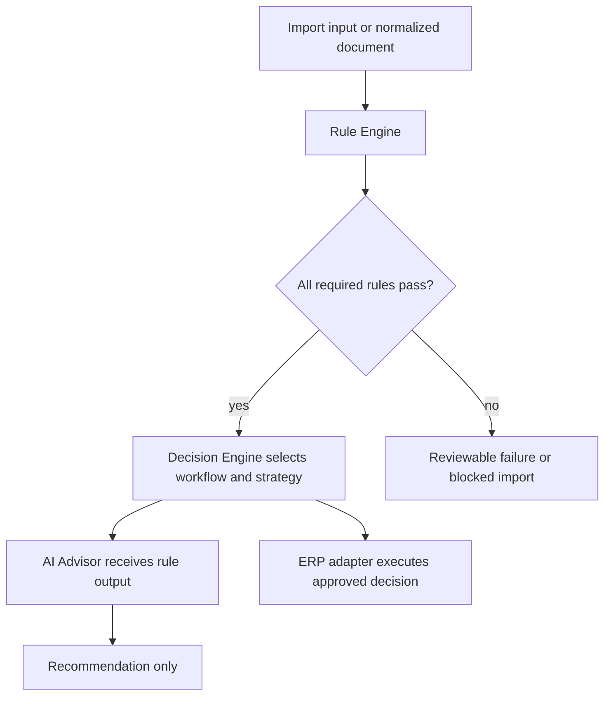
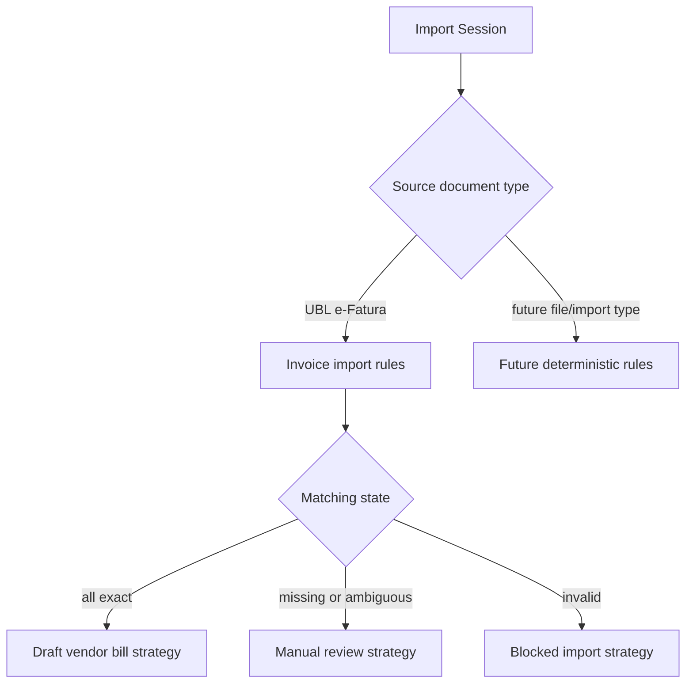

# Rule Engine

The Rule Engine is the deterministic policy execution layer for ICT IPP. It lives inside the Hub, executes before AI, and is the source of workflow decisions.

No single `app/rule_engine` package exists yet. This document formalizes the accepted boundary and maps it to current deterministic implementation points.

## Purpose

The Rule Engine answers questions that must be resolved by explicit business policy:

- Is an import allowed to continue?
- Which workflow should be selected?
- Which strategy should be used?
- Is a candidate match exact, missing, ambiguous, invalid, or not required?
- Is an ERP write allowed?
- Is traceability preserved or broken?

AI may comment on these results after the Rule Engine runs. AI must not replace them.

## Current Deterministic Rules

| Rule area | Current implementation | Behavior |
| --- | --- | --- |
| Runtime production gates | `app/core/runtime_checks.py` | Reject unsafe production configuration before startup/readiness succeeds |
| Uyumsoft read-only boundary | `app/connectors/uyumsoft`, `app/services/uyumsoft_invoice_sync.py`, `app/services/document_service.py` | Allow listing and UBL XML retrieval only |
| Metadata idempotency | `app/services/invoice_persistence.py` | Use ETTN or deterministic fallback identity |
| Document idempotency | `app/services/document_service.py` | Use invoice/document type uniqueness and SHA-256 conflict detection |
| Product matching | `app/matching/product.py` | Match by buyer item code, barcode, then seller item code; stop on ambiguity |
| Tax mapping | `app/tax_mapping/engine.py` | Match active tax by exact company, type, and Decimal rate |
| Odoo resolution | `app/services/odoo_resolution.py` | Resolve existing records with exact deterministic rules only |
| Draft creation validation | `app/services/odoo_draft_invoice.py` | Require confirmation, reviewed IDs, ready preview, ETTN, and non-production gate |
| Vendor bill build validation | `app/billing/builder.py` | Require matched partner, product, tax, invoice header, and valid quantities/prices |

## Decision Flow

## Workflow Selection

## Required Rule Result Shape

Future consolidated Rule Engine results should be typed and auditable:

- rule id
- rule version
- input reference
- status: passed, failed, warning, skipped
- deterministic reason
- safe evidence fields
- affected traceability link
- required next action

Rule results must not include credentials, raw XML, SOAP envelopes, full Odoo payloads, or sensitive invoice contents.

## Rule Engine vs Decision Engine

The Rule Engine evaluates facts and policies. The Decision Engine chooses the workflow and strategy using Rule Engine output.

Example:

- Rule Engine: product line 3 has multiple exact candidates by default code.
- Decision Engine: choose manual review strategy instead of draft creation strategy.
- AI Advisor: explain why the line needs review and suggest what data the user may inspect.

## Rule Engine vs AI Advisor

The Rule Engine is authoritative. AI Advisor is explanatory and advisory.

AI can:

- summarize failed rules
- suggest likely missing data
- explain why a rule blocked automation
- recommend a human-review checklist

AI cannot:

- mark a failed rule as passed
- select an ambiguous candidate
- choose a strategy
- approve ERP writes

## Implementation Guidance

When implementing a future `app/rule_engine` package:

- extract rules incrementally from existing deterministic behavior
- keep public rule contracts typed
- preserve current status values and safety behavior
- keep rules side-effect free where practical
- test exact inputs, ambiguous cases, invalid data, and safe error output
- update ADRs if the extraction changes authority or behavior

## Related Documents

- [Decision Engine ADR](adr/ADR-0004-decision-engine.md)
- [Rule Engine ADR](adr/ADR-0005-rule-engine.md)
- [Matching](MATCHING.md)
- [Workflows](WORKFLOWS.md)
