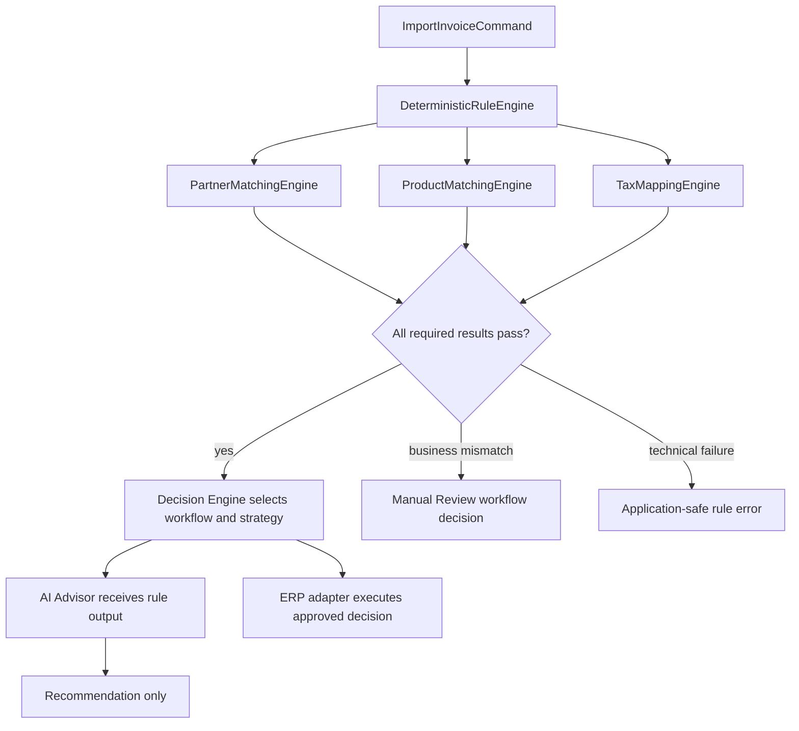
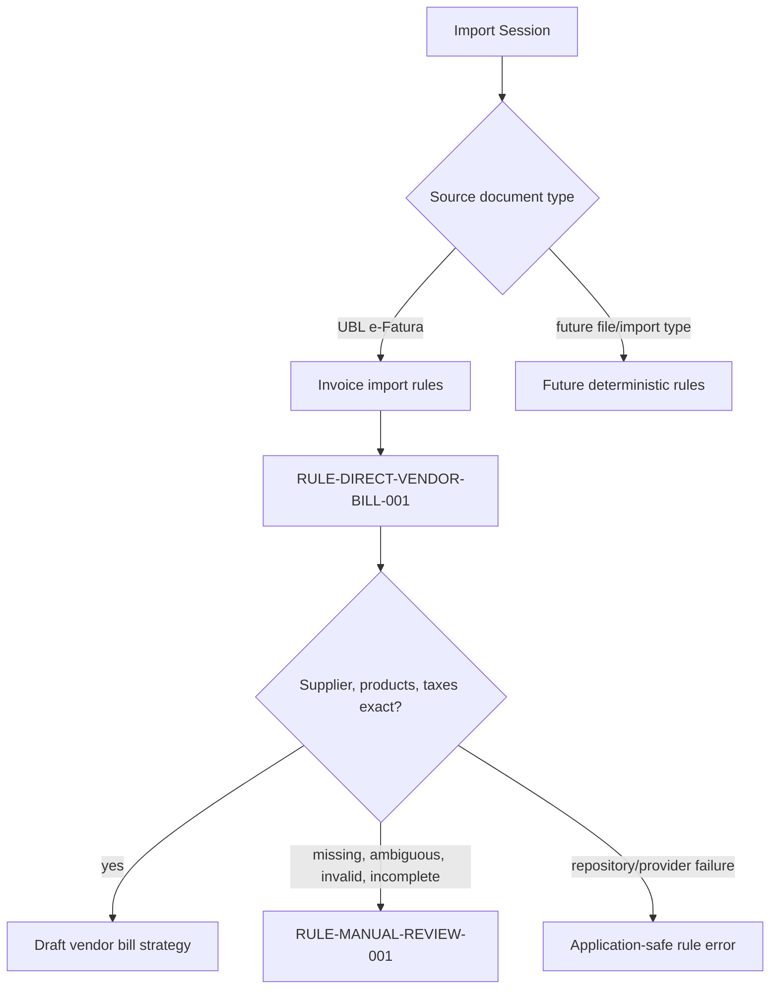

# Rule Engine

The Rule Engine is the deterministic policy execution layer for ICT IPP. It lives inside the Hub, executes before AI, and is the source of workflow decisions.

The current implementation provides the `RuleEngine` application port consumed by `DecisionEngine` and the first concrete implementation: `DeterministicRuleEngine`.

The configurable invoice decision-rule classifier is implemented separately as `InvoiceDecisionRuleEngine`. It consumes canonical `InvoiceClassificationContext` evidence plus Odoo-authored canonical `InvoiceDecisionRule` values and returns `InvoiceClassificationResult`. It does not implement the existing `RuleEngine` port and is not yet wired into `DecisionEngine`.

## Purpose

The Rule Engine answers questions that must be resolved by explicit business policy:

- Is an import allowed to continue?
- Which workflow should be selected?
- Which strategy should be used?
- Is a candidate match exact, missing, ambiguous, invalid, or not required?
- Is an ERP write allowed?
- Is traceability preserved or broken?

AI may comment on these results after the Rule Engine runs. AI must not replace them.

## Current Deterministic Rules

| Rule area | Current implementation | Behavior |
| --- | --- | --- |
| Runtime production gates | `app/core/runtime_checks.py` | Reject unsafe production configuration before startup/readiness succeeds |
| Uyumsoft read-only boundary | `app/connectors/uyumsoft`, `app/services/uyumsoft_invoice_sync.py`, `app/services/document_service.py` | Allow listing and UBL XML retrieval only |
| Metadata idempotency | `app/services/invoice_persistence.py` | Use ETTN or deterministic fallback identity |
| Document idempotency | `app/services/document_service.py` | Use invoice/document type uniqueness and SHA-256 conflict detection |
| Product matching | `app/matching/product.py` | Match by buyer item code, barcode, then seller item code; stop on ambiguity |
| Tax mapping | `app/tax_mapping/engine.py` | Match active tax by exact company, type, and Decimal rate |
| Odoo resolution | `app/services/odoo_resolution.py` | Resolve existing records with exact deterministic rules only |
| Draft creation validation | `app/services/odoo_draft_invoice.py` | Require confirmation, reviewed IDs, ready preview, ETTN, and non-production gate |
| Vendor bill build validation | `app/billing/builder.py` | Require matched partner, product, tax, invoice header, and valid quantities/prices |
| Direct Vendor Bill rule | `app/application/rules/deterministic.py` | Select `WorkflowType.VENDOR_BILL` only when supplier, product, and tax results are deterministic and complete |
| Manual Review rule | `app/application/rules/deterministic.py` | Select `WorkflowType.MANUAL_REVIEW` with structured review reasons for deterministic business mismatches |
| Configurable invoice classification | `app/application/rules/classification.py` | Evaluate canonical invoice evidence against Odoo-authored `InvoiceDecisionRule` values and return classification evidence only |

## Implemented Rule: RULE-DIRECT-VENDOR-BILL-001

`RULE-DIRECT-VENDOR-BILL-001` is the first concrete deterministic workflow rule.

It selects `WorkflowType.VENDOR_BILL` only when all prerequisites pass:

- supplier partner matching returns exactly one deterministic match
- supplier matching is not missing, ambiguous, or invalid
- product matching returns one deterministic match for every invoice line
- product matching is not missing, ambiguous, invalid, or incomplete
- tax mapping returns one deterministic tax id for every tax present on invoice lines
- tax mapping is not missing, ambiguous, invalid, or incomplete
- no component-level blocking error is present

Successful output includes an immutable `WorkflowDecision`:

```python
WorkflowDecision(
    workflow=WorkflowType.VENDOR_BILL,
    matched_rule="RULE-DIRECT-VENDOR-BILL-001",
    explanation=("Supplier, products and taxes matched deterministically; Vendor Bill workflow selected."),
)
```

Current deterministic dependencies:

- supplier matching: `PartnerMatchingEngine`, using supplier tax number only and raising safe `PartnerMatchingError` values for repository/provider failures
- product matching: `ProductMatchingEngine`, preserving buyer item code, barcode, seller item code priority
- tax mapping: `TaxMappingEngine`, preserving exact company, type, and `Decimal` rate matching

The rule engine coordinates these components through injected dependencies. It does not instantiate Odoo adapters, call ERP APIs, persist records, build Vendor Bills, execute strategies, perform duplicate detection, use AI, or perform fuzzy matching.

## Configurable Invoice Classification

`InvoiceDecisionRuleEngine` is the first configurable rule-evaluation slice. The flow is:

```text
Odoo authors rules
  -> Hub reads canonical rules
  -> deterministic classifier evaluates canonical invoice context
  -> InvoiceClassificationResult evidence
```

The classifier supports only deterministic match conditions from `InvoiceDecisionRuleMatch`: exact company, vendor partner, vendor tax ID, currency, provider document type, purchase order presence, product mapping ID presence, and line-description corpus matching.

Description matching uses a case-normalized substring check against the canonical description corpus. All configured terms must be present. The classifier does not use token similarity, stemming, synonyms, AI, embeddings, historical decisions, or display text inference.

Winner selection evaluates all enabled rules, orders them with `order_invoice_decision_rules(...)`, and groups matching rules by the winning specificity plus priority tier/rank. No match returns `NO_MATCH`. Equal-winning rules with equivalent action fingerprints return `MATCHED` or `REVIEW_REQUIRED`. Equal-winning rules with incompatible action fingerprints return `CONFLICT` with immutable rule evidence.

Classification does not itself perform ERP execution, create Workbench records, write Odoo, call providers, or alter runtime execution.

## Implemented Rule: RULE-MANUAL-REVIEW-001

`RULE-MANUAL-REVIEW-001` selects `WorkflowType.MANUAL_REVIEW` when deterministic matching or mapping completes safely but finds business data that requires human review.

Manual Review reasons are immutable and structured. Current reason codes include:

- `SUPPLIER_TAX_NUMBER_MISSING`
- `SUPPLIER_NOT_FOUND`
- `SUPPLIER_AMBIGUOUS`
- `PRODUCT_IDENTIFIER_MISSING`
- `PRODUCT_NOT_FOUND`
- `PRODUCT_AMBIGUOUS`
- `PRODUCT_MAPPING_INCOMPLETE`
- `TAX_NOT_FOUND`
- `TAX_AMBIGUOUS`
- `TAX_MAPPING_INCOMPLETE`
- `UNSUPPORTED_INVOICE_CONTENT`

The Manual Review rule may be selected for missing, ambiguous, invalid, or incomplete business prerequisites. It must not be selected for repository, provider, authorization, timeout, transport, mapper, or unexpected dependency failures.

## Failure Behavior

Business mismatches are deterministic workflow outcomes:

- missing or malformed supplier tax number returns Manual Review
- no matching ERP partner returns Manual Review
- multiple matching ERP partners return Manual Review
- product and tax not-found, ambiguous, invalid, or incomplete results return Manual Review

Technical failures are safe and explicit application exceptions:

- `PartnerRuleEvaluationError`: safe partner matcher failure
- `ProductRuleEvaluationError`: safe product matcher failure
- `TaxRuleEvaluationError`: safe tax mapper failure

Technical exceptions preserve exception chaining internally, but safe messages must not expose credentials, raw HTTP responses, tokens, URLs with secrets, or internal exception text.

Component warnings are propagated on `RuleEvaluationResult`. Decision-level explanation remains on `WorkflowDecision`.

## Decision Flow



## Workflow Selection



## Required Rule Result Shape

Future consolidated Rule Engine results should be typed and auditable:

- rule id
- rule version
- input reference
- status: passed, failed, warning, skipped
- deterministic reason
- safe evidence fields
- affected traceability link
- required next action

Rule results must not include credentials, raw XML, SOAP envelopes, full Odoo payloads, or sensitive invoice contents.

## Rule Engine vs Decision Engine

The Rule Engine evaluates facts and policies. The Decision Engine chooses the workflow and strategy using Rule Engine output.

Example:

- Rule Engine: product line 3 has multiple exact candidates by default code.
- Decision Engine: choose manual review strategy instead of draft creation strategy.
- AI Advisor: explain why the line needs review and suggest what data the user may inspect.

Current implementation:

- `RuleEngine` is a port under `app/application/ports`.
- `DeterministicRuleEngine` implements that port under `app/application/rules`.
- `InvoiceDecisionRuleEngine` is a separate side-effect-free classifier and does not replace the current `RuleEngine` port.
- `DecisionEngine` calls that port and receives a `RuleEvaluationResult`.
- `DecisionEngine` resolves the workflow from that result through `WorkflowStrategyResolver`.
- This repository currently implements `VendorBillStrategy` and the non-writing `ManualReviewStrategy`.

The Decision Engine does not evaluate rules itself.

## Rule Engine vs AI Advisor

The Rule Engine is authoritative. AI Advisor is explanatory and advisory.

AI can:

- summarize failed rules
- suggest likely missing data
- explain why a rule blocked automation
- recommend a human-review checklist

AI cannot:

- mark a failed rule as passed
- select an ambiguous candidate
- choose a strategy
- approve ERP writes

## Implementation Guidance

When extending rule evaluation:

- add rules incrementally from existing deterministic behavior
- keep public rule contracts typed
- preserve current status values and safety behavior
- keep rules side-effect free where practical
- test exact inputs, ambiguous cases, invalid data, and safe error output
- update ADRs if the extraction changes authority or behavior

Configurable rule storage, rule administration UI, Rule DSLs, persistent Manual Review execution, and AI Advisor integration are future work and are not implemented by the current Rule Engine.

## Related Documents

- [Decision Engine ADR](adr/ADR-0004-decision-engine.md)
- [Rule Engine ADR](adr/ADR-0005-rule-engine.md)
- [Matching](MATCHING.md)
- [Workflows](WORKFLOWS.md)
