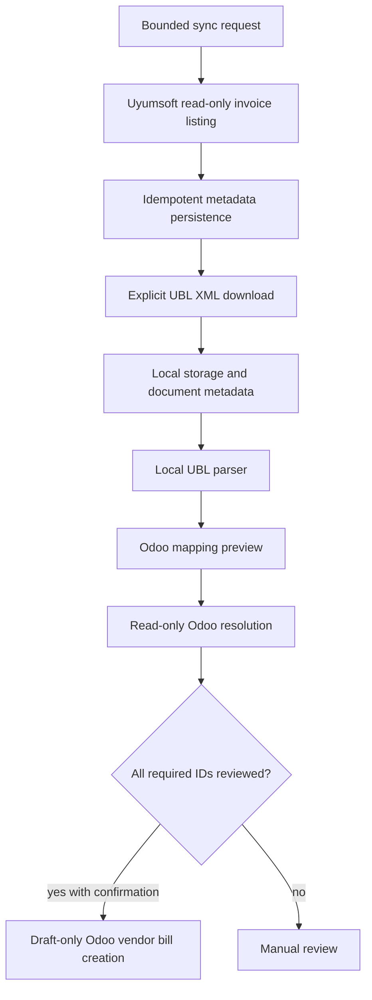
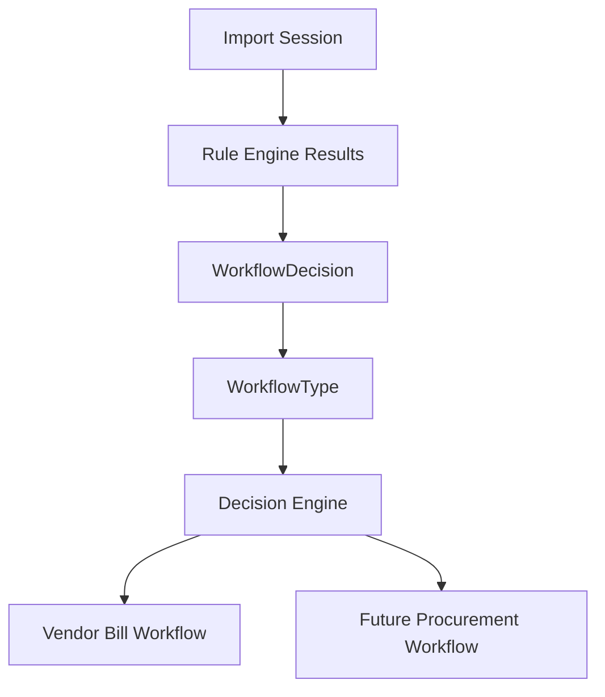
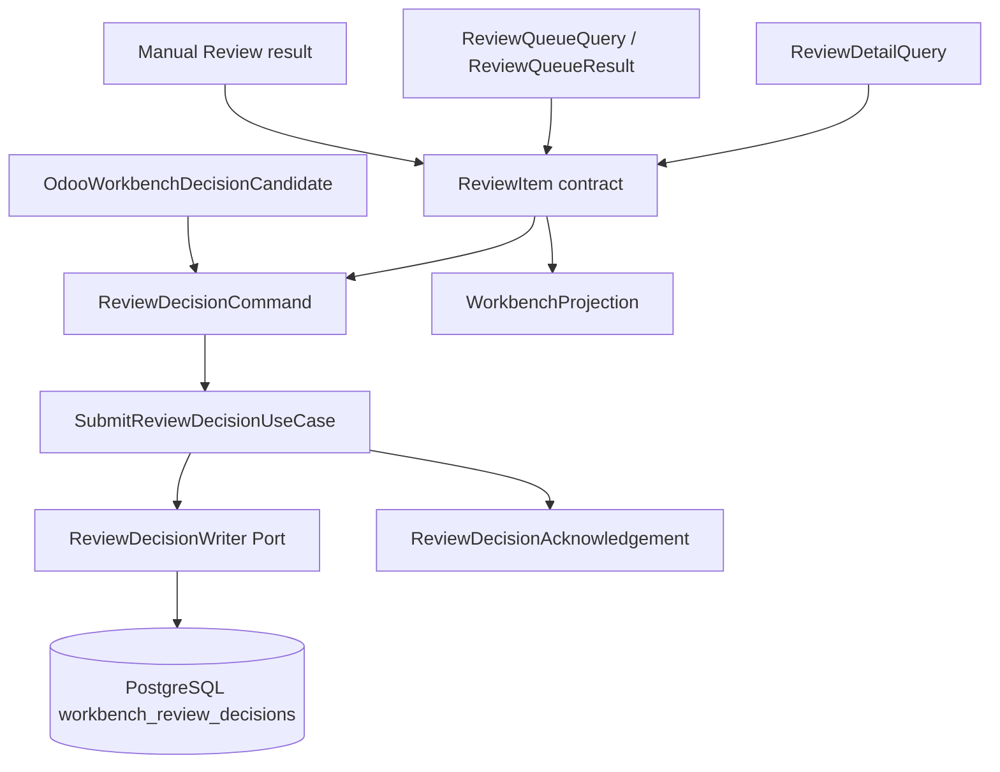
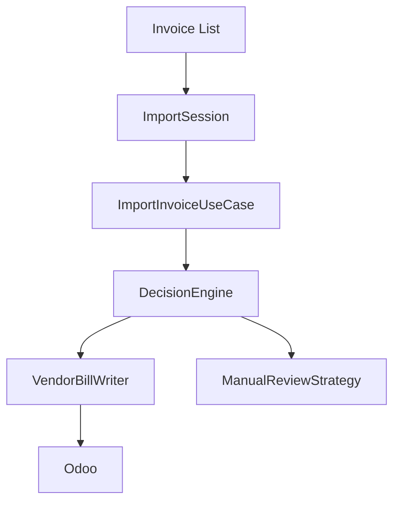
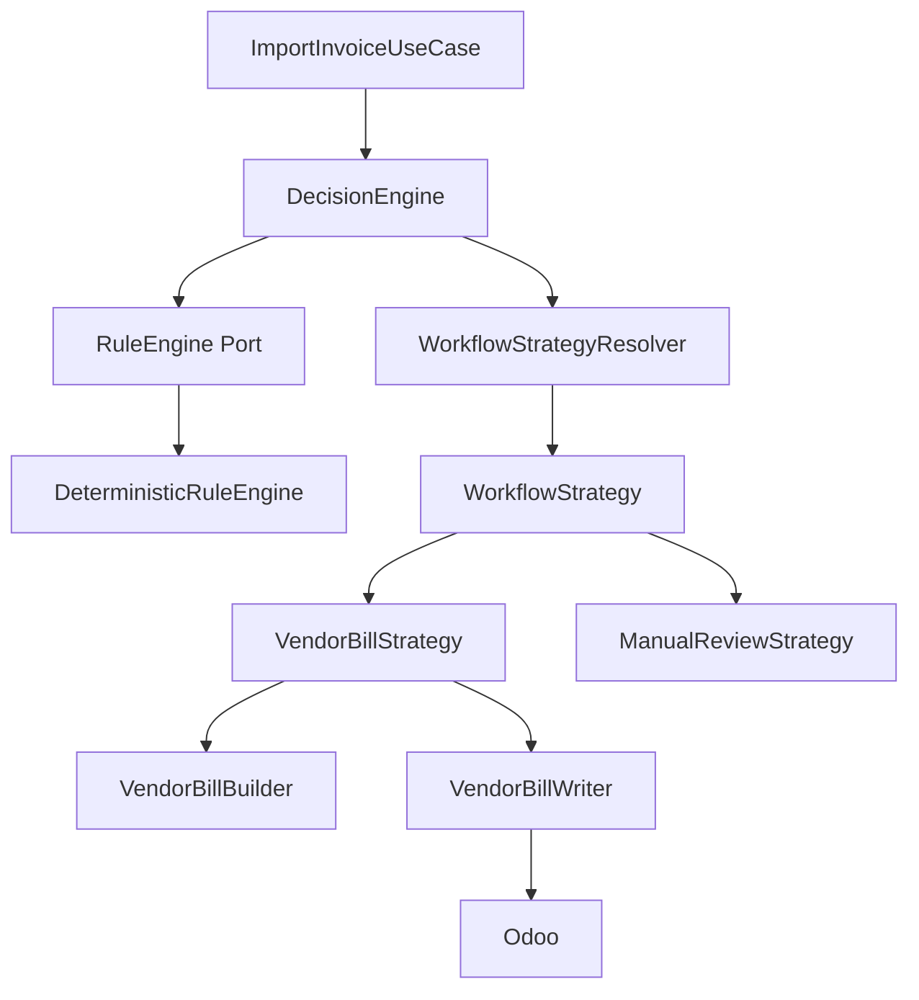

# Workflows

Workflows describe how ICT IPP moves data from source systems through deterministic rules, review, and ERP execution.

Current implementation covers Uyumsoft invoice ingestion through draft Odoo vendor bill creation. Future IPP workflows must preserve the same boundaries: Rule Engine before AI, Decision Engine inside the Hub, ERP execution through adapters.

## Current Invoice Workflow

Forbidden inside this workflow:

- Uyumsoft provider state mutation
- Odoo posting
- master-data creation
- silent selection of ambiguous candidates
- AI-based decision making

## Workflow Selection

Workflow selection is an accepted Decision Engine responsibility.

Workflow names are not free-form strings. The Application layer owns the shared Workflow Model:

- `WorkflowType.VENDOR_BILL`
- `WorkflowType.RFQ`
- `WorkflowType.EXPENSE`
- `WorkflowType.ASSET`
- `WorkflowType.SUBSCRIPTION`
- `WorkflowType.MANUAL_REVIEW`

The Rule Engine returns a `WorkflowDecision` containing one `WorkflowType`, the matched rule reference, explanation, warnings, and errors. `DecisionEngine`, `WorkflowStrategyResolver`, `WorkflowStrategy`, and `DecisionResult` consume that same vocabulary. The future AI Advisor may read this model to explain or recommend, but it must not replace deterministic workflow selection.

The current codebase contains the first centralized `DecisionEngine` implementation. It delegates rule evaluation to the `RuleEngine` port and executes the selected workflow through `WorkflowStrategyResolver`.

The current Rule Engine implementation contains one concrete workflow rule:

- `RULE-DIRECT-VENDOR-BILL-001`: selects `WorkflowType.VENDOR_BILL` when supplier partner matching, product matching, and tax mapping all succeed deterministically and completely
- `RULE-MANUAL-REVIEW-001`: selects `WorkflowType.MANUAL_REVIEW` with structured review reasons when matching or mapping completes safely but finds missing, ambiguous, invalid, or incomplete business data

Repository, provider, authorization, timeout, mapper, or unexpected dependency failures still raise application-safe rule errors. They are not silently converted into Manual Review results.

## Use Case Convention

Every future business workflow should be represented by a dedicated application use case under `app/application/use_cases` or a task-specific subpackage.

Examples:

- `ImportInvoiceUseCase`
- `CreateVendorBillUseCase`
- `CreateRFQUseCase`
- `CreatePurchaseOrderUseCase`
- `ReviewInvoiceUseCase`

Use cases coordinate application flow. They should consume commands or queries, call domain services/builders, invoke ports, and return immutable application DTOs. They should not contain provider transport logic, ORM models, HTTP exceptions, or AI decision authority.

Current executable use case:

- `ImportInvoiceUseCase`: coordinates duplicate detection and delegates workflow selection/execution to `DecisionEngine`.
- `ImportSession`: coordinates multiple `InternalInvoice` imports sequentially by delegating each invoice to `ImportInvoiceUseCase` and collecting immutable results.

See [Application Layer](APPLICATION_LAYER.md) for the package and port conventions.

## Import Workbench Contract Flow

The current repository defines application contracts and persistence boundaries for direct Hub API clients and future Odoo Online Studio projection synchronization. It does not implement Odoo Studio setup, projection JSON-2 synchronization, decision ingestion, user decision execution, ERP writes, or AI recommendations.

Traceability choices in the current `ReviewDecisionCommand` are explicit user-provided identifiers through legacy `BusinessContextDecision`. The new `BusinessContextAllocationSet` contract defines the future multi-allocation shape, but it is not wired into the command, API, persistence, or Odoo adapter yet. The contract supports future choices such as direct Vendor Bill, RFQ/Purchase Order, existing Purchase Order matching, expense, asset, subscription, customer recharge, affiliate targeting, project cost, internal cost, or dismissal without executing those workflows in this slice. Manual Review is the unresolved state; it cannot be selected as a resolution workflow.

A single invoice-level selected workflow may not describe every allocation purpose in mixed cases. Future workflow handling must distinguish the review decision, the overall processing strategy, and allocation-line purposes. Mixed allocations will require a future Composite Workflow Strategy. This PR does not add `WorkflowType.MIXED`, change the existing workflow vocabulary, or implement composite execution.

Submitted decisions are persisted append-only and update the review item status/version atomically. `SELECT_WORKFLOW` moves `PENDING_REVIEW` to `DECISION_SUBMITTED`; `DISMISS` moves `PENDING_REVIEW` to `DISMISSED`. Optimistic concurrency uses `expected_version`, and decision-command idempotency uses `(company_id, idempotency_key)` so identical replays return the original acknowledgement without incrementing the review version again.

Recommendation acceptance is future work. It must be introduced together with a versioned recommendation contract that carries identity, source, and rationale metadata so stale recommendations cannot be accepted silently.

## Import Session Orchestration

Current multi-invoice orchestration is intentionally sequential and in-memory.

`ImportSession` does not run Rule Engine, Decision Engine, AI Advisor, matching, Vendor Bill building, ERP calls, retries, batching, or persistence. Those responsibilities remain in their existing layers or future accepted implementation slices.

## Strategy Selection

Strategies are deterministic execution paths resolved by the Decision Engine from Rule Engine output:

- draft vendor bill strategy
- manual review strategy

Current implemented strategy:

- `VendorBillStrategy`: delegates to `VendorBillBuilder` and `VendorBillWriter`
- `ManualReviewStrategy`: returns `review_required` results with structured reasons and performs no ERP writes

Future strategies may include read-only ingestion, document acquisition, mapping preview, exact resolution, blocked import, RFQ, Purchase Order, expense, asset, and subscription paths. Future strategies should be added by implementing `WorkflowStrategy` and registering it with `WorkflowStrategyResolver`, not by modifying `DecisionEngine`.

Mixed Business Context Allocation sets may require a future Composite Workflow Strategy that coordinates multiple allocation-line purposes while preserving one accepted review decision. That strategy is not implemented here.

Strategy selection must be explainable and based on Rule Engine output.

## Review States

Workflow outputs should distinguish:

- ready: all required rules and matches pass
- needs review: missing or ambiguous data can be reviewed by a user
- invalid: input or configuration violates required policy
- blocked: workflow cannot proceed until an external correction happens
- completed: execution finished and local state is recorded
- failed: execution failed with safe diagnostic details

Existing Odoo resolution states use `resolved`, `unresolved`, `ambiguous`, `invalid`, and `not_required`. Future workflow state models should preserve that precision.

## ERP Execution

ERP adapters execute reviewed decisions. For Odoo today:

- read-only lookup uses `search_read`
- draft Vendor Bill creation uses `OdooVendorBillWriter` through the `VendorBillWriter` port
- the writer performs duplicate `account.move/search_read` before `account.move/create`
- draft creation uses `move_type=in_invoice`
- posting remains a finance-controlled Odoo action outside Integration Hub

Future ERP adapters must keep equivalent boundaries.

## AI In Workflows

AI Advisor runs after Rule Engine. It may generate recommendations for review workflows, but it does not select the workflow, approve execution, or mutate ERP/provider state.

## Related Documents

- [Rule Engine](RULE_ENGINE.md)
- [Import Session](IMPORT_SESSION.md)
- [Import Workbench](IMPORT_WORKBENCH.md)
- [Strategy Pattern ADR](adr/ADR-0010-strategy-pattern.md)
