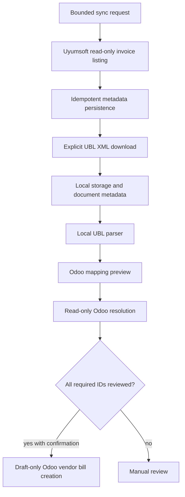
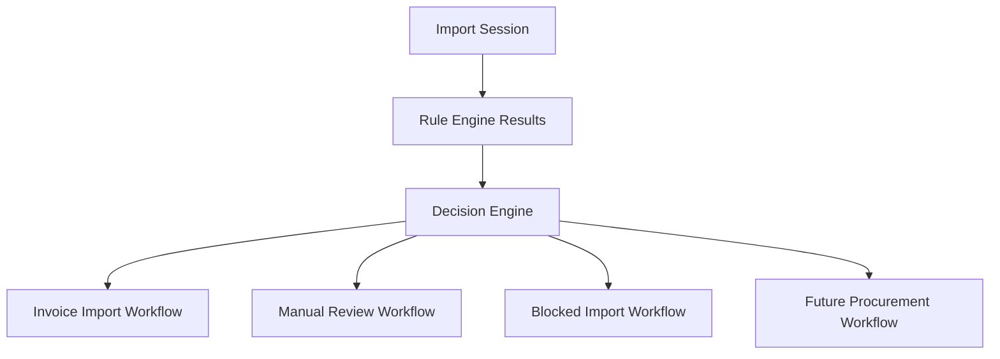

# Workflows

Workflows describe how ICT IPP moves data from source systems through deterministic rules, review, and ERP execution.

Current implementation covers Uyumsoft invoice ingestion through draft Odoo vendor bill creation. Future IPP workflows must preserve the same boundaries: Rule Engine before AI, Decision Engine inside the Hub, ERP execution through adapters.

## Current Invoice Workflow

Forbidden inside this workflow:

- Uyumsoft provider state mutation
- Odoo posting
- master-data creation
- silent selection of ambiguous candidates
- AI-based decision making

## Workflow Selection

Workflow selection is an accepted Decision Engine responsibility.

The current codebase does not yet contain a centralized Decision Engine. Existing services should be treated as workflow execution steps that future Decision Engine work can orchestrate.

## Use Case Convention

Every future business workflow should be represented by a dedicated application use case under `app/application/use_cases` or a task-specific subpackage.

Examples:

- `ImportInvoiceUseCase`
- `CreateVendorBillUseCase`
- `CreateRFQUseCase`
- `CreatePurchaseOrderUseCase`
- `ReviewInvoiceUseCase`

Use cases coordinate application flow. They should consume commands or queries, call domain services/builders, invoke ports, and return immutable application DTOs. They should not contain provider transport logic, ORM models, HTTP exceptions, or AI decision authority.

See [Application Layer](APPLICATION_LAYER.md) for the package and port conventions.

## Strategy Selection

Strategies are deterministic execution paths chosen by the Decision Engine:

- read-only ingestion strategy
- document acquisition strategy
- mapping preview strategy
- exact resolution strategy
- manual review strategy
- draft vendor bill strategy
- blocked import strategy

Strategy selection must be explainable and based on Rule Engine output.

## Review States

Workflow outputs should distinguish:

- ready: all required rules and matches pass
- needs review: missing or ambiguous data can be reviewed by a user
- invalid: input or configuration violates required policy
- blocked: workflow cannot proceed until an external correction happens
- completed: execution finished and local state is recorded
- failed: execution failed with safe diagnostic details

Existing Odoo resolution states use `resolved`, `unresolved`, `ambiguous`, `invalid`, and `not_required`. Future workflow state models should preserve that precision.

## ERP Execution

ERP adapters execute reviewed decisions. For Odoo today:

- read-only lookup uses `search_read`
- draft creation uses `account.move/create` for `move_type=in_invoice`
- posting remains a finance-controlled Odoo action outside Integration Hub

Future ERP adapters must keep equivalent boundaries.

## AI In Workflows

AI Advisor runs after Rule Engine. It may generate recommendations for review workflows, but it does not select the workflow, approve execution, or mutate ERP/provider state.

## Related Documents

- [Rule Engine](RULE_ENGINE.md)
- [Import Session](IMPORT_SESSION.md)
- [Import Workbench](IMPORT_WORKBENCH.md)
- [Strategy Pattern ADR](adr/ADR-0010-strategy-pattern.md)
