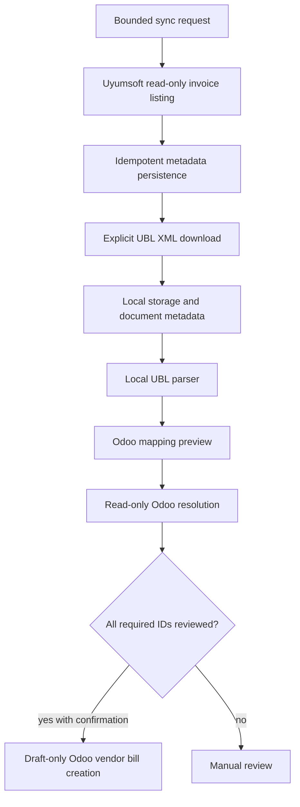
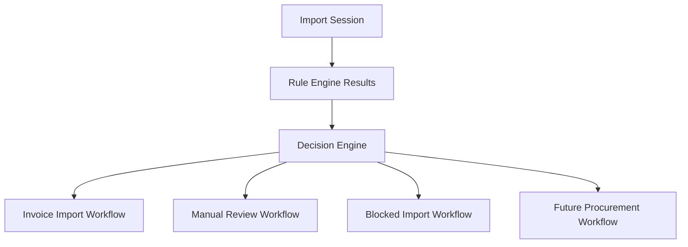
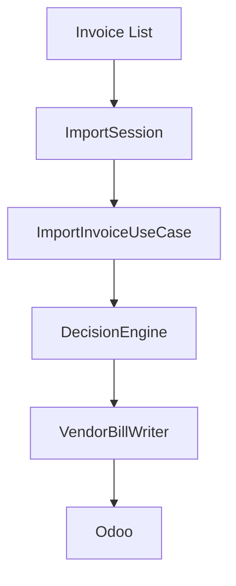
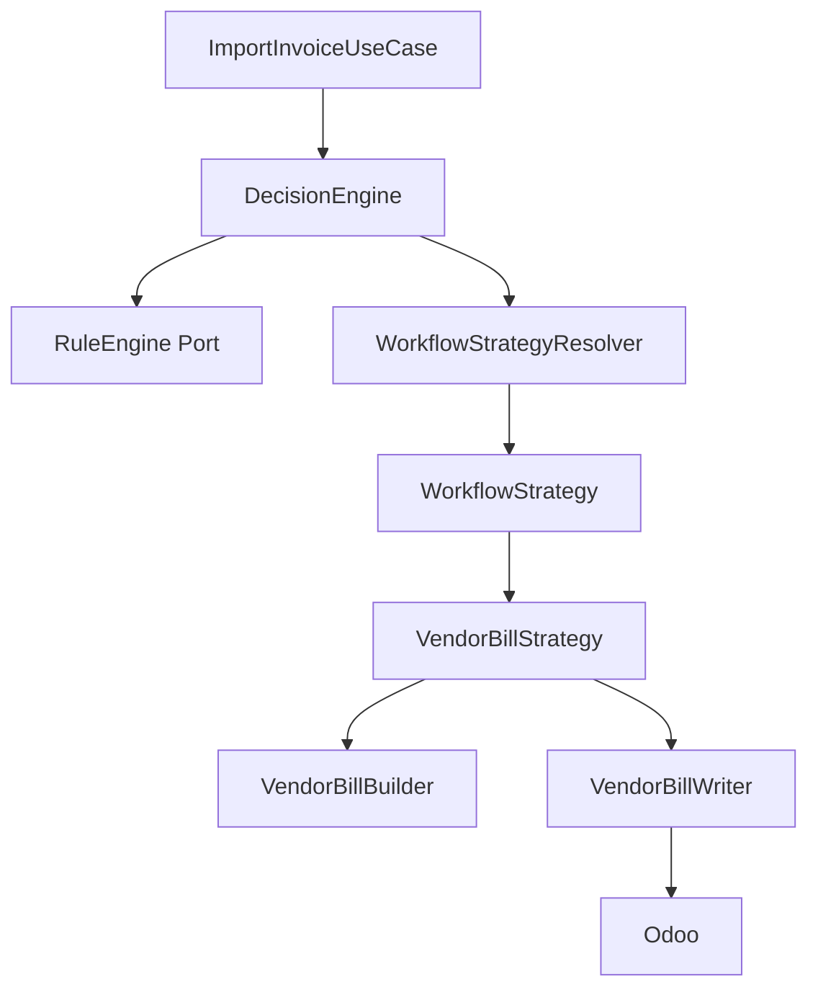

# Workflows

Workflows describe how ICT IPP moves data from source systems through deterministic rules, review, and ERP execution.

Current implementation covers Uyumsoft invoice ingestion through draft Odoo vendor bill creation. Future IPP workflows must preserve the same boundaries: Rule Engine before AI, Decision Engine inside the Hub, ERP execution through adapters.

## Current Invoice Workflow

Forbidden inside this workflow:

- Uyumsoft provider state mutation
- Odoo posting
- master-data creation
- silent selection of ambiguous candidates
- AI-based decision making

## Workflow Selection

Workflow selection is an accepted Decision Engine responsibility.

The current codebase contains the first centralized `DecisionEngine` implementation. It delegates rule evaluation to the `RuleEngine` port and executes the selected workflow through `WorkflowStrategyResolver`.

## Use Case Convention

Every future business workflow should be represented by a dedicated application use case under `app/application/use_cases` or a task-specific subpackage.

Examples:

- `ImportInvoiceUseCase`
- `CreateVendorBillUseCase`
- `CreateRFQUseCase`
- `CreatePurchaseOrderUseCase`
- `ReviewInvoiceUseCase`

Use cases coordinate application flow. They should consume commands or queries, call domain services/builders, invoke ports, and return immutable application DTOs. They should not contain provider transport logic, ORM models, HTTP exceptions, or AI decision authority.

Current executable use case:

- `ImportInvoiceUseCase`: coordinates duplicate detection and delegates workflow selection/execution to `DecisionEngine`.
- `ImportSession`: coordinates multiple `InternalInvoice` imports sequentially by delegating each invoice to `ImportInvoiceUseCase` and collecting immutable results.

See [Application Layer](APPLICATION_LAYER.md) for the package and port conventions.

## Import Session Orchestration

Current multi-invoice orchestration is intentionally sequential and in-memory.

`ImportSession` does not run Rule Engine, Decision Engine, AI Advisor, matching, Vendor Bill building, ERP calls, retries, batching, or persistence. Those responsibilities remain in their existing layers or future accepted implementation slices.

## Strategy Selection

Strategies are deterministic execution paths resolved by the Decision Engine from Rule Engine output:

- draft vendor bill strategy

Current implemented strategy:

- `VendorBillStrategy`: delegates to `VendorBillBuilder` and `VendorBillWriter`

Future strategies may include read-only ingestion, document acquisition, mapping preview, exact resolution, manual review, blocked import, RFQ, Purchase Order, expense, asset, and subscription paths. Future strategies should be added by implementing `WorkflowStrategy` and registering it with `WorkflowStrategyResolver`, not by modifying `DecisionEngine`.

Strategy selection must be explainable and based on Rule Engine output.

## Review States

Workflow outputs should distinguish:

- ready: all required rules and matches pass
- needs review: missing or ambiguous data can be reviewed by a user
- invalid: input or configuration violates required policy
- blocked: workflow cannot proceed until an external correction happens
- completed: execution finished and local state is recorded
- failed: execution failed with safe diagnostic details

Existing Odoo resolution states use `resolved`, `unresolved`, `ambiguous`, `invalid`, and `not_required`. Future workflow state models should preserve that precision.

## ERP Execution

ERP adapters execute reviewed decisions. For Odoo today:

- read-only lookup uses `search_read`
- draft Vendor Bill creation uses `OdooVendorBillWriter` through the `VendorBillWriter` port
- the writer performs duplicate `account.move/search_read` before `account.move/create`
- draft creation uses `move_type=in_invoice`
- posting remains a finance-controlled Odoo action outside Integration Hub

Future ERP adapters must keep equivalent boundaries.

## AI In Workflows

AI Advisor runs after Rule Engine. It may generate recommendations for review workflows, but it does not select the workflow, approve execution, or mutate ERP/provider state.

## Related Documents

- [Rule Engine](RULE_ENGINE.md)
- [Import Session](IMPORT_SESSION.md)
- [Import Workbench](IMPORT_WORKBENCH.md)
- [Strategy Pattern ADR](adr/ADR-0010-strategy-pattern.md)
