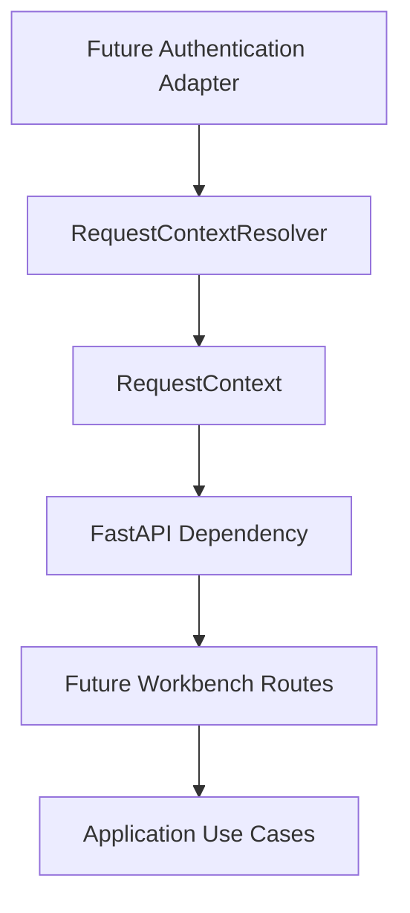
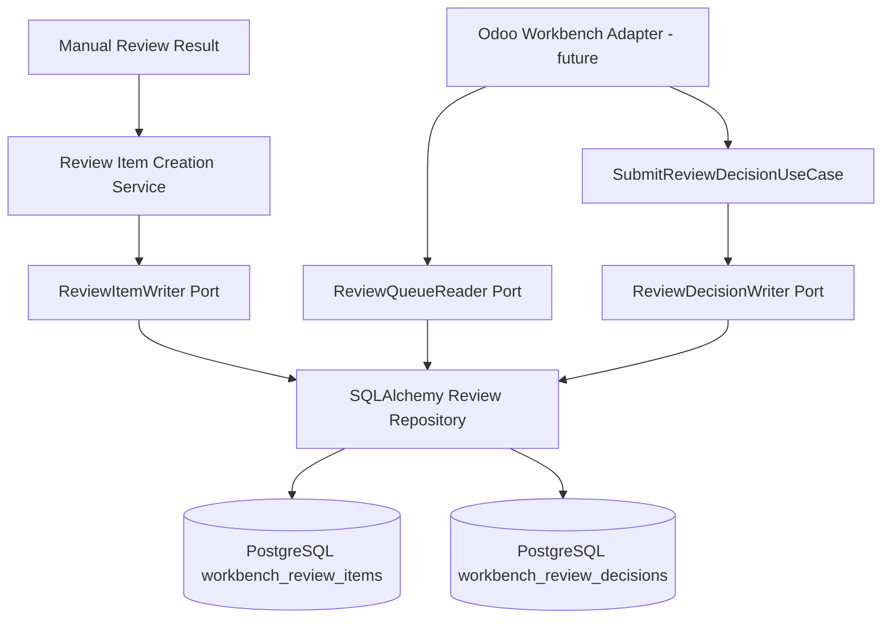

# Architecture

## High-Level Flow

```text
Uyumsoft
  → Connector Layer
  → UBL XML
  → InternalInvoice Domain
  → Deterministic Matching
  → Rule Engine
  → Decision Engine
  → Workflow Strategy
  → Odoo Adapter
  → Odoo Import Workbench and ERP Records
```

## Core Layers

### Connector Layer

Owns provider communication, authentication, invoice listing, download, integrity checks, and production safety. It contains no ERP business rules.

### Domain Layer

Owns immutable invoice DTOs, UBL parsing, validation, and domain exceptions. It does not depend on Odoo, SOAP, HTTP, or persistence.

### Matching and Mapping

Performs deterministic matching only:

- partner by VKN/TCKN
- product by exact identifiers
- tax by exact company, canonical type, and Decimal rate

Name similarity, fuzzy matching, and AI matching are excluded from automatic matching.

### Rule and Decision Layer

The Rule Engine evaluates deterministic company-scoped rules. Complete matches select the direct Vendor Bill workflow; safe business mismatches select Manual Review with structured reasons. Repository, provider, authorization, timeout, transport, mapper, and unexpected dependency failures remain safe application exceptions. The Decision Engine converts rule results and context into a workflow recommendation.

### AI Advisor

Runs only when deterministic rules cannot provide a sufficient decision. It uses company memory and a local model to produce an advisory recommendation. It cannot perform writes.

### Workflow Layer

Executes an approved strategy such as direct Vendor Bill, manual review, existing-PO matching, RFQ/PO creation, expense, asset, subscription, or ignore. The current Manual Review strategy is non-writing and returns review-required results only.

### API Security Context

FastAPI adapters resolve a trusted `RequestContext` before future authenticated routes construct application commands or queries. The Application layer remains unaware of HTTP headers, cookies, sessions, JWTs, OAuth providers, or FastAPI request objects.

The current implementation provides only a development-header authentication adapter. It is disabled by default and cannot be enabled in production. Future real authentication adapters should implement the same resolver boundary.



### Import Workbench Persistence

Manual Review items can be persisted durably for future Odoo Workbench display. The Application layer owns the immutable `ReviewItem`, `ReviewQueueQuery`, `ReviewDetailQuery`, `ReviewDecisionCommand`, `ReviewDecisionAcknowledgement`, `ReviewQueueReader`, `ReviewItemWriter`, and `ReviewDecisionWriter` contracts. The SQLAlchemy repository is an infrastructure adapter that creates pending review records idempotently, serves company-scoped read-only queue/detail queries, and submits explicit user decisions with optimistic concurrency and idempotency.

Decision submission changes only local Workbench review state. It does not execute the selected workflow, write ERP records, create Vendor Bills, create rules, call AI, or contact Odoo/Uyumsoft.



### ERP Adapter

Odoo implementations translate approved workflow commands into Odoo records. Odoo is not allowed to own cross-ERP business rules.

## User Interaction

The user works in an Odoo Import Workbench. The workbench displays source invoice data, matching status, workflow recommendation, related sales/procurement context, warnings, and available actions.

## Traceability

When relevant, all generated or matched records must retain links sufficient to traverse from sale to procurement and actual cost.

## Safety

- read-only by default where possible
- dry-run before production write
- explicit production approval gates
- idempotent creates
- draft records only unless a separate approved workflow posts them
- sanitized logs
- immutable result DTOs
